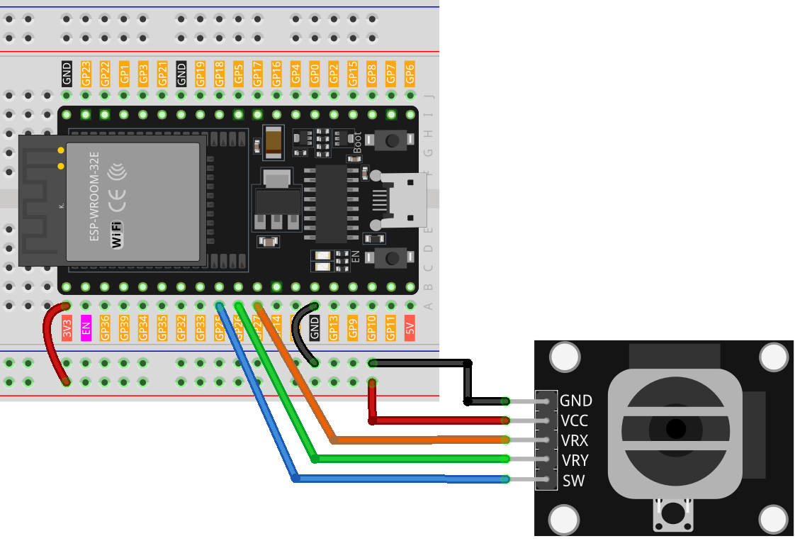

.. note::

    Bonjour, bienvenue dans la communauté des passionnés de SunFounder Raspberry Pi, Arduino et ESP32 sur Facebook ! Plongez plus profondément dans l'univers de Raspberry Pi, Arduino et ESP32 aux côtés d'autres passionnés.

    **Pourquoi rejoindre ?**

    - **Support d'experts** : Obtenez de l'aide pour résoudre les problèmes post-vente et les défis techniques grâce à notre communauté et notre équipe.
    - **Apprendre & Partager** : Échangez des astuces et des tutoriels pour enrichir vos compétences.
    - **Aperçus exclusifs** : Accédez en avant-première aux annonces de nouveaux produits et aux coulisses de leur développement.
    - **Réductions spéciales** : Profitez de promotions exclusives sur nos dernières nouveautés.
    - **Promotions festives et cadeaux** : Participez à des jeux concours et à des offres spéciales pour les fêtes.

    👉 Prêt à explorer et à créer avec nous ? Cliquez sur [|link_sf_facebook|] et rejoignez-nous dès aujourd'hui !

.. _esp32_lesson09_joystick:

Leçon 09 : Module Joystick
==================================

Dans cette leçon, vous apprendrez à lire les valeurs d'un module joystick en utilisant une carte de développement ESP32. Nous verrons comment mesurer les mouvements des axes X et Y du joystick et interpréter la position du bouton poussoir (switch). En intégrant ces entrées avec l'ESP32, vous découvrirez comment gérer les signaux analogiques et numériques. Ce projet est idéal pour les débutants, offrant une expérience pratique sur la lecture et le traitement des données issues de composants matériels interactifs.

Composants requis
--------------------------

Pour ce projet, nous avons besoin des composants suivants.

Il est certainement pratique d'acheter un kit complet, voici le lien :

.. list-table::
    :widths: 20 20 20
    :header-rows: 1

    *   - Nom
        - ÉLÉMENTS DANS CE KIT
        - LIEN
    *   - Kit Capteurs Universel pour Makers
        - 94
        - |link_umsk|

Vous pouvez également les acheter séparément via les liens ci-dessous.

.. list-table::
    :widths: 30 20
    :header-rows: 1

    *   - Introduction des composants
        - Lien d'achat

    *   - ESP32 & Carte de développement (:ref:`cpn_esp32_wroom_32e`)
        - |link_esp32_camera_pro_kit_buy|
    *   - :ref:`cpn_joystick`
        - |link_joystick_buy|
    *   - :ref:`cpn_breadboard`
        - |link_breadboard_buy|

Câblage
---------------------------

Code
---------------------------

.. raw:: html

    <iframe src=https://create.arduino.cc/editor/sunfounder01/6a9f54fb-a117-48f2-bca0-fd43bdd45b51/preview?embed style="height:510px;width:100%;margin:10px 0" frameborder=0></iframe>

Analyse du code
---------------------------

#. Définition des broches :
   
   .. code-block:: arduino
   
      const int xPin = 27;  // Broche connectée à VRX
      const int yPin = 26;  // Broche connectée à VRY
      const int swPin = 25;  // Broche connectée à SW

   Les broches du joystick sont définies comme des constantes. ``xPin`` et ``yPin`` sont des broches analogiques permettant de mesurer les déplacements du joystick sur les axes X et Y. ``swPin`` est une broche numérique détectant l'état du bouton poussoir.

#. Fonction d'initialisation (setup) :

   .. code-block:: arduino
   
      void setup() {
        pinMode(swPin, INPUT_PULLUP);
        Serial.begin(9600);
      }

   Configure ``swPin`` en entrée avec une résistance de pull-up intégrée, essentielle pour détecter l'appui sur le bouton du joystick. Initialise la communication série à un débit de 9600 bauds pour afficher les valeurs sur le moniteur série.

#. Fonction principale (loop) :

   .. code-block:: arduino
   
      void loop() {
        Serial.print("X: ");
        Serial.print(analogRead(xPin));  // Lire et afficher la valeur de VRX
        Serial.print("|Y: ");
        Serial.print(analogRead(yPin));  // Lire et afficher la valeur de VRY
        Serial.print("|Z: ");
        Serial.println(digitalRead(swPin));  // Lire et afficher l'état du bouton poussoir SW
        delay(50);
      }

   Cette boucle lit en continu les valeurs des axes X et Y ainsi que l'état du bouton poussoir du joystick.  
   Les valeurs sont affichées sur le moniteur série avec un délai de 50 ms entre chaque lecture pour une meilleure lisibilité.
