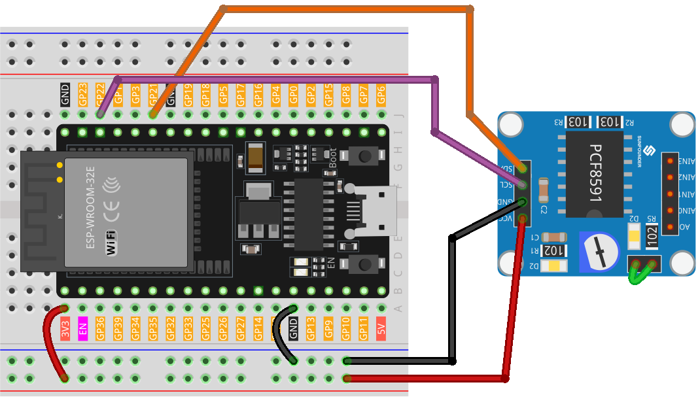

.. note:: 

    ¡Hola, bienvenido a la comunidad de entusiastas de SunFounder en Facebook sobre Raspberry Pi, Arduino y ESP32! Sumérgete más a fondo en Raspberry Pi, Arduino y ESP32 con otros entusiastas.

    **¿Por qué unirse?**

    - **Soporte de Expertos**: Resuelve problemas posventa y desafíos técnicos con ayuda de nuestra comunidad y equipo.
    - **Aprender y Compartir**: Intercambia consejos y tutoriales para mejorar tus habilidades.
    - **Previsualizaciones Exclusivas**: Obtén acceso anticipado a anuncios de nuevos productos y avances exclusivos.
    - **Descuentos Especiales**: Disfruta de descuentos exclusivos en nuestros productos más nuevos.
    - **Promociones Festivas y Sorteos**: Participa en sorteos y promociones festivas.

    👉 ¿Listo para explorar y crear con nosotros? Haz clic en [|link_sf_facebook|] ¡y únete hoy!

.. _esp32_lesson10_pcf8591:

Lección 10: Módulo Convertidor ADC DAC PCF8591
==============================================================

En esta lección, aprenderás a conectar la Placa de Desarrollo ESP32 con un Módulo Convertidor ADC DAC PCF8591. Cubriremos la lectura de valores analógicos de la entrada AIN0, el envío de estos valores al DAC (AOUT) y la visualización de las lecturas tanto crudas como convertidas en voltaje en el monitor serial. El potenciómetro del módulo está conectado a AIN0 mediante capsulas de puente, y el LED D2 en el módulo está conectado a AOUT, por lo que podrás ver cómo cambia el brillo del LED D2 a medida que giras el potenciómetro.

Componentes Requeridos
--------------------------

En este proyecto, necesitamos los siguientes componentes.

Es definitivamente conveniente comprar un kit completo, aquí está el enlace:

.. list-table::
    :widths: 20 20 20
    :header-rows: 1

    *   - Nombre	
        - ARTÍCULOS EN ESTE KIT
        - ENLACE
    *   - Kit Universal de Sensores para Creadores
        - 94
        - |link_umsk|

También puedes comprarlos por separado desde los siguientes enlaces.

.. list-table::
    :widths: 30 20
    :header-rows: 1

    *   - Introducción al Componente
        - Enlace de Compra

    *   - ESP32 & Placa de Desarrollo (:ref:`cpn_esp32_wroom_32e`)
        - |link_esp32_camera_pro_kit_buy|
    *   - :ref:`cpn_pcf8591`
        - |link_pcf8591_module_buy|
    *   - :ref:`cpn_breadboard`
        - |link_breadboard_buy|

Cableado
---------------------------

Código
---------------------------

.. note:: 
   Para instalar la librería, usa el Administrador de Librerías de Arduino y busca **"Adafruit PCF8591"** e instálala.

.. raw:: html

    <iframe src=https://create.arduino.cc/editor/sunfounder01/5f184da9-9ea5-4c8a-877e-a7a41abf8c15/preview?embed style="height:510px;width:100%;margin:10px 0" frameborder=0></iframe>

Análisis del Código
---------------------------

1. **Incluir la Librería y Definir Constantes**

   .. note:: 
      Para instalar la librería, usa el Administrador de Librerías de Arduino y busca **"Adafruit PCF8591"** e instálala. 

   .. code-block:: arduino

      // Incluir la librería Adafruit PCF8591
      #include <Adafruit_PCF8591.h>
      // Definir el voltaje de referencia para la conversión ADC
      #define ADC_REFERENCE_VOLTAGE 3.3

   Esta sección incluye la librería Adafruit PCF8591, que proporciona funciones para interactuar con el módulo PCF8591. El voltaje de referencia del ADC se establece en 3.3 voltios, que es el voltaje máximo que el ADC puede medir.

2. **Configuración del Módulo PCF8591**

   .. code-block:: arduino

      // Crear una instancia del módulo PCF8591
      Adafruit_PCF8591 pcf = Adafruit_PCF8591();
      void setup() {
        Serial.begin(9600);
        Serial.println("# Adafruit PCF8591 demo");
        if (!pcf.begin()) {
          Serial.println("# PCF8591 not found!");
          while (1) delay(10);
        }
        Serial.println("# PCF8591 found");
        pcf.enableDAC(true);
      }

   En la función de configuración, se inicia la comunicación serial y se crea una instancia del módulo PCF8591. La función ``pcf.begin()`` verifica si el módulo está conectado correctamente. Si no lo está, imprime un mensaje de error y detiene el programa. Si el módulo es encontrado, se habilita el DAC.

3. **Lectura del ADC y Escritura en el DAC**

   .. code-block:: arduino

      void loop() {
        AIN0 = pcf.analogRead(0);
        pcf.analogWrite(AIN0);
        Serial.print("AIN0: ");
        Serial.print(AIN0);
        Serial.print(", ");
        Serial.print(int_to_volts(AIN0, 8, ADC_REFERENCE_VOLTAGE));
        Serial.println("V");
        delay(500);
      }

   La función loop lee continuamente el valor analógico desde AIN0 (entrada analógica 0) del módulo PCF8591, luego escribe este valor de vuelta en el DAC. También imprime el valor crudo y el valor convertido en voltaje de AIN0 en el Monitor Serial.

   Las capsulas de puente vinculan el potenciómetro del módulo a AIN0, y el LED D2 está conectado a AOUT; por favor, consulta el :ref:`schematic <cpn_pcf8591_sch>` para más detalles. El brillo del LED cambia a medida que se gira el potenciómetro.

4. **Función de Conversión de Digital a Voltaje**

   .. code-block:: arduino

      float int_to_volts(uint16_t dac_value, uint8_t bits, float logic_level) {
        return (((float)dac_value / ((1 << bits) - 1)) * logic_level);
      }

   Esta función convierte el valor digital de vuelta a su correspondiente voltaje. Toma el valor digital (``dac_value``), el número de bits de resolución (``bits``), y el voltaje de nivel lógico (``logic_level``) como parámetros. La fórmula utilizada es un enfoque estándar para convertir un valor digital a su voltaje equivalente.