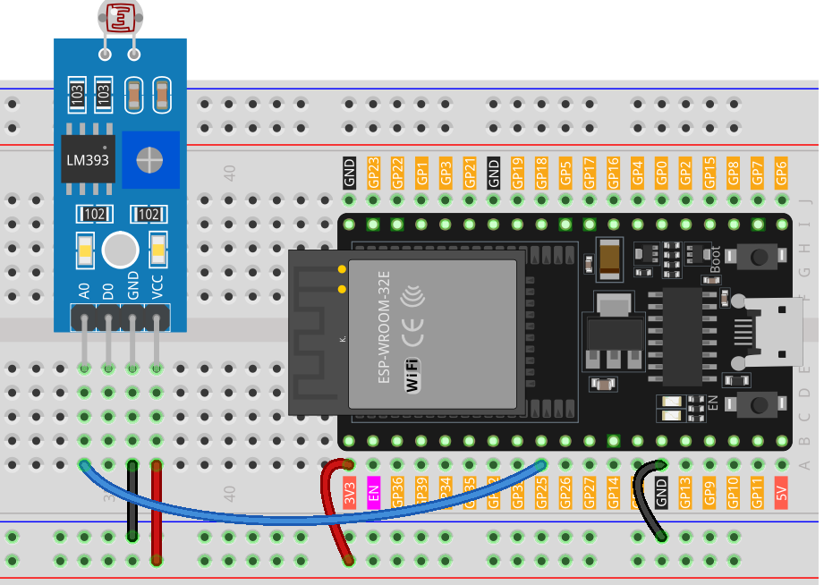

.. note:: 

    ¡Hola, bienvenido a la comunidad de entusiastas de SunFounder en Facebook sobre Raspberry Pi, Arduino y ESP32! Sumérgete más a fondo en Raspberry Pi, Arduino y ESP32 con otros entusiastas.

    **¿Por qué unirse?**

    - **Soporte de Expertos**: Resuelve problemas posventa y desafíos técnicos con la ayuda de nuestra comunidad y equipo.
    - **Aprender y Compartir**: Intercambia consejos y tutoriales para mejorar tus habilidades.
    - **Previsualizaciones Exclusivas**: Obtén acceso anticipado a anuncios de nuevos productos y avances exclusivos.
    - **Descuentos Especiales**: Disfruta de descuentos exclusivos en nuestros productos más nuevos.
    - **Promociones Festivas y Sorteos**: Participa en sorteos y promociones festivas.

    👉 ¿Listo para explorar y crear con nosotros? Haz clic en [|link_sf_facebook|] ¡y únete hoy!

.. _esp32_lesson11_photoresistor:

Lección 11: Módulo Fotocélula
==================================

En esta lección, aprenderás a usar un sensor de fotocélula con una placa de desarrollo ESP32 para medir la intensidad de luz. Exploraremos cómo el sensor detecta diferentes niveles de luz, procesa y muestra estas lecturas en el monitor serial. Este proyecto es ideal para principiantes, ya que proporciona experiencia práctica con sensores analógicos y manejo de datos en tiempo real en la programación de Arduino.

Componentes Requeridos
--------------------------

En este proyecto, necesitamos los siguientes componentes.

Es definitivamente conveniente comprar un kit completo, aquí está el enlace:

.. list-table::
    :widths: 20 20 20
    :header-rows: 1

    *   - Nombre
        - ARTÍCULOS EN ESTE KIT
        - ENLACE
    *   - Kit Universal de Sensores para Creadores
        - 94
        - |link_umsk|

También puedes comprarlos por separado desde los siguientes enlaces.

.. list-table::
    :widths: 30 20
    :header-rows: 1

    *   - Introducción al Componente
        - Enlace de Compra

    *   - ESP32 & Placa de Desarrollo (:ref:`cpn_esp32_wroom_32e`)
        - |link_esp32_camera_pro_kit_buy|
    *   - :ref:`cpn_photoresistor`
        - |link_photoresistor_sensor_module_buy|
    *   - :ref:`cpn_breadboard`
        - |link_breadboard_buy|

Cableado
---------------------------

Código
---------------------------

.. raw:: html

    <iframe src=https://create.arduino.cc/editor/sunfounder01/d66fd803-df3b-4afd-9986-b335e0739241/preview?embed style="height:510px;width:100%;margin:10px 0" frameborder=0></iframe>

Análisis del Código
---------------------------

#. **Configuración del Pin del Sensor y Comunicación Serial**

   Comenzamos definiendo el pin del sensor e inicializando la comunicación serial en la función de configuración. La fotocélula se conecta al pin 25.

   .. code-block:: arduino

      const int sensorPin = 25;  // Pin conectado a la fotocélula

      void setup() {
        Serial.begin(9600);  // Iniciar la comunicación serial a 9600 baudios
      }

#. **Lectura y Visualización de los Datos del Sensor**

   En la función loop, leemos continuamente el valor analógico del sensor y lo imprimimos en el Monitor Serial. También agregamos un breve retraso para estabilizar las lecturas.

   .. code-block:: arduino

      void loop() {
        Serial.println(analogRead(sensorPin));  // Leer e imprimir el valor analógico
        delay(50);                              // Breve retraso para estabilizar las lecturas
      }

