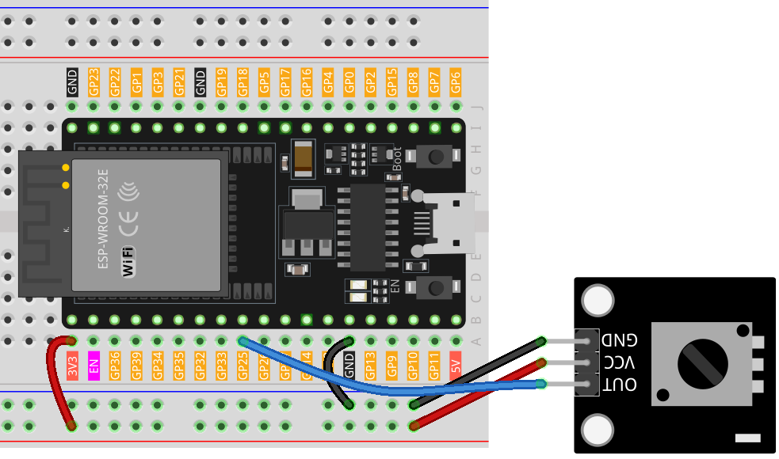

.. note::

    Bonjour, bienvenue dans la communauté des passionnés de SunFounder Raspberry Pi, Arduino et ESP32 sur Facebook ! Plongez plus profondément dans l’univers de Raspberry Pi, Arduino et ESP32 aux côtés d’autres passionnés.

    **Pourquoi rejoindre ?**

    - **Support d'experts** : Résolvez les problèmes post-vente et relevez les défis techniques avec l'aide de notre communauté et de notre équipe.
    - **Apprendre & Partager** : Échangez des conseils et des tutoriels pour améliorer vos compétences.
    - **Aperçus exclusifs** : Accédez en avant-première aux annonces de nouveaux produits et à des avant-goûts exclusifs.
    - **Réductions spéciales** : Bénéficiez de remises exclusives sur nos dernières nouveautés.
    - **Promotions festives et cadeaux** : Participez à des jeux concours et à des promotions spéciales pour les fêtes.

    👉 Prêt à explorer et à créer avec nous ? Cliquez sur [|link_sf_facebook|] et rejoignez-nous dès aujourd'hui !

.. _esp32_lesson13_potentiometer:

Leçon 13 : Module Potentiomètre
==================================

Dans cette leçon, vous apprendrez à lire la valeur analogique d’un potentiomètre à l’aide de la carte de développement ESP32. Nous connecterons un module potentiomètre à la broche 25 et observerons les variations des valeurs analogiques (0-4095) sur le moniteur série. Ce projet offre une expérience pratique pour comprendre les entrées analogiques et la communication série, ce qui en fait un excellent exercice pour les débutants souhaitant explorer les capacités de l'ESP32.

Composants requis
--------------------------

Dans ce projet, nous avons besoin des composants suivants.

Il est certainement plus pratique d'acheter un kit complet, voici le lien :

.. list-table::
    :widths: 20 20 20
    :header-rows: 1

    *   - Nom
        - ÉLÉMENTS DANS CE KIT
        - LIEN
    *   - Kit Capteurs Universel pour Makers
        - 94
        - |link_umsk|

Vous pouvez également les acheter séparément via les liens ci-dessous.

.. list-table::
    :widths: 30 20
    :header-rows: 1

    *   - Présentation du composant
        - Lien d'achat

    *   - ESP32 & Carte de développement (:ref:`cpn_esp32_wroom_32e`)
        - |link_esp32_camera_pro_kit_buy|
    *   - :ref:`cpn_potentiometer`
        - |link_potentiometer_sensor_module_buy|
    *   - :ref:`cpn_breadboard`
        - |link_breadboard_buy|

Câblage
---------------------------

Code
---------------------------

.. raw:: html

    <iframe src=https://create.arduino.cc/editor/sunfounder01/80644221-74b4-4df5-804e-236fdc4ab30e/preview?embed style="height:510px;width:100%;margin:10px 0" frameborder=0></iframe>

Analyse du code
---------------------------

#. Cette ligne de code définit le numéro de broche auquel le potentiomètre est connecté sur la carte ESP32.

   .. code-block:: arduino

      const int sensorPin = 25;

#. La fonction ``setup()`` est une fonction spéciale d'Arduino qui s'exécute une seule fois lorsque l'ESP32 est mis sous tension ou réinitialisé. Dans ce projet, la commande ``Serial.begin(9600)`` initialise la communication série à un débit de 9600 bauds.

   .. code-block:: arduino

      void setup() {
        Serial.begin(9600);  
      }

#. La fonction ``loop()`` est la fonction principale où le programme s'exécute en continu. Dans cette fonction, ``analogRead()`` lit la valeur analogique du potentiomètre et l'affiche sur le moniteur série via ``Serial.println()``. La commande ``delay(50)`` suspend l'exécution du programme pendant 50 millisecondes avant d’effectuer une nouvelle lecture.

   .. code-block:: arduino

      void loop() {
        Serial.println(analogRead(sensorPin));  
        delay(50);
      }
