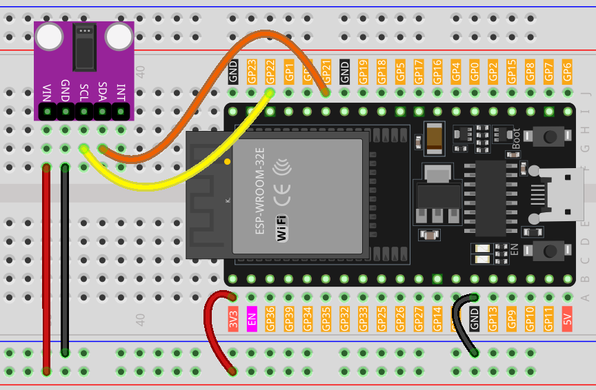

.. note::

    Bonjour, bienvenue dans la communauté des passionnés de SunFounder Raspberry Pi, Arduino et ESP32 sur Facebook ! Plongez plus profondément dans l’univers de Raspberry Pi, Arduino et ESP32 aux côtés d’autres passionnés.

    **Pourquoi rejoindre ?**

    - **Support d'experts** : Résolvez les problèmes après-vente et relevez les défis techniques avec l'aide de notre communauté et de notre équipe.
    - **Apprendre & Partager** : Échangez des conseils et des tutoriels pour améliorer vos compétences.
    - **Aperçus exclusifs** : Accédez en avant-première aux annonces de nouveaux produits et à des démonstrations exclusives.
    - **Réductions spéciales** : Bénéficiez de remises exclusives sur nos dernières nouveautés.
    - **Promotions festives et cadeaux** : Participez à des jeux concours et à des promotions spéciales pour les fêtes.

    👉 Prêt à explorer et à créer avec nous ? Cliquez sur [|link_sf_facebook|] et rejoignez-nous dès aujourd'hui !

.. _esp32_lesson14_max30102:

Leçon 14 : Module Oxymètre de pouls et Capteur de fréquence cardiaque (MAX30102)
==================================================================================

Dans cette leçon, vous apprendrez à mesurer la fréquence cardiaque à l’aide d’une carte de développement ESP32 et du capteur MAX30102. Nous verrons comment configurer le capteur, lire les valeurs infrarouges et calculer avec précision les battements par minute (BPM). Ce projet est idéal pour ceux qui s’intéressent aux systèmes de surveillance de la santé et offre une introduction précieuse à l’utilisation des capteurs biomédicaux avec l’ESP32.

.. warning::
    Ce projet détecte le rythme cardiaque optiquement. Cette méthode est délicate et sujette à des erreurs de mesure. **NE L'UTILISEZ PAS** pour un diagnostic médical réel.

Composants requis
--------------------------

Dans ce projet, nous avons besoin des composants suivants.

Il est certainement plus pratique d'acheter un kit complet, voici le lien :

.. list-table::
    :widths: 20 20 20
    :header-rows: 1

    *   - Nom
        - ÉLÉMENTS DANS CE KIT
        - LIEN
    *   - Kit Capteurs Universel pour Makers
        - 94
        - |link_umsk|

Vous pouvez également les acheter séparément via les liens ci-dessous.

.. list-table::
    :widths: 30 20
    :header-rows: 1

    *   - Présentation du composant
        - Lien d'achat

    *   - ESP32 & Carte de développement (:ref:`cpn_esp32_wroom_32e`)
        - |link_esp32_camera_pro_kit_buy|
    *   - :ref:`cpn_max30102`
        - |link_max30102_module_buy|
    *   - :ref:`cpn_breadboard`
        - |link_breadboard_buy|

Câblage
---------------------------

Code
---------------------------

.. note:: 
   Pour installer la bibliothèque, utilisez le gestionnaire de bibliothèques Arduino et recherchez **"SparkFun MAX3010x"**, puis installez-la.

.. raw:: html

    <iframe src=https://create.arduino.cc/editor/sunfounder01/a59539a0-dab1-414e-a195-3d221a61c9a9/preview?embed style="height:510px;width:100%;margin:10px 0" frameborder=0></iframe>

Analyse du code
---------------------------

1. **Inclusion des bibliothèques et initialisation des variables globales** :

   Les bibliothèques essentielles sont importées, l’objet capteur est instancié et les variables globales pour la gestion des données sont définies.

   .. note:: 
      Pour installer la bibliothèque, utilisez le gestionnaire de bibliothèques Arduino et recherchez **"SparkFun MAX3010x"**, puis installez-la.

   .. code-block:: arduino
    
      #include <Wire.h>
      #include "MAX30105.h"
      #include "heartRate.h"
      MAX30105 particleSensor;
      // ... (autres variables globales)

2. **Fonction setup() et initialisation du capteur** :

   La communication série est initialisée avec un débit de 9600 bauds. La connexion du capteur est vérifiée, et en cas de succès, une séquence d’initialisation est exécutée. Si le capteur n’est pas détecté, un message d’erreur est affiché.

   .. code-block:: arduino

      void setup() {
        Serial.begin(9600);
        if (!particleSensor.begin(Wire, I2C_SPEED_FAST)) {
          Serial.println("MAX30102 not found.");
          while (1) ;  // Boucle infinie si le capteur n'est pas détecté.
        }
        // ... (autres configurations)

3. **Lecture des valeurs IR et détection du battement cardiaque** :

   La valeur IR, qui reflète le flux sanguin, est récupérée depuis le capteur. La fonction ``checkForBeat()`` détermine si un battement cardiaque est détecté en fonction de cette valeur.

   .. code-block:: arduino

      long irValue = particleSensor.getIR();
      if (checkForBeat(irValue) == true) {
          // ... (actions en cas de détection de battement)
      }

4. **Calcul des battements par minute (BPM)** :

   Lorsqu’un battement cardiaque est détecté, le BPM est calculé en fonction du temps écoulé depuis le dernier battement. Le code s'assure également que la valeur du BPM est réaliste avant de mettre à jour la moyenne.

   .. code-block:: arduino

      long delta = millis() - lastBeat;
      beatsPerMinute = 60 / (delta / 1000.0);
      if (beatsPerMinute < 255 && beatsPerMinute > 20) {
          // ... (stockage et calcul de la moyenne du BPM)
      }

5. **Affichage des valeurs sur le moniteur série** :

   La valeur IR, le BPM actuel et le BPM moyen sont affichés sur le moniteur série. De plus, le code vérifie si la valeur IR est trop faible, ce qui suggère l'absence d’un doigt sur le capteur.

   .. code-block:: arduino

      // Affichage de la valeur IR, du BPM actuel et du BPM moyen sur le moniteur série
      Serial.print("IR=");
      Serial.print(irValue);
      Serial.print(", BPM=");
      Serial.print(beatsPerMinute);
      Serial.print(", Avg BPM=");
      Serial.print(beatAvg);

      if (irValue < 50000)
        Serial.print(" No finger?");