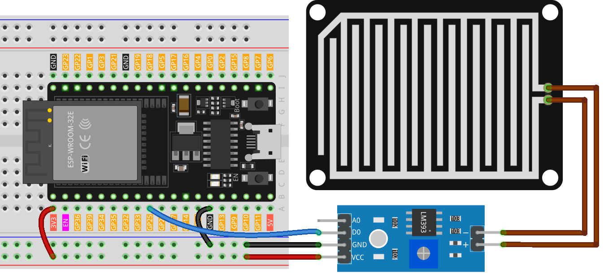

.. note::

    Bonjour, bienvenue dans la communauté des passionnés de SunFounder Raspberry Pi, Arduino et ESP32 sur Facebook ! Plongez dans l’univers de Raspberry Pi, Arduino et ESP32 avec d’autres passionnés.

    **Pourquoi rejoindre ?**

    - **Support d'experts** : Résolvez les problèmes après-vente et relevez les défis techniques grâce à l’aide de notre communauté et de notre équipe.
    - **Apprendre & Partager** : Échangez des conseils et des tutoriels pour améliorer vos compétences.
    - **Aperçus exclusifs** : Bénéficiez d’un accès anticipé aux annonces de nouveaux produits et à des démonstrations exclusives.
    - **Réductions spéciales** : Profitez de remises exclusives sur nos dernières nouveautés.
    - **Promotions festives et cadeaux** : Participez à des jeux concours et à des offres promotionnelles spéciales pour les fêtes.

    👉 Prêt à explorer et créer avec nous ? Cliquez sur [|link_sf_facebook|] et rejoignez-nous dès aujourd’hui !

.. _esp32_lesson15_raindrop:

Leçon 15 : Module de détection de pluie
===========================================

Dans cette leçon, vous apprendrez à utiliser un capteur de détection de pluie avec une carte de développement ESP32. Nous verrons comment lire les signaux numériques du capteur lorsqu’il détecte de l’eau de pluie et comment afficher ces informations sur le moniteur série. Ce projet constitue une introduction ludique à la gestion des entrées et sorties numériques en programmation microcontrôleur, ce qui le rend idéal pour les débutants en électronique et en programmation sur la plateforme ESP32.

Composants requis
--------------------------

Dans ce projet, nous avons besoin des composants suivants.

Il est plus pratique d’acheter un kit complet, voici le lien :

.. list-table::
    :widths: 20 20 20
    :header-rows: 1

    *   - Nom
        - ÉLÉMENTS DANS CE KIT
        - LIEN
    *   - Kit Capteurs Universel pour Makers
        - 94
        - |link_umsk|

Vous pouvez également les acheter séparément via les liens ci-dessous.

.. list-table::
    :widths: 30 20
    :header-rows: 1

    *   - Présentation du composant
        - Lien d’achat

    *   - ESP32 & Carte de développement (:ref:`cpn_esp32_wroom_32e`)
        - |link_esp32_camera_pro_kit_buy|
    *   - :ref:`cpn_raindrop`
        - |link_raindrop_sensor_module_buy|
    *   - :ref:`cpn_breadboard`
        - |link_breadboard_buy|

Câblage
---------------------------

Code
---------------------------

.. raw:: html

    <iframe src=https://create.arduino.cc/editor/sunfounder01/5aff47ab-22c5-4500-bbe3-fefc55f6e40f/preview?embed style="height:510px;width:100%;margin:10px 0" frameborder=0></iframe>

Analyse du code
---------------------------

1. Définition de la broche du capteur

   Ici, une constante entière nommée ``sensorPin`` est définie et assignée à la valeur 25. Cela correspond à la broche numérique de la carte ESP32 où le capteur de détection de pluie est connecté.

   .. code-block:: arduino

       const int sensorPin = 25;

2. Configuration de la broche et initialisation de la communication série.

   Dans la fonction ``setup()``, deux étapes essentielles sont effectuées. Tout d’abord, ``pinMode()`` est utilisé pour configurer ``sensorPin`` en tant qu’entrée, permettant ainsi de lire les valeurs numériques du capteur de pluie. Ensuite, la communication série est initialisée avec un débit de 9600 bauds.

   .. code-block:: arduino

       void setup() {
         pinMode(sensorPin, INPUT);
         Serial.begin(9600);
       }

3. Lecture de la valeur numérique et affichage sur le moniteur série.

   La fonction ``loop()`` lit en continu la valeur numérique du capteur de pluie à l’aide de ``digitalRead()``. Cette valeur (HIGH ou LOW) est affichée sur le moniteur série. Lorsque des gouttes de pluie sont détectées, le moniteur série affichera 0 ; en l’absence de pluie, il affichera 1. Le programme attend ensuite 50 millisecondes avant de refaire une lecture.

   .. code-block:: arduino

       void loop() {
         Serial.println(digitalRead(sensorPin));
         delay(50);
       }
