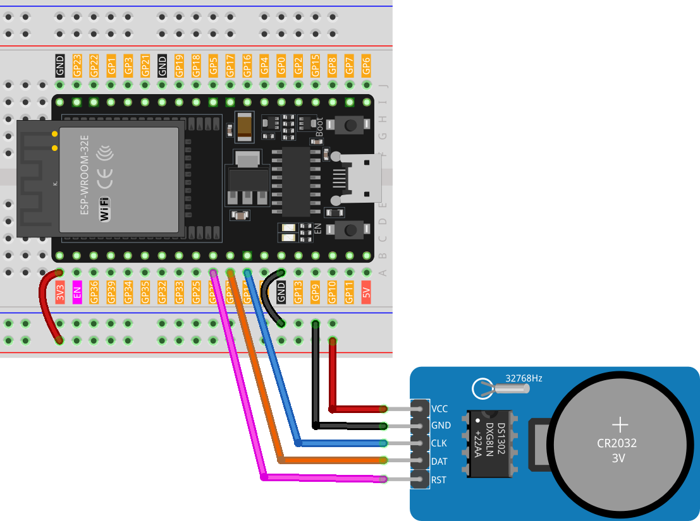

.. note::

    Ciao, benvenuto nella Comunità di Appassionati di Raspberry Pi, Arduino e ESP32 di SunFounder su Facebook! Approfondisci le tue conoscenze su Raspberry Pi, Arduino e ESP32 con altri appassionati.

    **Why Join?**

    - **Expert Support**: Risolvi problemi post-vendita e sfide tecniche con il supporto della nostra comunità e del nostro team.
    - **Learn & Share**: Scambia consigli e tutorial per migliorare le tue competenze.
    - **Exclusive Previews**: Ottieni accesso anticipato ad annunci di nuovi prodotti e anteprime esclusive.
    - **Special Discounts**: Godi di sconti esclusivi sui nostri prodotti più recenti.
    - **Festive Promotions and Giveaways**: Partecipa a giveaway e promozioni festive.

    👉 Pronto a esplorare e creare con noi? Clicca [|link_sf_facebook|] e unisciti oggi!

.. _esp32_lesson16_ds1306:

Lezione 16: Modulo Orologio in Tempo Reale (DS1302)
=======================================================

In questa lezione, imparerai come configurare e utilizzare un modulo orologio in tempo reale (RTC) con una scheda di sviluppo ESP32. Tratteremo l'integrazione del modulo RTC DS1302, la comprensione delle sue funzioni e la programmazione dell'ESP32 per visualizzare la data e l'ora attuali. Imparerai anche come gestire le situazioni in cui l'RTC ha perso le sue impostazioni di data e ora e impostarlo automaticamente sull'ora di compilazione del tuo sketch. Questo progetto è ideale per coloro che cercano di migliorare la loro comprensione delle funzioni legate al tempo nei progetti con microcontrollori.

Componenti Necessari
---------------------------

Per questo progetto, abbiamo bisogno dei seguenti componenti.

È decisamente conveniente acquistare un kit completo, ecco il link:

.. list-table::
    :widths: 20 20 20
    :header-rows: 1

    *   - Nome	
        - ELEMENTI IN QUESTO KIT
        - LINK
    *   - Kit Sensori Universale Maker
        - 94
        - |link_umsk|

Puoi anche acquistarli separatamente dai link qui sotto.

.. list-table::
    :widths: 30 20
    :header-rows: 1

    *   - Introduzione al Componente
        - Link d'acquisto

    *   - ESP32 & Scheda di Sviluppo (:ref:`cpn_esp32_wroom_32e`)
        - |link_esp32_camera_pro_kit_buy|
    *   - :ref:`cpn_rtc_ds1302`
        - |link_ds1302_module_buy|
    *   - :ref:`cpn_breadboard`
        - |link_breadboard_buy|

Cablaggio
---------------------------

Codice
---------------------------

.. note:: 
   Per installare la libreria, usa il Gestore delle Librerie di Arduino e cerca **"Rtc by Makuna"** e installala.

.. raw:: html

    <iframe src=https://create.arduino.cc/editor/sunfounder01/12a5464b-7a6e-48e1-b43e-ca585cb9e310/preview?embed style="height:510px;width:100%;margin:10px 0" frameborder=0></iframe>

Analisi del Codice
---------------------------

1. Inizializzazione e inclusione delle librerie

   .. note:: 
      Per installare la libreria, usa il Gestore delle Librerie di Arduino e cerca **"Rtc by Makuna"** e installala.

   Qui, vengono incluse le librerie necessarie per il modulo RTC DS1302.

   .. code-block:: arduino

      #include <ThreeWire.h>
      #include <RtcDS1302.h>

2. Definizione dei pin e creazione dell'istanza RTC

   I pin per la comunicazione sono definiti e viene creata un'istanza dell'RTC.

   .. code-block:: arduino

      const int IO = 27;    // DAT
      const int SCLK = 14;  // CLK
      const int CE = 26;    // RST

      ThreeWire myWire(IO, SCLK, CE));
      RtcDS1302<ThreeWire> Rtc(myWire);

3. Funzione ``setup()``

   Questa funzione inizia la comunicazione seriale e configura il modulo RTC. Si effettuano vari controlli per assicurarsi che l'RTC funzioni correttamente.

   .. code-block:: arduino

      void setup() {
        Serial.begin(9600);
      
        Serial.print("compiled: ");
        Serial.print(__DATE__);
        Serial.println(__TIME__);
      
        Rtc.Begin();
      
        RtcDateTime compiled = RtcDateTime(__DATE__, __TIME__);
        printDateTime(compiled);
        Serial.println();
      
        if (!Rtc.IsDateTimeValid()) {
          // Common Causes:
          //    1) first time you ran and the device wasn't running yet
          //    2) the battery on the device is low or even missing
      
          Serial.println("RTC lost confidence in the DateTime!");
          Rtc.SetDateTime(compiled);
        }
      
        if (Rtc.GetIsWriteProtected()) {
          Serial.println("RTC was write protected, enabling writing now");
          Rtc.SetIsWriteProtected(false);
        }
      
        if (!Rtc.GetIsRunning()) {
          Serial.println("RTC was not actively running, starting now");
          Rtc.SetIsRunning(true);
        }
      
        RtcDateTime now = Rtc.GetDateTime();
        if (now < compiled) {
          Serial.println("RTC is older than compile time!  (Updating DateTime)");
          Rtc.SetDateTime(compiled);
        } else if (now > compiled) {
          Serial.println("RTC is newer than compile time. (this is expected)");
        } else if (now == compiled) {
          Serial.println("RTC is the same as compile time! (not expected but all is fine)");
        }
      }

4. Funzione ``loop()``

   Questa funzione recupera periodicamente la data e l'ora correnti dall'RTC e le stampa sul monitor seriale. Controlla anche se l'RTC mantiene ancora una data e un'ora valide.

   .. code-block:: arduino

      void loop() {
        RtcDateTime now = Rtc.GetDateTime();
      
        printDateTime(now);
        Serial.println();
      
        if (!now.IsValid()) {
          // Common Causes:
          //    1) the battery on the device is low or even missing and the power line was disconnected
          Serial.println("RTC lost confidence in the DateTime!");
        }
      
        delay(5000);  // cinque secondi
      }

5. Funzione di stampa di data e ora

   Una funzione di aiuto che prende un oggetto ``RtcDateTime`` e stampa la data e l'ora formattate sul monitor seriale.

   .. code-block:: arduino

      void printDateTime(const RtcDateTime& dt) {
        char datestring[20];
      
        snprintf_P(datestring,
                   countof(datestring),
                   PSTR("%02u/%02u/%04u %02u:%02u:%02u"),
                   dt.Month(),
                   dt.Day(),
                   dt.Year(),
                   dt.Hour(),
                   dt.Minute(),
                   dt.Second());
        Serial.print(datestring);
      }
