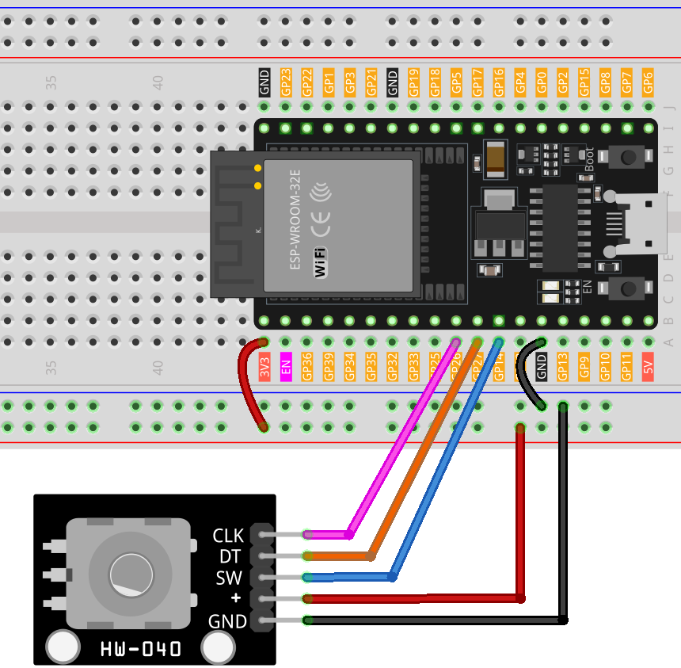

.. note:: 

    ¡Hola, bienvenido a la Comunidad de Entusiastas de Raspberry Pi, Arduino y ESP32 de SunFounder en Facebook! Profundiza en Raspberry Pi, Arduino y ESP32 con otros entusiastas.

    **¿Por qué unirse?**

    - **Soporte experto**: Resuelve problemas postventa y desafíos técnicos con la ayuda de nuestra comunidad y equipo.
    - **Aprende y comparte**: Intercambia consejos y tutoriales para mejorar tus habilidades.
    - **Vistas exclusivas**: Obtén acceso anticipado a nuevos anuncios de productos y adelantos.
    - **Descuentos especiales**: Disfruta de descuentos exclusivos en nuestros productos más nuevos.
    - **Promociones festivas y sorteos**: Participa en sorteos y promociones especiales de temporada.

    👉 ¿Listo para explorar y crear con nosotros? Haz clic en [|link_sf_facebook|] y únete hoy mismo!

.. _esp32_lesson17_rotary_encoder:

Lección 17: Módulo de Codificador Rotatorio
==============================================

En esta lección, aprenderás a usar una placa de desarrollo ESP32 junto con un módulo de codificador rotatorio para detectar la dirección y el conteo de rotaciones, así como los pulsos de botón. Exploraremos cómo el codificador detecta las rotaciones en sentido horario y antihorario, e incrementa o decrementa un contador según corresponda. Además, aprenderás a detectar pulsaciones de botones en el módulo del codificador. Este proyecto es ideal para aquellos interesados en obtener experiencia práctica en el manejo de codificadores rotatorios y la lectura de entradas digitales, mejorando tus habilidades en el uso de la plataforma ESP32 y la programación de Arduino.

Componentes requeridos
-------------------------

En este proyecto, necesitamos los siguientes componentes.

Definitivamente es conveniente comprar un kit completo, aquí está el enlace:

.. list-table::
    :widths: 20 20 20
    :header-rows: 1

    *   - Nombre
        - ARTÍCULOS EN ESTE KIT
        - ENLACE
    *   - Kit Sensor Universal Maker
        - 94
        - |link_umsk|

También puedes comprarlos por separado desde los enlaces a continuación.

.. list-table::
    :widths: 30 20
    :header-rows: 1

    *   - Introducción al componente
        - Enlace de compra

    *   - ESP32 y placa de desarrollo (:ref:`cpn_esp32_wroom_32e`)
        - |link_esp32_camera_pro_kit_buy|
    *   - :ref:`cpn_rotary_encoder`
        - \-
    *   - :ref:`cpn_breadboard`
        - |link_breadboard_buy|

Cableado
------------

Código
--------

.. raw:: html

    <iframe src=https://create.arduino.cc/editor/sunfounder01/0ba81725-2139-4c8c-9575-c4d343be6708/preview?embed style="height:510px;width:100%;margin:10px 0" frameborder=0></iframe>

Análisis del código
----------------------

#. **Configuración e inicialización**

   .. code-block:: arduino

      void setup() {
        pinMode(CLK, INPUT);
        pinMode(DT, INPUT);
        pinMode(SW, INPUT_PULLUP);
        Serial.begin(9600);
        lastStateCLK = digitalRead(CLK);
      }

   En la función de configuración, se establecen los pines digitales conectados al CLK y DT del codificador como entradas. El pin SW, que está conectado al botón, se establece como entrada con una resistencia pull-up interna. Esta configuración elimina la necesidad de una resistencia pull-up externa. La comunicación serial se inicia a una velocidad de 9600 baudios para habilitar la visualización de los datos en el monitor serial. Se lee y almacena el estado inicial del pin CLK.

#. **Bucle principal: Lectura del estado del codificador y del botón**

   .. code-block:: arduino

      void loop() {
        currentStateCLK = digitalRead(CLK);
        if (currentStateCLK != lastStateCLK && currentStateCLK == 1) {
          if (digitalRead(DT) != currentStateCLK) {
            counter--;
            currentDir = "CCW";
          } else {
            counter++;
            currentDir = "CW";
          }
          Serial.print("Direction: ");
          Serial.print(currentDir);
          Serial.print(" | Counter: ");
          Serial.println(counter);
        }
        lastStateCLK = currentStateCLK;
        int btnState = digitalRead(SW);
        if (btnState == LOW) {
          if (millis() - lastButtonPress > 50) {
            Serial.println("Button pressed!");
          }
          lastButtonPress = millis();
        }
        delay(1);
      }

   En la función loop, el programa lee continuamente el estado actual del pin CLK. Si hay un cambio en el estado, esto indica que se ha producido una rotación. La dirección de la rotación se determina comparando los estados de los pines CLK y DT. Si son diferentes, indica rotación en sentido antihorario (CCW); de lo contrario, es en sentido horario (CW). El contador del codificador se incrementa o decrementa en consecuencia. Esta información se envía al monitor serial.
   

   El estado del botón se lee desde el pin SW. Si es bajo (presionado), se implementa un mecanismo de "debounce" verificando el tiempo transcurrido desde la última pulsación del botón. Si han pasado más de 50 milisegundos, se considera una pulsación válida y se envía un mensaje al monitor serial. El `delay(1)` al final ayuda en el "debounce".
