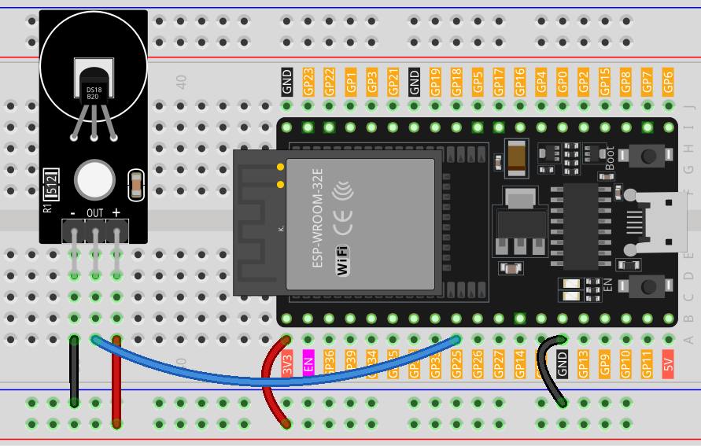

.. note::

    Ciao, benvenuto nella Comunità di Appassionati di Raspberry Pi, Arduino e ESP32 di SunFounder su Facebook! Approfondisci le tue conoscenze su Raspberry Pi, Arduino e ESP32 con altri appassionati.

    **Why Join?**

    - **Expert Support**: Risolvi problemi post-vendita e sfide tecniche con il supporto della nostra comunità e del nostro team.
    - **Learn & Share**: Scambia consigli e tutorial per migliorare le tue competenze.
    - **Exclusive Previews**: Ottieni accesso anticipato ad annunci di nuovi prodotti e anteprime esclusive.
    - **Special Discounts**: Godi di sconti esclusivi sui nostri prodotti più recenti.
    - **Festive Promotions and Giveaways**: Partecipa a giveaway e promozioni festive.

    👉 Pronto a esplorare e creare con noi? Clicca [|link_sf_facebook|] e unisciti oggi!

.. _esp32_lesson18_ds18b20:

Lezione 18: Modulo Sensore di Temperatura (DS18B20)
=======================================================

In questa lezione, imparerai come leggere i dati di temperatura da un modulo sensore di temperatura DS18B20 utilizzando una scheda di sviluppo ESP32. Useremo la libreria DallasTemperature per interfacciarci con il sensore e visualizzare le letture della temperatura sia in gradi Celsius che Fahrenheit sul Monitor Seriale.

Componenti Necessari
--------------------------

Per questo progetto, abbiamo bisogno dei seguenti componenti.

È decisamente conveniente acquistare un kit completo, ecco il link:

.. list-table::
    :widths: 20 20 20
    :header-rows: 1

    *   - Nome	
        - ELEMENTI IN QUESTO KIT
        - LINK
    *   - Kit Sensori Universale Maker
        - 94
        - |link_umsk|

Puoi anche acquistarli separatamente dai link qui sotto.

.. list-table::
    :widths: 30 20
    :header-rows: 1

    *   - Introduzione al Componente
        - Link d'acquisto

    *   - ESP32 & Scheda di Sviluppo (:ref:`cpn_esp32_wroom_32e`)
        - |link_esp32_camera_pro_kit_buy|
    *   - :ref:`cpn_ds18b20`
        - \-
    *   - :ref:`cpn_breadboard`
        - |link_breadboard_buy|

Cablaggio
---------------------------

Codice
---------------------------

.. note:: 
   Per installare la libreria, utilizza il Gestore delle Librerie di Arduino e cerca **"DallasTemperature"** e installala.

.. raw:: html

    <iframe src=https://create.arduino.cc/editor/sunfounder01/08628842-3743-431f-871e-51b51ae1851f/preview?embed style="height:510px;width:100%;margin:10px 0" frameborder=0></iframe>

Analisi del Codice
---------------------------

1. Inclusione delle biblioteche

   L'inclusione delle librerie OneWire e DallasTemperature permette la comunicazione con il sensore DS18B20.

   .. note:: 
      Per installare la libreria, utilizza il Gestore delle Librerie di Arduino e cerca **"DallasTemperature"** e installala.

   .. code-block:: arduino

      #include <OneWire.h>
      #include <DallasTemperature.h>

2. Definizione del pin dei dati del sensore

   Il DS18B20 è collegato al pin digitale 25 dell'Arduino.

   .. code-block:: arduino

      #define ONE_WIRE_BUS 25

3. Inizializzazione del sensore

   Viene creata e inizializzata un'istanza di OneWire e un oggetto DallasTemperature.

   .. code-block:: arduino

      OneWire oneWire(ONE_WIRE_BUS);	
      DallasTemperature sensors(&oneWire);

4. Funzione di setup

   La funzione ``setup()`` inizializza il sensore e configura la comunicazione seriale.

   .. code-block:: arduino

      void setup(void)
      {
         sensors.begin();	// Avvia la libreria
         Serial.begin(9600);
      }

5. Loop principale

   Nella funzione ``loop()``, il programma richiede letture della temperatura e le stampa sia in Celsius che in Fahrenheit.

   .. code-block:: arduino

      void loop(void)
      { 
         sensors.requestTemperatures();
         Serial.print("Temperature: ");
         Serial.print(sensors.getTempCByIndex(0));
         Serial.print("℃ | ");
         Serial.print((sensors.getTempCByIndex(0) * 9.0) / 5.0 + 32.0);
         Serial.println("℉");
         delay(500);
      }