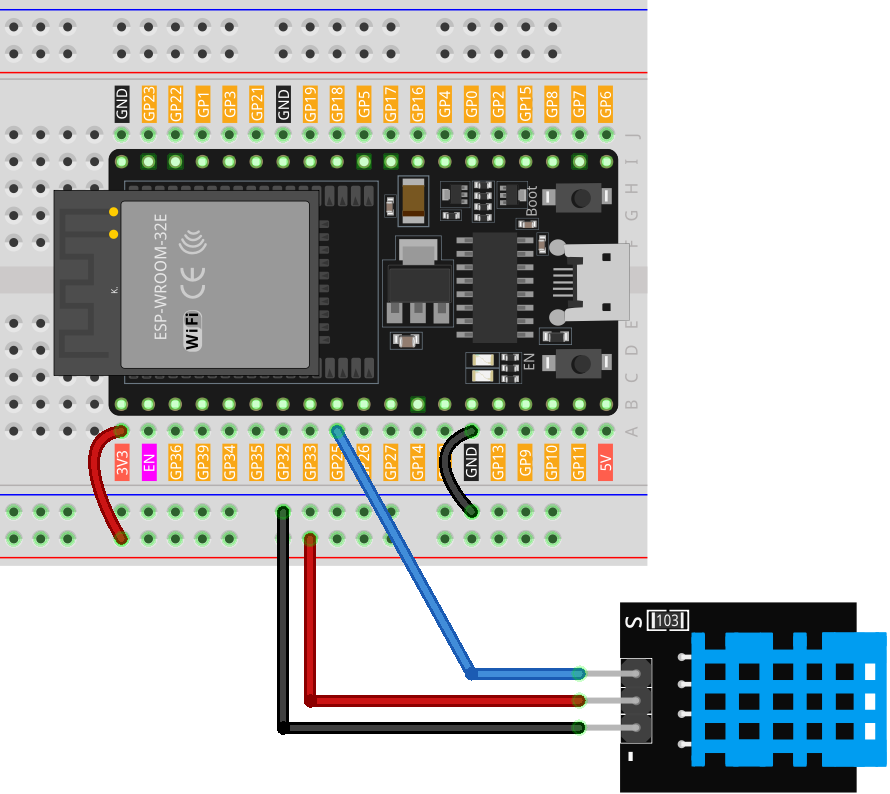
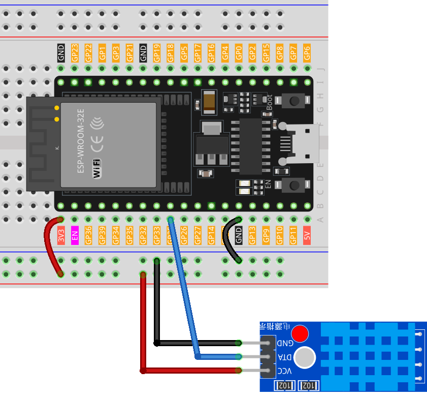

.. note::

    Bonjour, bienvenue dans la communauté des passionnés de SunFounder Raspberry Pi, Arduino et ESP32 sur Facebook ! Plongez dans l’univers de Raspberry Pi, Arduino et ESP32 avec d’autres passionnés.

    **Pourquoi rejoindre ?**

    - **Support d'experts** : Résolvez les problèmes après-vente et relevez les défis techniques grâce à l’aide de notre communauté et de notre équipe.
    - **Apprendre & Partager** : Échangez des conseils et des tutoriels pour améliorer vos compétences.
    - **Aperçus exclusifs** : Bénéficiez d’un accès anticipé aux annonces de nouveaux produits et à des démonstrations exclusives.
    - **Réductions spéciales** : Profitez de remises exclusives sur nos dernières nouveautés.
    - **Promotions festives et cadeaux** : Participez à des jeux concours et à des offres promotionnelles spéciales pour les fêtes.

    👉 Prêt à explorer et créer avec nous ? Cliquez sur [|link_sf_facebook|] et rejoignez-nous dès aujourd’hui !

.. _esp32_lesson19_dht11:

Leçon 19 : Module Capteur de Température et d’Humidité (DHT11)
====================================================================

Dans cette leçon, vous apprendrez à lire la température et l’humidité à partir d’un capteur DHT11 à l’aide d’une carte de développement ESP32. Nous aborderons également l’interprétation de ces relevés et le calcul de l’indice de chaleur en degrés Celsius et Fahrenheit. Ce projet est idéal pour les débutants en capteurs environnementaux, offrant une expérience pratique en acquisition de données et en surveillance climatique sur la plateforme ESP32.

Composants requis
--------------------------

Dans ce projet, nous avons besoin des composants suivants.

Il est plus pratique d’acheter un kit complet, voici le lien :

.. list-table::
    :widths: 20 20 20
    :header-rows: 1

    *   - Nom
        - ÉLÉMENTS DANS CE KIT
        - LIEN
    *   - Kit Capteurs Universel pour Makers
        - 94
        - |link_umsk|

Vous pouvez également les acheter séparément via les liens ci-dessous.

.. list-table::
    :widths: 30 10
    :header-rows: 1

    *   - Présentation du composant
        - Lien d’achat

    *   - ESP32 & Carte de développement (:ref:`cpn_esp32_wroom_32e`)
        - |link_esp32_camera_pro_kit_buy|
    *   - :ref:`cpn_dht11`
        - |link_dht11_humiture_buy|
    *   - :ref:`cpn_breadboard`
        - |link_breadboard_buy|

Câblage
---------------------------

.. note:: 
   Le kit peut contenir différentes versions du module DHT11. Veuillez vérifier la méthode de câblage en fonction du module que vous possédez.

.. csv-table:: 
   :header: "module", "diagram"
   :widths: 25, 75

   |dht11_module|, |dht11_module_circuit|
   |dht11_module_withLED|, |dht11_module_withLED_circuit|

.. |dht11_module| image:: img/Lesson_19_dht11_module.png 
   :width: 100px

.. |dht11_module_withLED| image:: img/Lesson_19_dht11_module_withLED.png
   :width: 150px

Code
---------------------------

.. note:: 
   Pour installer la bibliothèque, utilisez le gestionnaire de bibliothèques Arduino et recherchez **"DHT sensor library"**, puis installez-la.

.. raw:: html

    <iframe src=https://create.arduino.cc/editor/sunfounder01/926830ca-9421-4852-ad72-ff75c1f10174/preview?embed style="height:510px;width:100%;margin:10px 0" frameborder=0></iframe>

Analyse du code
---------------------------

#. Inclusion des bibliothèques et définition des constantes 
   Cette partie du code inclut la bibliothèque du capteur DHT et définit le numéro de la broche et le type de capteur utilisé dans ce projet.

   .. note:: 
      Pour installer la bibliothèque, utilisez le gestionnaire de bibliothèques Arduino et recherchez **"DHT sensor library"**, puis installez-la.

   .. code-block:: arduino
    
      #include <DHT.h>
      #define DHTPIN 25       // Définition de la broche de connexion du capteur
      #define DHTTYPE DHT11  // Définition du type de capteur

#. Création de l’objet DHT  
   Ici, nous créons un objet DHT en utilisant la broche et le type de capteur définis.

   .. code-block:: arduino

      DHT dht(DHTPIN, DHTTYPE);  // Création de l’objet DHT

#. Cette fonction est exécutée une seule fois au démarrage de la carte de développement ESP32. Elle initialise la communication série ainsi que le capteur DHT.

   .. code-block:: arduino

      void setup() {
        Serial.begin(9600);
        Serial.println(F("DHT11 test!"));
        dht.begin();  // Initialize the DHT sensor
      }

#. Boucle principale  
   La fonction ``loop()`` s’exécute en continu après la configuration initiale. Ici, nous lisons les valeurs d’humidité et de température, calculons l’indice de chaleur et affichons ces valeurs sur le moniteur série. Si la lecture du capteur échoue (retourne NaN), un message d’erreur est affiché.

   .. note::
    
      L’ |link_heat_index| est une mesure qui prend en compte la température de l’air et l’humidité pour estimer la température ressentie. Il est aussi appelé "température apparente".

   .. code-block:: arduino

      void loop() {
        delay(2000);
        float h = dht.readHumidity();
        float t = dht.readTemperature();
        float f = dht.readTemperature(true);
        if (isnan(h) || isnan(t) || isnan(f)) {
          Serial.println(F("Failed to read from DHT sensor!"));
          return;
        }
        float hif = dht.computeHeatIndex(f, h);
        float hic = dht.computeHeatIndex(t, h, false);
        Serial.print(F("Humidity: "));
        Serial.print(h);
        Serial.print(F("%  Temperature: "));
        Serial.print(t);
        Serial.print(F("°C "));
        Serial.print(f);
        Serial.print(F("°F  Heat index: "));
        Serial.print(hic);
        Serial.print(F("°C "));
        Serial.print(hif);
        Serial.println(F("°F"));
      }