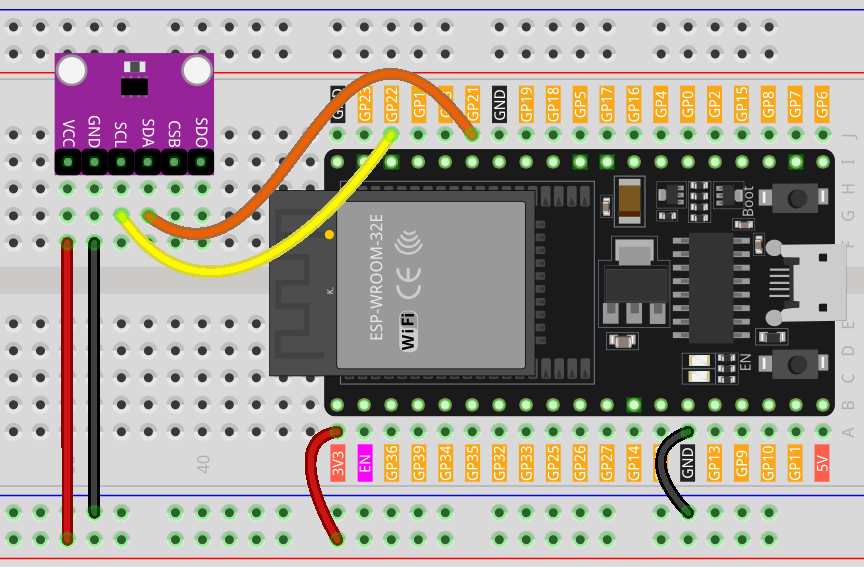

.. note:: 

    Bonjour et bienvenue dans la communauté SunFounder Raspberry Pi & Arduino & ESP32 Enthusiasts sur Facebook ! Plongez plus profondément dans l'univers du Raspberry Pi, de l'Arduino et de l'ESP32 avec d'autres passionnés.

    **Pourquoi rejoindre la communauté ?**

    - **Support d'experts** : Résolvez les problèmes après-vente et relevez les défis techniques avec l'aide de notre communauté et de notre équipe.
    - **Apprendre & partager** : Échangez des astuces et des tutoriels pour améliorer vos compétences.
    - **Aperçus exclusifs** : Accédez en avant-première aux annonces de nouveaux produits et aux aperçus exclusifs.
    - **Réductions spéciales** : Profitez de remises exclusives sur nos derniers produits.
    - **Promotions festives et cadeaux** : Participez à des tirages au sort et à des promotions saisonnières.

    👉 Prêt à explorer et créer avec nous ? Cliquez sur [|link_sf_facebook|] et rejoignez-nous dès aujourd’hui !

.. _esp32_lesson20_bmp280:

Leçon 20 : Capteur de Température, Humidité & Pression (BMP280)
====================================================================

Dans cette leçon, vous apprendrez à mesurer la pression atmosphérique, la température et l'altitude approximative à l'aide du capteur BMP280 et d'une carte de développement ESP32. Nous verrons comment interfacer le capteur avec la bibliothèque Adafruit BMP280 et afficher les relevés sur le moniteur série. Ce tutoriel est idéal pour ceux qui souhaitent approfondir leur compréhension de la détection environnementale et de l'acquisition de données sur la plateforme ESP32.

Composants nécessaires
--------------------------

Pour ce projet, nous aurons besoin des composants suivants.

Il est souvent plus pratique d’acheter un kit complet, voici le lien :

.. list-table::
    :widths: 20 20 20
    :header-rows: 1

    *   - Nom	
        - ÉLÉMENTS DANS CE KIT
        - LIEN
    *   - Kit de capteurs Universal Maker
        - 94
        - |link_umsk|

Vous pouvez également les acheter séparément via les liens ci-dessous.

.. list-table::
    :widths: 30 20
    :header-rows: 1

    *   - Introduction des composants
        - Lien d'achat

    *   - ESP32 & Carte de développement (:ref:`cpn_esp32_wroom_32e`)
        - |link_esp32_camera_pro_kit_buy|
    *   - :ref:`cpn_bmp280`
        - |link_bmp280_module_buy|
    *   - :ref:`cpn_breadboard`
        - |link_breadboard_buy|

Câblage
---------------------------

Code
---------------------------

.. note:: 
   Pour installer la bibliothèque, utilisez le gestionnaire de bibliothèques d’Arduino et recherchez **"Adafruit BMP280"**, puis installez-la.

.. raw:: html

    <iframe src=https://create.arduino.cc/editor/sunfounder01/25c4b695-7d09-47f5-9385-61d239afa214/preview?embed style="height:510px;width:100%;margin:10px 0" frameborder=0></iframe>

Analyse du Code
---------------------------

1. Inclusion des bibliothèques et initialisation. Les bibliothèques nécessaires sont incluses et le capteur BMP280 est initialisé pour la communication via l'interface I2C.

   .. note:: 
      Pour installer la bibliothèque, utilisez le gestionnaire de bibliothèques d’Arduino et recherchez **"Adafruit BMP280"**, puis installez-la. 

   - Bibliothèque Adafruit BMP280 : Fournit une interface facile à utiliser pour le capteur BMP280, permettant de lire la température, la pression et l'altitude. 
   - Wire.h : Utilisé pour la communication I2C.

      .. raw:: html
    
        
    
   .. code-block:: arduino
    
      #include <Wire.h>
      #include <Adafruit_BMP280.h>
      #define BMP280_ADDRESS 0x76
      Adafruit_BMP280 bmp;  // Utilisation de l'interface I2C

2. Fonction ``setup()``. Initialise la communication série, vérifie la présence du capteur BMP280 et configure ses paramètres par défaut.

   .. code-block:: arduino

      void setup() {
        Serial.begin(9600);
        while (!Serial) delay(100);
        Serial.println(F("BMP280 test"));
        unsigned status;
        status = bmp.begin(BMP280_ADDRESS);
        // ... (reste du code d'initialisation)

3. Fonction ``loop()``. Lit les données du capteur BMP280 (température, pression et altitude) et les affiche sur le moniteur série.

   .. code-block:: arduino

      void loop() {
        // ... (lecture et affichage des données de température, pression et altitude)
        delay(2000);  // Pause de 2 secondes entre les relevés.
      }
