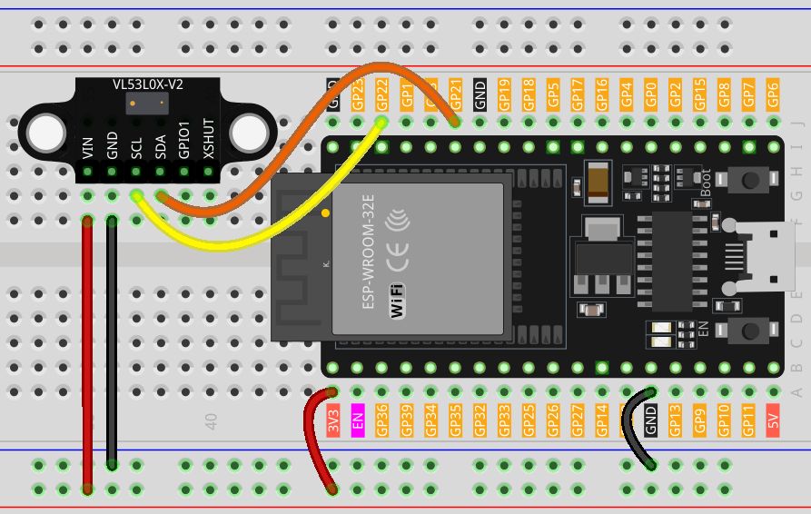

.. note:: 

    Bonjour et bienvenue dans la communauté SunFounder Raspberry Pi & Arduino & ESP32 Enthusiasts sur Facebook ! Plongez plus profondément dans l'univers du Raspberry Pi, de l'Arduino et de l'ESP32 avec d'autres passionnés.

    **Pourquoi rejoindre la communauté ?**

    - **Support d'experts** : Résolvez les problèmes après-vente et relevez les défis techniques avec l'aide de notre communauté et de notre équipe.
    - **Apprendre & partager** : Échangez des astuces et des tutoriels pour améliorer vos compétences.
    - **Aperçus exclusifs** : Accédez en avant-première aux annonces de nouveaux produits et aux aperçus exclusifs.
    - **Réductions spéciales** : Profitez de remises exclusives sur nos derniers produits.
    - **Promotions festives et cadeaux** : Participez à des tirages au sort et à des promotions saisonnières.

    👉 Prêt à explorer et créer avec nous ? Cliquez sur [|link_sf_facebook|] et rejoignez-nous dès aujourd’hui !

.. _esp32_lesson21_vl53l0x:

Leçon 21 : Capteur de distance Time of Flight Micro-LIDAR (VL53L0X)
======================================================================

Dans cette leçon, vous apprendrez à utiliser le capteur de distance Time of Flight Adafruit VL53L0X avec une carte de développement ESP32. Nous verrons comment initialiser le capteur, effectuer des mesures de distance et les afficher en millimètres sur le moniteur série.

Composants nécessaires
----------------------------

Pour ce projet, nous aurons besoin des composants suivants.

Il est souvent plus pratique d’acheter un kit complet, voici le lien :

.. list-table::
    :widths: 20 20 20
    :header-rows: 1

    *   - Nom	
        - ÉLÉMENTS DANS CE KIT
        - LIEN
    *   - Kit de capteurs Universal Maker
        - 94
        - |link_umsk|

Vous pouvez également les acheter séparément via les liens ci-dessous.

.. list-table::
    :widths: 30 10
    :header-rows: 1

    *   - Introduction des composants
        - Lien d'achat

    *   - ESP32 & Carte de développement (:ref:`cpn_esp32_wroom_32e`)
        - |link_esp32_camera_pro_kit_buy|
    *   - :ref:`cpn_VL53L0X`
        - |link_vl53l0x_module_buy|
    *   - :ref:`cpn_breadboard`
        - |link_breadboard_buy|

Câblage
---------------------------

Code
---------------------------

.. note:: 
   Pour installer la bibliothèque, utilisez le gestionnaire de bibliothèques d’Arduino et recherchez **"Adafruit_VL53L0X"**, puis installez-la.

.. raw:: html

    <iframe src=https://create.arduino.cc/editor/sunfounder01/2f8bf48c-e404-4a3d-a9ac-eb1878f54017/preview?embed style="height:510px;width:100%;margin:10px 0" frameborder=0></iframe>

Analyse du Code
---------------------------

1. Inclusion de la bibliothèque nécessaire et initialisation de l'objet capteur. Nous commençons par inclure la bibliothèque pour le capteur VL53L0X et créer une instance de la classe Adafruit_VL53L0X.

   .. note:: 
      Pour installer la bibliothèque, utilisez le gestionnaire de bibliothèques d’Arduino et recherchez **"Adafruit_VL53L0X"**, puis installez-la.

   .. code-block:: arduino

      #include <Adafruit_VL53L0X.h>
      Adafruit_VL53L0X lox = Adafruit_VL53L0X();

2. Initialisation dans la fonction ``setup()``. Ici, nous configurons la communication série et initialisons le capteur de distance. Si le capteur ne peut pas être initialisé, le programme s'arrête.

   .. code-block:: arduino

      void setup() {
        Serial.begin(115200);
        while (!Serial) {
          delay(1);
        }
        Serial.println("Adafruit VL53L0X test");
        if (!lox.begin()) {
          Serial.println(F("Failed to boot VL53L0X"));
          while (1)
            ;
        }
        Serial.println(F("VL53L0X API Simple Ranging example\n\n"));
      }

3. Capture et affichage des mesures dans la fonction ``loop()``. En continu, la carte de développement ESP32 capture une mesure de distance en utilisant la méthode ``rangingTest()``. Si la mesure est valide, elle est affichée sur le moniteur série.

   .. code-block:: arduino
       
      void loop() {
        VL53L0X_RangingMeasurementData_t measure;
        Serial.print("Reading a measurement... ");
        lox.rangingTest(&measure, false);
        if (measure.RangeStatus != 4) {
          Serial.print("Distance (mm): ");
          Serial.println(measure.RangeMilliMeter);
        } else {
          Serial.println(" out of range ");
        }
        delay(100);
      }