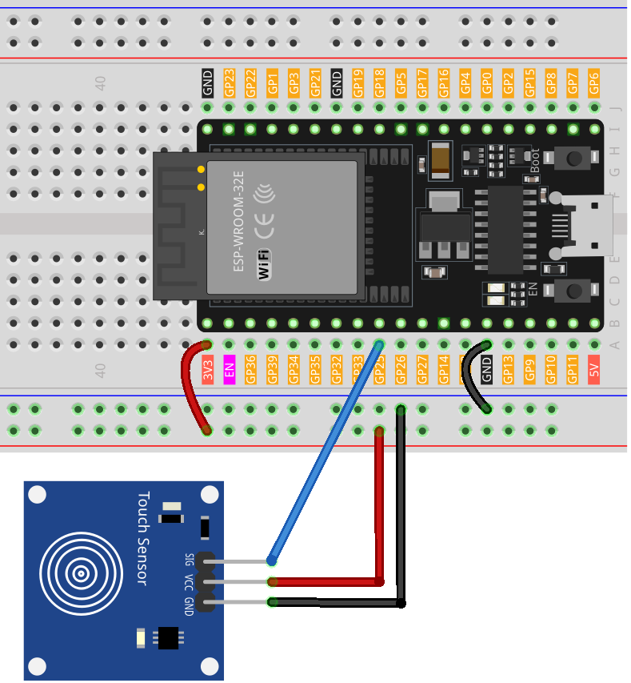

.. note:: 

    Bonjour et bienvenue dans la communauté SunFounder Raspberry Pi & Arduino & ESP32 Enthusiasts sur Facebook ! Plongez plus profondément dans l'univers du Raspberry Pi, de l'Arduino et de l'ESP32 avec d'autres passionnés.

    **Pourquoi rejoindre la communauté ?**

    - **Support d'experts** : Résolvez les problèmes après-vente et relevez les défis techniques avec l'aide de notre communauté et de notre équipe.
    - **Apprendre & partager** : Échangez des astuces et des tutoriels pour améliorer vos compétences.
    - **Aperçus exclusifs** : Accédez en avant-première aux annonces de nouveaux produits et aux aperçus exclusifs.
    - **Réductions spéciales** : Profitez de remises exclusives sur nos derniers produits.
    - **Promotions festives et cadeaux** : Participez à des tirages au sort et à des promotions saisonnières.

    👉 Prêt à explorer et créer avec nous ? Cliquez sur [|link_sf_facebook|] et rejoignez-nous dès aujourd’hui !

.. _esp32_lesson22_touch_sensor:

Leçon 22 : Module de capteur tactile
=======================================

Dans cette leçon, vous apprendrez à utiliser un capteur tactile avec une carte de développement ESP32. Nous verrons comment le fait de toucher le capteur envoie un signal à l'ESP32, déclenchant une réponse qui sera affichée via la communication série. Ce projet est idéal pour les débutants et offre une expérience pratique avec les entrées numériques et la sortie série sur la plateforme ESP32. Vous développerez une compréhension fondamentale de la manière dont les capteurs interagissent avec les microcontrôleurs, ce qui est essentiel pour créer des projets interactifs en matériel.

Composants nécessaires
--------------------------

Dans ce projet, nous avons besoin des composants suivants.

Il est certainement pratique d’acheter un kit complet, voici le lien :

.. list-table::
    :widths: 20 20 20
    :header-rows: 1

    *   - Nom	
        - ÉLÉMENTS DANS CE KIT
        - LIEN
    *   - Kit de capteurs Universal Maker
        - 94
        - |link_umsk|

Vous pouvez également les acheter séparément via les liens ci-dessous.

.. list-table::
    :widths: 30 20
    :header-rows: 1

    *   - Introduction des composants
        - Lien d'achat

    *   - ESP32 & Carte de développement (:ref:`cpn_esp32_wroom_32e`)
        - |link_esp32_camera_pro_kit_buy|
    *   - :ref:`cpn_touch`
        - |link_touch_buy|
    *   - :ref:`cpn_breadboard`
        - |link_breadboard_buy|

Câblage
---------------------------

Code
---------------------------

.. raw:: html

    <iframe src=https://create.arduino.cc/editor/sunfounder01/f3fd3d61-1d6b-46b8-8e62-e3c91e262830/preview?embed style="height:510px;width:100%;margin:10px 0" frameborder=0></iframe>

Analyse du code
---------------------------

1. **Configuration du pin et de la communication série**

   - Le capteur tactile est connecté au pin 25 de l'ESP32, et ce pin est configuré comme une entrée.
   - La commande ``Serial.begin(9600);`` initialise la communication série à un débit de 9600 bauds.

   .. raw:: html
      
       

   .. code-block:: arduino

      const int sensorPin = 25;

      void setup() {
        pinMode(sensorPin, INPUT);     // Définir le pin du capteur comme entrée
        Serial.begin(9600);            // Démarrer la communication série
      }

2. **Lecture du capteur et envoi des données au Moniteur Série**

   - La fonction ``loop()`` vérifie en continu l'état du capteur tactile.
   - La commande ``digitalRead(sensorPin)`` lit la valeur numérique (1 ou 0) du pin du capteur.
   - Si le capteur est touché (valeur 1), il affiche "Touch detected!" sur le Moniteur Série.
   - Si le capteur n'est pas touché (valeur 0), il affiche "No touch detected...".
   - La commande ``delay(100);`` permet de "débouncer" le capteur et d'éviter des lectures rapides successives.

   .. raw:: html
      
       

   .. code-block:: arduino

      void loop() {
        if (digitalRead(sensorPin) == 1) {  // Si le capteur est touché
          Serial.println("Touch detected!");
        } else {
          Serial.println("No touch detected...");
        }
        delay(100);  // Attendre un court instant pour éviter des lectures rapides du capteur
      }