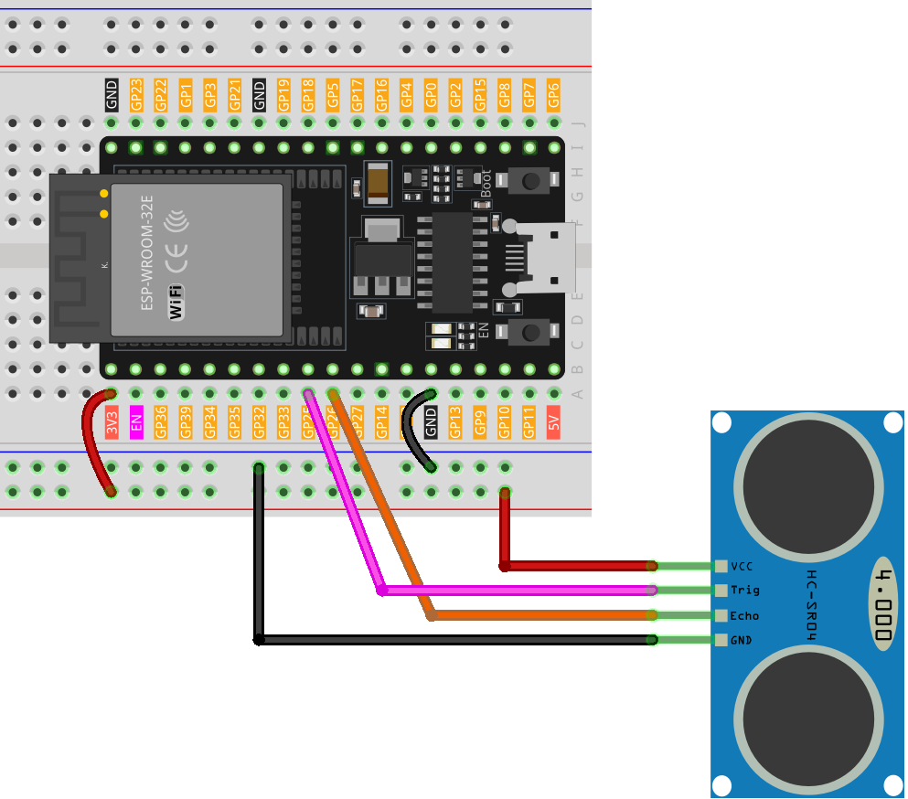

.. note::

    Ciao, benvenuto nella Comunità di Appassionati di Raspberry Pi, Arduino e ESP32 di SunFounder su Facebook! Approfondisci le tue conoscenze su Raspberry Pi, Arduino e ESP32 con altri appassionati.

    **Why Join?**

    - **Expert Support**: Risolvi problemi post-vendita e sfide tecniche con il supporto della nostra comunità e del nostro team.
    - **Learn & Share**: Scambia consigli e tutorial per migliorare le tue competenze.
    - **Exclusive Previews**: Ottieni accesso anticipato ad annunci di nuovi prodotti e anteprime esclusive.
    - **Special Discounts**: Godi di sconti esclusivi sui nostri prodotti più recenti.
    - **Festive Promotions and Giveaways**: Partecipa a giveaway e promozioni festive.

    👉 Pronto a esplorare e creare con noi? Clicca [|link_sf_facebook|] e unisciti oggi!

.. _esp32_lesson23_ultrasonic:

Lezione 23: Modulo Sensore ad Ultrasuoni (HC-SR04)
======================================================

In questa lezione, imparerai come utilizzare una scheda di sviluppo ESP32 per misurare distanze con un sensore ad ultrasuoni (HC-SR04). Tratteremo l'installazione del sensore, la lettura dei dati e il calcolo della distanza in centimetri. Questo progetto è ideale per i principianti che lavorano con microcontrollori e sensori, offrendo esperienza pratica nell'acquisizione di dati e nella comunicazione seriale. Svilupperai competenze pratiche nella programmazione dell'ESP32 e comprenderai la tecnologia di rilevamento ad ultrasuoni.

Componenti Necessari
--------------------------

Per questo progetto, abbiamo bisogno dei seguenti componenti.

È decisamente conveniente acquistare un kit completo, ecco il link:

.. list-table::
    :widths: 20 20 20
    :header-rows: 1

    *   - Nome	
        - ELEMENTI IN QUESTO KIT
        - LINK
    *   - Kit Sensori Universale Maker
        - 94
        - |link_umsk|

Puoi anche acquistarli separatamente dai link qui sotto.

.. list-table::
    :widths: 30 20
    :header-rows: 1

    *   - Introduzione al Componente
        - Link d'acquisto

    *   - ESP32 & Scheda di Sviluppo (:ref:`cpn_esp32_wroom_32e`)
        - |link_esp32_camera_pro_kit_buy|
    *   - :ref:`cpn_ultrasonic`
        - |link_ultrasonic_buy|
    *   - :ref:`cpn_breadboard`
        - |link_breadboard_buy|

Cablaggio
---------------------------

Codice
---------------------------

.. raw:: html

    <iframe src=https://create.arduino.cc/editor/sunfounder01/b5dbcdfa-3dc8-4f64-adf9-a3227e3f6044/preview?embed style="height:510px;width:100%;margin:10px 0" frameborder=0></iframe>

Analisi del Codice
---------------------------

1. Dichiarazione dei pin:

   Si inizia definendo i pin per il sensore ad ultrasuoni. ``echoPin`` e ``trigPin`` sono dichiarati come interi e i loro valori sono impostati per corrispondere al collegamento fisico sulla scheda di sviluppo ESP32.

   .. code-block:: arduino

      const int echoPin = 26;
      const int trigPin = 25;

2. Funzione ``setup()``:

   La funzione ``setup()`` inizializza la comunicazione seriale, imposta le modalità dei pin e stampa un messaggio per indicare che il sensore ad ultrasuoni è pronto.
 
   .. code-block:: arduino
 
      void setup() {
        Serial.begin(9600);
        pinMode(echoPin, INPUT);
        pinMode(trigPin, OUTPUT);
        Serial.println("Ultrasonic sensor:");
      }

3. Funzione ``loop()``:

   La funzione ``loop()`` legge la distanza dal sensore e la stampa sul monitor seriale, poi attende 400 millisecondi prima di ripetere.

   .. code-block:: arduino

      void loop() {
        float distance = readDistance();
        Serial.print(distance);
        Serial.println(" cm");
        delay(400);
      }

4. Funzione ``readDistance()``:

   La funzione ``readDistance()`` attiva il sensore ad ultrasuoni e calcola la distanza in base al tempo impiegato dal segnale per rimbalzare.

   Per maggiori dettagli, si prega di fare riferimento al :ref:`principle <cpn_ultrasonic_principle>` di funzionamento del modulo sensore ad ultrasuoni.

   .. code-block:: arduino

      float readDistance() {
        digitalWrite(trigPin, LOW);   // Imposta il pin trig su basso per garantire un impulso pulito
        delayMicroseconds(2);         // Ritardo di 2 microsecondi
        digitalWrite(trigPin, HIGH);  // Invia un impulso di 10 microsecondi impostando il pin trig su alto
        delayMicroseconds(10);
        digitalWrite(trigPin, LOW);  // Reimposta il pin trig su basso
        float distance = pulseIn(echoPin, HIGH) / 58.00;  // Formula: (340m/s * 1us) / 2
        return distance;
      }
