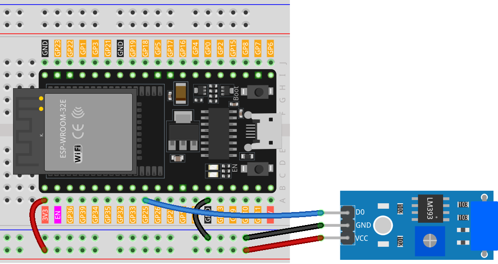

.. note::

    Ciao, benvenuto nella Community di appassionati di SunFounder Raspberry Pi & Arduino & ESP32 su Facebook! Approfondisci le tue conoscenze su Raspberry Pi, Arduino e ESP32 con altri appassionati.

    **Why Join?**

    - **Expert Support**: Risolvi problemi post-vendita e sfide tecniche con l'aiuto della nostra comunità e del nostro team.
    - **Learn & Share**: Scambia consigli e tutorial per migliorare le tue abilità.
    - **Exclusive Previews**: Ottieni accesso anticipato agli annunci di nuovi prodotti e anteprime esclusive.
    - **Special Discounts**: Goditi sconti esclusivi sui nostri prodotti più recenti.
    - **Festive Promotions and Giveaways**: Partecipa a giveaway e promozioni festive.

    👉 Pronto a esplorare e creare con noi? Clicca [|link_sf_facebook|] e unisciti oggi!

.. _esp32_lesson24_vibration_sensor:

Lezione 24: Modulo Sensore di Vibrazione (SW-420)
====================================================

In questa lezione, imparerai a rilevare le vibrazioni usando una scheda di sviluppo ESP32 e un Sensore di Vibrazione (SW-420). Tratteremo la lettura dell'output digitale dal sensore e l'uso di istruzioni condizionali per visualizzare messaggi sul monitor seriale. Quando il sensore rileva una vibrazione, verrà visualizzato "Vibrazione rilevata..."; altrimenti, verrà visualizzato "...". Questo progetto offre un modo pratico per comprendere gli input digitali e la comunicazione seriale, rendendolo ideale per i principianti in elettronica e programmazione.

Componenti Necessari
---------------------------

Per questo progetto, abbiamo bisogno dei seguenti componenti.

È decisamente conveniente acquistare un kit completo, ecco il link:

.. list-table::
    :widths: 20 20 20
    :header-rows: 1

    *   - Nome	
        - ELEMENTI IN QUESTO KIT
        - LINK
    *   - Kit Sensori Universale Maker
        - 94
        - |link_umsk|

Puoi anche acquistarli separatamente dai link qui sotto.

.. list-table::
    :widths: 30 20
    :header-rows: 1

    *   - Introduzione al Componente
        - Link d'acquisto

    *   - ESP32 & Scheda di Sviluppo (:ref:`cpn_esp32_wroom_32e`)
        - |link_esp32_camera_pro_kit_buy|
    *   - :ref:`cpn_vibration`
        - |link_sw420_vibration_module_buy|
    *   - :ref:`cpn_breadboard`
        - |link_breadboard_buy|

Cablaggio
---------------------------

Codice
---------------------------

.. raw:: html

    <iframe src=https://create.arduino.cc/editor/sunfounder01/a64a9f69-b056-4b41-993e-3f77101091e0/preview?embed style="height:510px;width:100%;margin:10px 0" frameborder=0></iframe>

Analisi del Codice
---------------------------

1. La prima riga di codice è una dichiarazione di intero costante per il pin del sensore di vibrazione. Utilizziamo il pin digitale 25 per leggere l'uscita dal sensore di vibrazione.

   .. code-block:: arduino
   
      const int sensorPin = 25;

2. Nella funzione ``setup()``, inizializziamo la comunicazione seriale a una velocità di trasmissione di 9600 per stampare le letture dal sensore di vibrazione sul monitor seriale. Impostiamo anche il pin del sensore di vibrazione come ingresso.

   .. code-block:: arduino
   
      void setup() {
        Serial.begin(9600);         // Avvia la comunicazione seriale a 9600 baud
        pinMode(sensorPin, INPUT);  // Imposta sensorPin come pin di ingresso
      }

3. La funzione ``loop()`` è dove controlliamo continuamente se il sensore rileva vibrazioni. Se il sensore rileva una vibrazione, stampa "Vibrazione rilevata..." sul monitor seriale. Se non viene rilevata alcuna vibrazione, stampa "...". Il ciclo si ripete ogni 100 millisecondi.

   .. code-block:: arduino
   
      void loop() {
        if (digitalRead(sensorPin)) {               // Controlla se il sensore ha rilevato vibrazioni
          Serial.println("Detected vibration...");  // Stampa "Vibrazione rilevata..." se viene rilevata una vibrazione
        } 
        else {
          Serial.println("...");  // Stampa "..." altrimenti
        }
        // Aggiungi un ritardo per evitare di sovraccaricare il monitor seriale
        delay(100);
      }