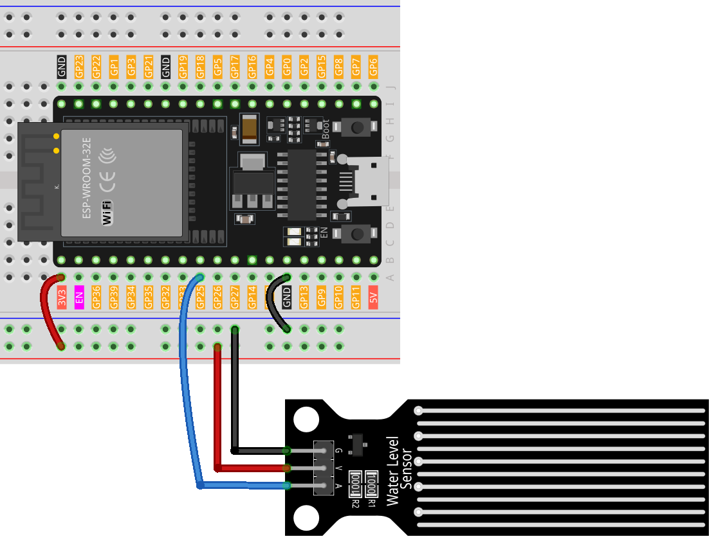

.. note::

    Ciao, benvenuto nella Comunità degli Appassionati di Raspberry Pi, Arduino e ESP32 di SunFounder su Facebook! Approfondisci la tua conoscenza di Raspberry Pi, Arduino e ESP32 insieme ad altri appassionati.

    **Why Join?**

    - **Expert Support**: Risolvi problemi post-vendita e sfide tecniche con l'aiuto della nostra comunità e del nostro team.
    - **Learn & Share**: Scambia consigli e tutorial per migliorare le tue competenze.
    - **Exclusive Previews**: Ottieni accesso anticipato alle nuove annunci di prodotti e anteprime esclusive.
    - **Special Discounts**: Goditi sconti esclusivi sui nostri prodotti più recenti.
    - **Festive Promotions and Giveaways**: Partecipa a giveaway e promozioni festive.

    👉 Pronto per esplorare e creare con noi? Clicca [|link_sf_facebook|] e unisciti oggi!

.. _esp32_lesson25_water_level:

Lezione 25: Modulo Sensore di Livello dell'Acqua
==================================================

In questa lezione, imparerai a utilizzare una Scheda di Sviluppo ESP32 per leggere un sensore di livello dell'acqua. Tratteremo il monitoraggio continuo del valore analogico del sensore e la sua visualizzazione sul monitor seriale. Questo progetto offre un'ottima opportunità per comprendere l'integrazione dei sensori e la lettura dei dati analogici con Arduino, rendendolo ideale per i principianti in elettronica e programmazione di microcontrollori.

Componenti Necessari
-----------------------

In questo progetto, abbiamo bisogno dei seguenti componenti.

È decisamente conveniente acquistare un kit completo, ecco il link:

.. list-table::
    :widths: 20 20 20
    :header-rows: 1

    *   - Nome	
        - ELEMENTI IN QUESTO KIT
        - LINK
    *   - Kit Sensori per Maker Universali
        - 94
        - |link_umsk|

Puoi anche acquistarli separatamente dai link qui sotto.

.. list-table::
    :widths: 30 20
    :header-rows: 1

    *   - Introduzione al Componente
        - Link per l'Acquisto

    *   - ESP32 & Scheda di Sviluppo (:ref:`cpn_esp32_wroom_32e`)
        - |link_esp32_camera_pro_kit_buy|
    *   - :ref:`cpn_water_level`
        - \-
    *   - :ref:`cpn_breadboard`
        - |link_breadboard_buy|

Cablaggio
------------

Codice
----------

.. raw:: html

    <iframe src=https://create.arduino.cc/editor/sunfounder01/f312bfd8-5583-4d54-a116-35e32d957ef6/preview?embed style="height:510px;width:100%;margin:10px 0" frameborder=0></iframe>

Analisi del Codice
------------------------

#. **Inizializzazione del Pin del Sensore**:

   Prima di utilizzare il sensore di livello dell'acqua, il numero del suo pin viene definito utilizzando una variabile costante. Questo rende il codice più leggibile e facile da modificare.

   .. code-block:: arduino

      const int sensorPin = 25;

#. **Impostazione della Comunicazione Seriale**:

   Nella funzione ``setup()``, viene impostata la velocità di trasmissione per la comunicazione seriale. Questo è fondamentale affinché l'Arduino possa comunicare con il monitor seriale del computer.

   .. code-block:: arduino

      void setup() {
        Serial.begin(9600);  // Avvia la comunicazione seriale a 9600 baud
      }

#. **Lettura dei Dati del Sensore e Trasmissione al Monitor Seriale**:

   La funzione ``loop()`` legge continuamente il valore analogico del sensore tramite ``analogRead()`` e lo trasmette al monitor seriale usando ``Serial.println()``. La funzione ``delay(100)`` fa attendere all'Arduino 100 millisecondi prima di ripetere il ciclo, controllando il ritmo di lettura e trasmissione dei dati.

   .. code-block:: arduino
    
      void loop() {
        Serial.println(analogRead(sensorPin));  // Leggi il valore analogico del sensore e stampalo sul monitor seriale
        delay(100);                             // Attendi 100 millisecondi
      }