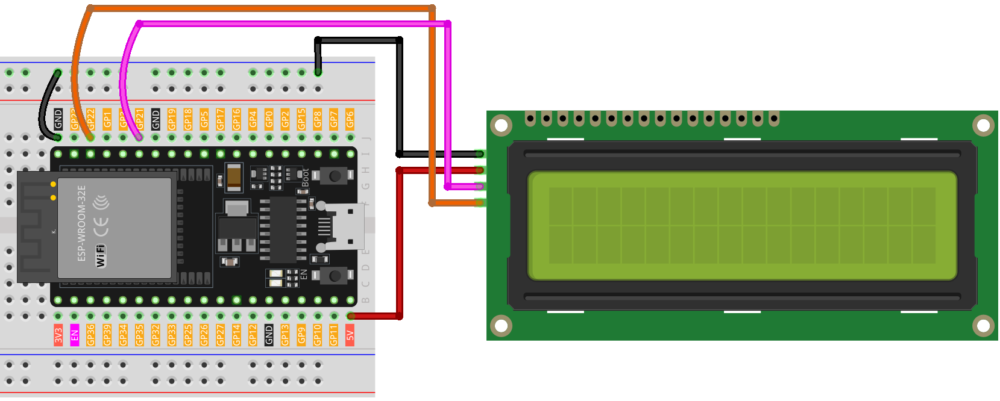

.. note::

    Ciao, benvenuto nella Comunità degli Appassionati di Raspberry Pi, Arduino e ESP32 di SunFounder su Facebook! Approfondisci la tua conoscenza di Raspberry Pi, Arduino e ESP32 insieme ad altri appassionati.

    **Why Join?**

    - **Expert Support**: Risolvi problemi post-vendita e sfide tecniche con l'aiuto della nostra comunità e del nostro team.
    - **Learn & Share**: Scambia consigli e tutorial per migliorare le tue competenze.
    - **Exclusive Previews**: Ottieni accesso anticipato alle nuove annunci di prodotti e anteprime esclusive.
    - **Special Discounts**: Goditi sconti esclusivi sui nostri prodotti più recenti.
    - **Festive Promotions and Giveaways**: Partecipa a giveaway e promozioni festive.

    👉 Pronto per esplorare e creare con noi? Clicca [|link_sf_facebook|] e unisciti oggi!

.. _esp32_lesson26_lcd:

Lezione 26: LCD I2C 1602
==================================

In questa lezione, imparerai a configurare e visualizzare messaggi su un display a cristalli liquidi (LCD) 16x2 con interfaccia I2C utilizzando una scheda di sviluppo ESP32. Copriremo l'inizializzazione dell'LCD utilizzando la libreria LiquidCrystal I2C, quindi visualizzeremo "Hello world!" e "LCD Tutorial" su due linee separate dello schermo. Questo tutorial è ideale per i principianti, offrendo esperienza pratica con le interfacce LCD e migliorando la tua comprensione delle operazioni di output nella programmazione Arduino.

Componenti Necessari
----------------------

In questo progetto, abbiamo bisogno dei seguenti componenti.

È decisamente conveniente acquistare un kit completo, ecco il link:

.. list-table::
    :widths: 20 20 20
    :header-rows: 1

    *   - Nome	
        - ELEMENTI IN QUESTO KIT
        - LINK
    *   - Kit Sensori per Maker Universali
        - 94
        - |link_umsk|

Puoi anche acquistarli separatamente dai link qui sotto.

.. list-table::
    :widths: 30 20
    :header-rows: 1

    *   - Introduzione al Componente
        - Link per l'Acquisto

    *   - ESP32 & Scheda di Sviluppo (:ref:`cpn_esp32_wroom_32e`)
        - |link_esp32_camera_pro_kit_buy|
    *   - :ref:`cpn_i2c_lcd1602`
        - |link_i2clcd1602_buy|
    *   - :ref:`cpn_breadboard`
        - |link_breadboard_buy|

Cablaggio
------------

Codice
--------

.. note:: 
   Per installare la libreria, usa il Gestore Librerie di Arduino e cerca **"LiquidCrystal I2C"** per installarla.

.. raw:: html

    <iframe src=https://create.arduino.cc/editor/sunfounder01/3c6bcc49-9030-4539-8220-4ff3c484814c/preview?embed style="height:510px;width:100%;margin:10px 0" frameborder=0></iframe>

Analisi del Codice
---------------------

1. Inclusione della Libreria e Inizializzazione dell'LCD:
   La libreria LiquidCrystal I2C viene inclusa per fornire funzioni e metodi per l'interfacciamento dell'LCD. Successivamente, viene creato un oggetto LCD utilizzando la classe LiquidCrystal_I2C, specificando l'indirizzo I2C, il numero di colonne e il numero di righe.

   .. note:: 
      Per installare la libreria, usa il Gestore Librerie di Arduino e cerca **"LiquidCrystal I2C"** per installarla.

   .. code-block:: arduino

      #include <LiquidCrystal_I2C.h>
      LiquidCrystal_I2C lcd(0x27, 16, 2);

2. Funzione di Setup:
   La funzione ``setup()`` viene eseguita una volta all'avvio della scheda di sviluppo ESP32. In questa funzione, l'LCD viene inizializzato, pulito, e si accende la retroilluminazione. Poi, vengono visualizzati due messaggi sull'LCD.

   .. code-block:: arduino

      void setup() {
        lcd.init();       // inizializza l'LCD
        lcd.clear();      // pulisce il display dell'LCD
        lcd.backlight();  // Assicurati che la retroilluminazione sia accesa
      
        // Stampa un messaggio su entrambe le linee dell'LCD.
        lcd.setCursor(2, 0);  // Imposta il cursore al carattere 2 sulla linea 0
        lcd.print("Hello world!");
      
        lcd.setCursor(2, 1);  // Sposta il cursore al carattere 2 sulla linea 1
        lcd.print("LCD Tutorial");
      }