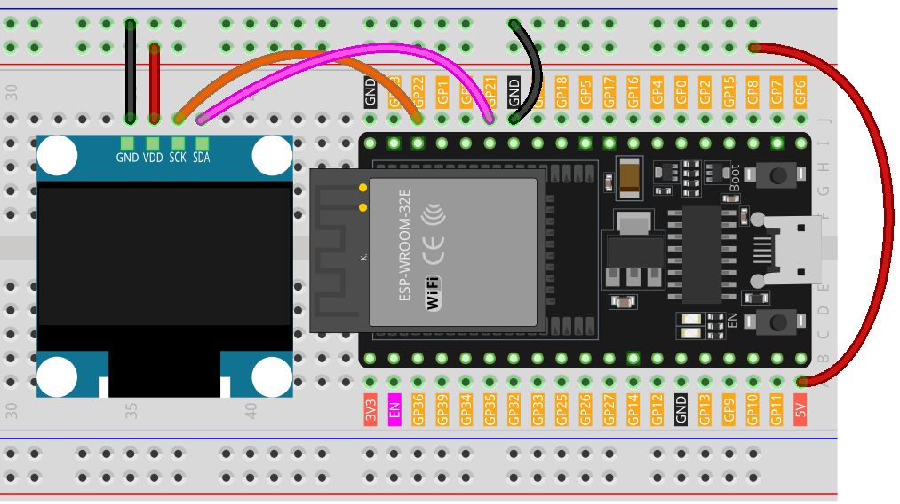

.. note::

    Ciao, benvenuto nella Comunità degli Appassionati di Raspberry Pi, Arduino e ESP32 di SunFounder su Facebook! Approfondisci la tua conoscenza di Raspberry Pi, Arduino e ESP32 insieme ad altri appassionati.

    **Why Join?**

    - **Expert Support**: Risolvi problemi post-vendita e sfide tecniche con l'aiuto della nostra comunità e del nostro team.
    - **Learn & Share**: Scambia consigli e tutorial per migliorare le tue competenze.
    - **Exclusive Previews**: Ottieni accesso anticipato alle nuove annunci di prodotti e anteprime esclusive.
    - **Special Discounts**: Goditi sconti esclusivi sui nostri prodotti più recenti.
    - **Festive Promotions and Giveaways**: Partecipa a giveaway e promozioni festive.

    👉 Pronto per esplorare e creare con noi? Clicca [|link_sf_facebook|] e unisciti oggi!

.. _esp32_lesson27_oled:

Lezione 27: Modulo Display OLED (SSD1306)
============================================

In questa lezione, imparerai a configurare e utilizzare un display OLED con una scheda di sviluppo ESP32 utilizzando le librerie Adafruit SSD1306 e GFX. Copriremo la visualizzazione di testi di diverse dimensioni, l'inversione dei colori del testo, la creazione di animazioni di testo scorrevole e la rappresentazione di grafiche bitmap personalizzate. Questo progetto fornisce un'introduzione completa alle tecniche di visualizzazione avanzate, ideale per coloro che cercano di migliorare le proprie competenze nello sviluppo di elettronica interattiva con microcontrollori.

Componenti Necessari
-----------------------

In questo progetto, abbiamo bisogno dei seguenti componenti.

È decisamente conveniente acquistare un kit completo, ecco il link:

.. list-table::
    :widths: 20 20 20
    :header-rows: 1

    *   - Nome	
        - ELEMENTI IN QUESTO KIT
        - LINK
    *   - Kit Sensori per Maker Universali
        - 94
        - |link_umsk|

Puoi anche acquistarli separatamente dai link qui sotto.

.. list-table::
    :widths: 30 20
    :header-rows: 1

    *   - Introduzione al Componente
        - Link per l'Acquisto

    *   - ESP32 & Scheda di Sviluppo (:ref:`cpn_esp32_wroom_32e`)
        - |link_esp32_camera_pro_kit_buy|
    *   - :ref:`cpn_oled`
        - \-
    *   - :ref:`cpn_breadboard`
        - |link_breadboard_buy|

Cablaggio
------------

Codice
---------

.. note:: 
   Per installare le librerie, utilizza il Gestore delle Librerie di Arduino e cerca **"Adafruit SSD1306"** e **"Adafruit GFX"** e installale.

.. raw:: html

    <iframe src=https://create.arduino.cc/editor/sunfounder01/33f2fdd0-af4e-4438-bacf-982894bb8ac4/preview?embed style="height:510px;width:100%;margin:10px 0" frameborder=0></iframe>

Analisi del Codice
----------------------

1. **Inclusione delle Librerie e Definizioni Iniziali**:
   Le librerie necessarie per l'interfacciamento con l'OLED sono incluse. Successivamente, sono fornite le definizioni relative alle dimensioni dell'OLED e all'indirizzo I2C.

   - **Adafruit SSD1306**: Questa libreria è progettata per facilitare l'interfacciamento con il display OLED SSD1306. Fornisce metodi per inizializzare il display, controllarne le impostazioni e visualizzare i contenuti.
   - **Libreria Grafica Adafruit (Adafruit GFX)**: È una libreria grafica di base per la visualizzazione di testi, la produzione di colori, il disegno di forme, ecc., su vari schermi inclusi gli OLED.

   .. note:: 
      Per installare le librerie, usa il Gestore delle Librerie di Arduino e cerca **"Adafruit SSD1306"** e **"Adafruit GFX"** e installale.

   .. code-block:: arduino
    
      #include <SPI.h>
      #include <Wire.h>
      #include <Adafruit_GFX.h>
      #include <Adafruit_SSD1306.h>

      #define SCREEN_WIDTH 128  // Larghezza del display OLED, in pixel
      #define SCREEN_HEIGHT 64  // Altezza del display OLED, in pixel

      #define OLED_RESET -1
      #define SCREEN_ADDRESS 0x3C

2. **Dati Bitmap**:
   Dati bitmap per visualizzare un'icona personalizzata sullo schermo OLED. Questi dati rappresentano un'immagine in un formato che l'OLED può interpretare.

   Puoi utilizzare questo strumento online chiamato |link_image2cpp| che può trasformare la tua immagine in un array. 

   La parola chiave ``PROGMEM`` denota che l'array è memorizzato nella memoria del programma del microcontrollore Arduino. Memorizzare i dati nella memoria del programma (PROGMEM) anziché nella RAM può essere utile per grandi quantità di dati, che altrimenti occuperebbero troppo spazio nella RAM.

   .. code-block:: arduino

      static const unsigned char PROGMEM sunfounderIcon[] = {...};

3. **Funzione di Setup (Inizializzazione e Visualizzazione)**:
   La funzione ``setup()`` inizializza l'OLED e visualizza una serie di pattern, testi e animazioni.

   .. code-block:: arduino

      void setup() {
         ...  // Inizializzazione seriale e inizializzazione dell'oggetto OLED
         ...  // Visualizzazione di vari testi, numeri e animazioni
      }