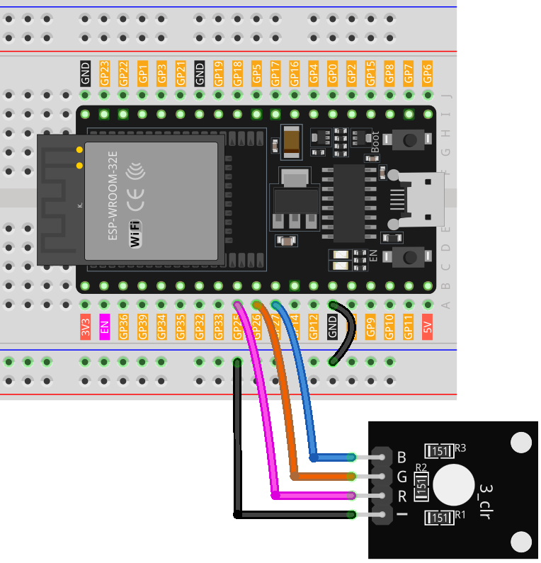

.. note:: 

    ¡Hola, bienvenido a la Comunidad de Entusiastas de Raspberry Pi, Arduino y ESP32 en Facebook! Profundiza en el mundo de Raspberry Pi, Arduino y ESP32 junto con otros entusiastas.

    **¿Por qué unirte?**

    - **Soporte experto**: Resuelve problemas postventa y desafíos técnicos con la ayuda de nuestra comunidad y equipo.
    - **Aprende y comparte**: Intercambia consejos y tutoriales para mejorar tus habilidades.
    - **Vistas previas exclusivas**: Accede a nuevos anuncios de productos y avances antes que nadie.
    - **Descuentos especiales**: Disfruta de descuentos exclusivos en nuestros productos más recientes.
    - **Promociones festivas y sorteos**: Participa en sorteos y promociones de temporada.

    👉 ¿Estás listo para explorar y crear con nosotros? Haz clic en [|link_sf_facebook|] y únete hoy mismo!

.. _esp32_lesson28_rgb_module:

Lección 28: Módulo de LED RGB
==================================

En esta lección aprenderás a controlar un LED RGB utilizando una placa de desarrollo ESP32. Veremos cómo usar diferentes canales de color para mostrar colores primarios y crear una secuencia de colores del arco iris. Este proyecto es ideal para principiantes en electrónica y programación, proporcionando experiencia práctica con operaciones de salida y mezcla de colores utilizando el ESP32 y el módulo de LED RGB.

Componentes necesarios
--------------------------

En este proyecto necesitamos los siguientes componentes. 

Es muy conveniente comprar un kit completo, aquí tienes el enlace: 

.. list-table::
    :widths: 20 20 20
    :header-rows: 1

    *   - Nombre	
        - ARTÍCULOS EN ESTE KIT
        - ENLACE
    *   - Kit de Sensor Universal Maker
        - 94
        - |link_umsk|

También puedes comprarlos por separado a través de los enlaces a continuación.

.. list-table::
    :widths: 30 20
    :header-rows: 1

    *   - Introducción al componente
        - Enlace de compra

    *   - ESP32 & Placa de Desarrollo (:ref:`cpn_esp32_wroom_32e`)
        - |link_esp32_camera_pro_kit_buy|
    *   - :ref:`cpn_rgb`
        - \-
    *   - :ref:`cpn_breadboard`
        - |link_breadboard_buy|

Conexiones
---------------------------

Código
---------------------------

.. raw:: html

    <iframe src=https://create.arduino.cc/editor/sunfounder01/a8796969-0aed-4037-8080-f62059cc2db5/preview?embed style="height:510px;width:100%;margin:10px 0" frameborder=0></iframe>

Análisis del código
---------------------------

1. El primer segmento del código declara e inicializa los pines a los que está conectado cada canal de color del módulo LED RGB.

   .. code-block:: arduino
       
      const int rledPin = 25;  // Pin conectado al canal de color rojo
      const int gledPin = 26;   // Pin conectado al canal de color verde
      const int bledPin = 27;  // Pin conectado al canal de color azul

2. La función ``setup()`` inicializa estos pines como salidas. Esto significa que estamos enviando señales desde estos pines hacia el módulo LED RGB.

   .. code-block:: arduino
   
      void setup() {
        pinMode(rledPin, OUTPUT);
        pinMode(gledPin, OUTPUT);
        pinMode(bledPin, OUTPUT);
      }

3. En la función ``loop()``, se llama a la función ``setColor()`` con diferentes parámetros para mostrar distintos colores. La función ``delay()`` se utiliza después de establecer cada color para hacer una pausa de 1000 milisegundos (o 1 segundo) antes de pasar al siguiente color.

   .. code-block:: arduino
   
      void loop() {
        setColor(255, 0, 0);  // Establecer el color del LED RGB a rojo
        delay(1000);
        setColor(0, 255, 0);  // Establecer el color del LED RGB a verde
        delay(1000);
        // El resto de la secuencia de colores...
      }

4. La función ``setColor()`` utiliza la función ``analogWrite()`` para ajustar el brillo de cada canal de color en el módulo LED RGB. La función ``analogWrite()`` emplea Modulación por Ancho de Pulso (PWM) para simular salidas de voltaje variables. Al controlar el ciclo de trabajo de la PWM (el porcentaje de tiempo que una señal está en ALTO dentro de un período fijo), se puede controlar el brillo de cada canal de color, permitiendo la mezcla de varios colores.

   .. code-block:: arduino

      void setColor(int R, int G, int B) {
        analogWrite(rledPin, R);  // Usar PWM para controlar el brillo del canal rojo
        analogWrite(gledPin, G);  // Usar PWM para controlar el brillo del canal verde
        analogWrite(bledPin, B);  // Usar PWM para controlar el brillo del canal azul
      }