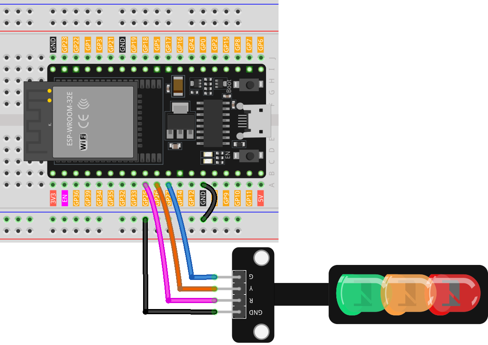

.. note:: 

    Bonjour, bienvenue dans la communauté des passionnés de SunFounder pour Raspberry Pi, Arduino et ESP32 sur Facebook ! Plongez plus profondément dans l'univers de Raspberry Pi, Arduino et ESP32 avec d'autres passionnés.

    **Pourquoi rejoindre ?**

    - **Support d'experts** : Résolvez les problèmes post-vente et les défis techniques avec l'aide de notre communauté et de notre équipe.
    - **Apprendre & partager** : Échangez des astuces et des tutoriels pour améliorer vos compétences.
    - **Aperçus exclusifs** : Obtenez un accès anticipé aux annonces de nouveaux produits et aux aperçus.
    - **Réductions spéciales** : Profitez de réductions exclusives sur nos produits les plus récents.
    - **Promotions festives et cadeaux** : Participez à des cadeaux et promotions pendant les fêtes.

    👉 Prêt à explorer et créer avec nous ? Cliquez sur [|link_sf_facebook|] et rejoignez-nous aujourd'hui !

.. _esp32_lesson29_traffic_light_module:

Leçon 29 : Module de feu de signalisation
===============================================

Dans cette leçon, vous apprendrez à utiliser une carte de développement ESP32 pour contrôler un Mini Module de feu de signalisation. Nous aborderons la configuration de la carte et la rédaction du code pour créer une séquence de feux de circulation : 5 secondes de feu vert, feu jaune clignotant pendant 1,5 seconde, et 5 secondes de feu rouge. Ce projet est idéal pour les débutants en électronique et en programmation car il fournit une expérience pratique des opérations de sortie et du contrôle de base des temps avec l'ESP32.

Composants nécessaires
---------------------------

Pour ce projet, nous avons besoin des composants suivants. 

Il est très pratique d'acheter un kit complet, voici le lien : 

.. list-table::
    :widths: 20 20 20
    :header-rows: 1

    *   - Nom    
        - COMPOSANTS DANS CE KIT
        - Lien
    *   - Kit de capteurs Universal Maker
        - 94
        - |link_umsk|

Vous pouvez également les acheter séparément via les liens ci-dessous.

.. list-table::
    :widths: 30 20
    :header-rows: 1

    *   - Description du composant
        - Lien d'achat

    *   - ESP32 & Carte de développement (:ref:`cpn_esp32_wroom_32e`)
        - |link_esp32_camera_pro_kit_buy|
    *   - :ref:`cpn_traffic`
        - |link_traffic_light_module_buy|
    *   - :ref:`cpn_breadboard`
        - |link_breadboard_buy|

Câblage
----------

Code
-------

.. raw:: html

    <iframe src=https://create.arduino.cc/editor/sunfounder01/df3260e8-4f79-4dca-aa47-c3a684867ca1/preview?embed style="height:510px;width:100%;margin:10px 0" frameborder=0></iframe>

Analyse du code
------------------

1. Avant toute opération, nous définissons les constantes pour les broches où les LEDs sont connectées. Cela rend notre code plus facile à lire et à modifier.

  .. code-block:: arduino

     const int rledPin = 25;  // rouge
     const int yledPin = 26;  // jaune
     const int gledPin = 27;  // vert

2. Ici, nous spécifions les modes de broche pour nos broches LED. Elles sont toutes réglées sur ``OUTPUT`` car nous avons l'intention d'envoyer une tension à celles-ci.

  .. code-block:: arduino

     void setup() {
       pinMode(rledPin, OUTPUT);
       pinMode(yledPin, OUTPUT);
       pinMode(gledPin, OUTPUT);
     }

3. C'est ici que notre logique de cycle de feu de signalisation est mise en œuvre. La séquence des opérations est :

    * Allumer la LED verte pendant 5 secondes.
    * Faire clignoter la LED jaune trois fois (chaque clignotement dure 0,5 seconde).
    * Allumer la LED rouge pendant 5 secondes.
    
  .. code-block:: arduino

     void loop() {
       digitalWrite(gledPin, HIGH);
       delay(5000);
       digitalWrite(gledPin, LOW);
       
       digitalWrite(yledPin, HIGH);
       delay(500);
       digitalWrite(yledPin, LOW);
       delay(500);
       digitalWrite(yledPin, HIGH);
       delay(500);
       digitalWrite(yledPin, LOW);
       delay(500);
       digitalWrite(yledPin, HIGH);
       delay(500);
       digitalWrite(yledPin, LOW);
       delay(500);
       
       digitalWrite(rledPin, HIGH);
       delay(5000);
       digitalWrite(rledPin, LOW);
     }

