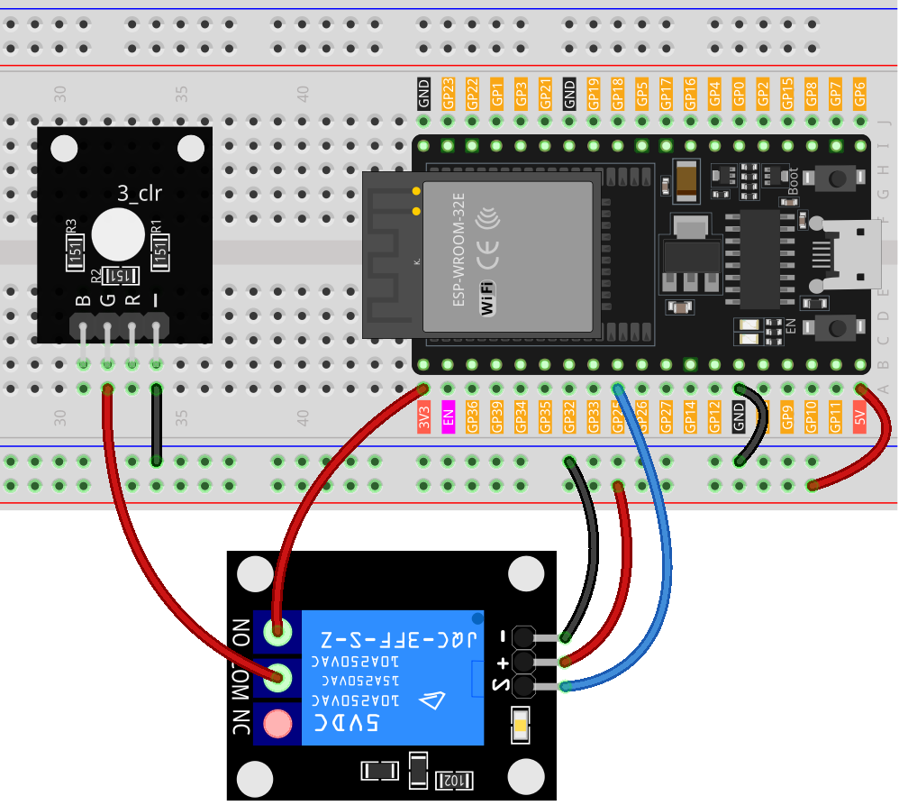

.. note::

    Ciao, benvenuto nella Comunità degli Appassionati di Raspberry Pi, Arduino e ESP32 di SunFounder su Facebook! Approfondisci la tua conoscenza di Raspberry Pi, Arduino e ESP32 insieme ad altri appassionati.

    **Why Join?**

    - **Expert Support**: Risolvi problemi post-vendita e sfide tecniche con l'aiuto della nostra comunità e del nostro team.
    - **Learn & Share**: Scambia consigli e tutorial per migliorare le tue competenze.
    - **Exclusive Previews**: Ottieni accesso anticipato alle nuove annunci di prodotti e anteprime esclusive.
    - **Special Discounts**: Goditi sconti esclusivi sui nostri prodotti più recenti.
    - **Festive Promotions and Giveaways**: Partecipa a giveaway e promozioni festive.

    👉 Pronto per esplorare e creare con noi? Clicca [|link_sf_facebook|] e unisciti oggi!

.. _esp32_lesson30_relay_module:

Lezione 30: Modulo Relè
==================================

In questa lezione, imparerai a utilizzare una scheda di sviluppo ESP32 per controllare un modulo relè a un canale. Tratteremo l'accensione e lo spegnimento del relè in un ciclo, con un ritardo di 3 secondi tra ogni cambio di stato. Questo progetto fornisce esperienza pratica con le operazioni di output digitale nei sistemi embedded, rendendolo ideale per i principianti che entrano nel mondo dell'ESP32 e dei moduli relè.

Componenti Necessari
----------------------

In questo progetto, abbiamo bisogno dei seguenti componenti.

È decisamente conveniente acquistare un kit completo, ecco il link:

.. list-table::
    :widths: 20 20 20
    :header-rows: 1

    *   - Nome	
        - ELEMENTI IN QUESTO KIT
        - LINK
    *   - Kit Sensori per Maker Universali
        - 94
        - |link_umsk|

Puoi anche acquistarli separatamente dai link qui sotto.

.. list-table::
    :widths: 30 20
    :header-rows: 1

    *   - Introduzione al Componente
        - Link per l'Acquisto

    *   - ESP32 & Scheda di Sviluppo (:ref:`cpn_esp32_wroom_32e`)
        - |link_esp32_camera_pro_kit_buy|
    *   - :ref:`cpn_breadboard`
        - |link_breadboard_buy|
    *   - :ref:`cpn_relay`
        - \-
    *   - :ref:`cpn_rgb`
        - \-

Cablaggio
-----------

Codice
--------

.. raw:: html

    <iframe src=https://create.arduino.cc/editor/sunfounder01/a0035890-76ca-4a85-9f21-9df01717d906/preview?embed style="height:510px;width:100%;margin:10px 0" frameborder=0></iframe>

Analisi del Codice
---------------------

#. Configurazione del pin del relè:

   - Il modulo relè è collegato al pin 25 della Scheda di Sviluppo ESP32. Questo pin è definito come ``relayPin`` per facilitare il riferimento nel codice.

   .. raw:: html

       

   .. code-block:: arduino
    
      const int relayPin = 25;

#. Configurazione del pin del relè come output:

   - Nella funzione ``setup()``, il pin del relè è impostato come OUTPUT usando la funzione ``pinMode()``. Questo significa che l'Arduino invierà segnali (sia HIGH che LOW) a questo pin.

   .. raw:: html

       

   .. code-block:: arduino

      void setup() {
        pinMode(relayPin, OUTPUT);
      }

#. Alternanza del relè ON e OFF:

   - Nella funzione ``loop()``, il relè è inizialmente impostato sullo stato OFF usando ``digitalWrite(relayPin, LOW)``. Rimane in questo stato per 3 secondi (``delay(3000)``).
   - Poi, il relè è impostato sullo stato ON usando ``digitalWrite(relayPin, HIGH)``. Anche in questo caso, rimane in questo stato per 3 secondi.
   - Questo ciclo si ripete indefinitamente.

   .. raw:: html

       

   .. code-block:: arduino

      void loop() {
        digitalWrite(relayPin, LOW);
        delay(3000);

        digitalWrite(relayPin, HIGH);
        delay(3000);
      }