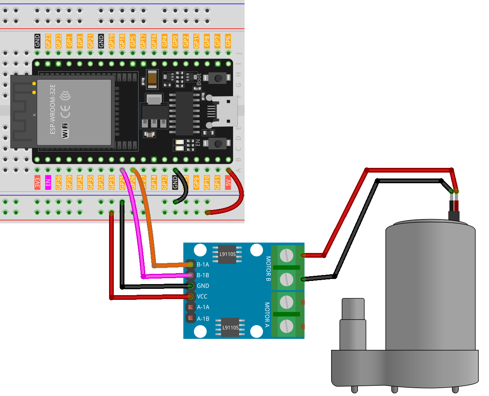

.. note::

    Ciao, benvenuto nella Comunità degli Appassionati di Raspberry Pi, Arduino e ESP32 di SunFounder su Facebook! Approfondisci la tua conoscenza di Raspberry Pi, Arduino e ESP32 insieme ad altri appassionati.

    **Why Join?**

    - **Expert Support**: Risolvi problemi post-vendita e sfide tecniche con l'aiuto della nostra comunità e del nostro team.
    - **Learn & Share**: Scambia consigli e tutorial per migliorare le tue competenze.
    - **Exclusive Previews**: Ottieni accesso anticipato alle nuove annunci di prodotti e anteprime esclusive.
    - **Special Discounts**: Goditi sconti esclusivi sui nostri prodotti più recenti.
    - **Festive Promotions and Giveaways**: Partecipa a giveaway e promozioni festive.

    👉 Pronto per esplorare e creare con noi? Clicca [|link_sf_facebook|] e unisciti oggi!

.. _esp32_lesson31_pump:

Lezione 31: Pompa Centrifuga
==================================

In questa lezione, imparerai a controllare una pompa centrifuga con una scheda di sviluppo ESP32 e una scheda di controllo motore L9110. Tratteremo l'impostazione e l'uso di due pin per operare il motore, facendo girare la pompa in una direzione per 5 secondi prima di spegnerla. Questo progetto offre esperienza pratica nella gestione delle operazioni dei motori e nella comprensione dei segnali digitali nella programmazione dei microcontrollori, rendendolo ideale per i principianti in elettronica e programmazione.

Componenti Necessari
-------------------------

In questo progetto, abbiamo bisogno dei seguenti componenti.

È decisamente conveniente acquistare un kit completo, ecco il link:

.. list-table::
    :widths: 20 20 20
    :header-rows: 1

    *   - Nome	
        - ELEMENTI IN QUESTO KIT
        - LINK
    *   - Kit Sensori per Maker Universali
        - 94
        - |link_umsk|

Puoi anche acquistarli separatamente dai link qui sotto.

.. list-table::
    :widths: 30 20
    :header-rows: 1

    *   - Introduzione al Componente
        - Link per l'Acquisto

    *   - ESP32 & Scheda di Sviluppo (:ref:`cpn_esp32_wroom_32e`)
        - |link_esp32_camera_pro_kit_buy|
    *   - :ref:`cpn_pump`
        - \-
    *   - :ref:`cpn_l9110`
        - \-
    *   - :ref:`cpn_breadboard`
        - |link_breadboard_buy|

Cablaggio
-------------

Codice
-----------

.. raw:: html

    <iframe src=https://create.arduino.cc/editor/sunfounder01/b1b98b14-d067-4cba-8c3f-a04a8ad5e0c7/preview?embed style="height:510px;width:100%;margin:10px 0" frameborder=0></iframe>

Analisi del Codice
---------------------

1. Due pin sono definiti per controllare il motore, specificamente ``motorB_1A`` e ``motorB_2A``. Questi pin si collegano alla scheda di controllo motore L9110 per controllare la direzione e la velocità del motore.
  
   .. code-block:: arduino
   
      const int motorB_1A = 26;
      const int motorB_2A = 25;

2. Configurazione dei pin e controllo del motore:

   - La funzione ``setup()`` inizializza i pin come ``OUTPUT`` il che significa che possono inviare segnali alla scheda di controllo motore.

   - La funzione ``analogWrite()`` è usata per impostare la velocità del motore. Qui, impostando un pin su ``HIGH`` e l'altro su ``LOW`` fa girare la pompa in una direzione. Dopo un ritardo di 5 secondi, entrambi i pin sono impostati su 0, spegnendo il motore.

   .. raw:: html

       
   
   .. code-block:: arduino
   
      void setup() {
         pinMode(motorB_1A, OUTPUT);  // imposta il pin 1 della pompa come output
         pinMode(motorB_2A, OUTPUT);  // imposta il pin 2 della pompa come output
         analogWrite(motorB_1A, HIGH); 
         analogWrite(motorB_2A, LOW);
         delay(5000);// attendi 5 secondi
         analogWrite(motorB_1A, 0);  // spegni la pompa
         analogWrite(motorB_2A, 0);
      }
