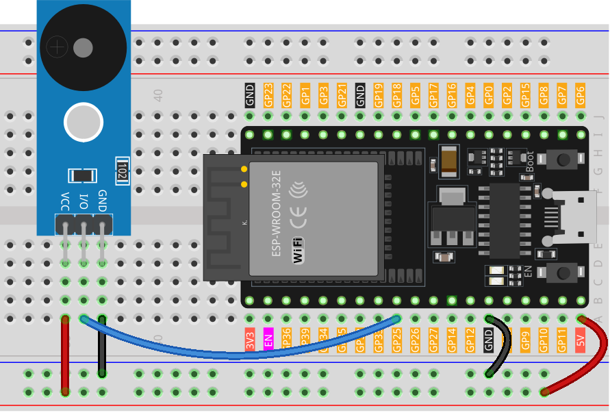

.. note:: 

    ¡Hola, bienvenido a la Comunidad de Entusiastas de Raspberry Pi, Arduino y ESP32 en Facebook! Profundiza en el mundo de Raspberry Pi, Arduino y ESP32 junto con otros entusiastas.

    **¿Por qué unirte?**

    - **Soporte experto**: Resuelve problemas postventa y desafíos técnicos con la ayuda de nuestra comunidad y equipo.
    - **Aprende y comparte**: Intercambia consejos y tutoriales para mejorar tus habilidades.
    - **Vistas previas exclusivas**: Accede a nuevos anuncios de productos y avances antes que nadie.
    - **Descuentos especiales**: Disfruta de descuentos exclusivos en nuestros productos más recientes.
    - **Promociones festivas y sorteos**: Participa en sorteos y promociones de temporada.

    👉 ¿Estás listo para explorar y crear con nosotros? Haz clic en [|link_sf_facebook|] y únete hoy mismo!

.. _esp32_lesson32_passive_buzzer:

Lección 32: Módulo de Zumbador Pasivo
=======================================

En esta lección aprenderás a reproducir una melodía en un módulo de zumbador pasivo utilizando una placa de desarrollo ESP32. Cubriremos cómo programar el ESP32 para controlar el zumbador y crear notas musicales con duraciones variables. Este proyecto es ideal para principiantes en electrónica y programación, proporcionando experiencia práctica en la generación de sonido y los principios básicos del sonido digital. Desarrollarás habilidades prácticas en el uso de la placa ESP32 e integración de componentes simples como el zumbador pasivo.

Componentes necesarios
----------------------------

En este proyecto necesitamos los siguientes componentes. 

Es muy conveniente comprar un kit completo, aquí tienes el enlace: 

.. list-table::
    :widths: 20 20 20
    :header-rows: 1

    *   - Nombre	
        - ARTÍCULOS EN ESTE KIT
        - ENLACE
    *   - Kit de Sensor Universal Maker
        - 94
        - |link_umsk|

También puedes comprarlos por separado a través de los enlaces a continuación.

.. list-table::
    :widths: 30 20
    :header-rows: 1

    *   - Introducción al componente
        - Enlace de compra

    *   - ESP32 & Placa de Desarrollo (:ref:`cpn_esp32_wroom_32e`)
        - |link_esp32_camera_pro_kit_buy|
    *   - :ref:`cpn_buzzer`
        - |link_passive_buzzer_module_buy|
    *   - :ref:`cpn_breadboard`
        - |link_breadboard_buy|

Conexiones
---------------------------

Código
---------------------------

.. raw:: html

    <iframe src=https://create.arduino.cc/editor/sunfounder01/1f3f8514-29eb-491f-b40f-0d808ef0aaac/preview?embed style="height:510px;width:100%;margin:10px 0" frameborder=0></iframe>

Análisis del código
---------------------------

1. Inclusión de la biblioteca de notas musicales:

   Esta biblioteca proporciona los valores de frecuencia para varias notas musicales, lo que permite utilizar notación musical en tu código.

   .. code-block:: arduino
       
      #include "pitches.h"

2. Definición de constantes y arreglos:

   * ``buzzerPin`` es el pin digital en la placa de desarrollo ESP32 donde se conecta el zumbador.

   * ``melody[]`` es un arreglo que almacena la secuencia de notas que se van a reproducir.

   * ``noteDurations[]`` es un arreglo que almacena la duración de cada nota en la melodía.

   .. raw:: html
       
       

   .. code-block:: arduino
   
      const int buzzerPin = 25;
      int melody[] = {
        NOTE_C4, NOTE_G3, NOTE_G3, NOTE_A3, NOTE_G3, 0, NOTE_B3, NOTE_C4
      };
      int noteDurations[] = {
        4, 8, 8, 4, 4, 4, 4, 4
      };

3. Reproducción de la melodía:

   * El ciclo ``for`` recorre cada nota en la melodía.

   * La función ``tone()`` reproduce una nota en el zumbador durante una duración específica.

   * Se añade un retraso entre las notas para distinguirlas.

   * La función ``noTone()`` detiene el sonido.

   .. raw:: html
       
       

   .. code-block:: arduino
   
      void setup() {
        for (int thisNote = 0; thisNote < 8; thisNote++) {
          int noteDuration = 1000 / noteDurations[thisNote];
          tone(buzzerPin, melody[thisNote], noteDuration);
          int pauseBetweenNotes = noteDuration * 1.30;
          delay(pauseBetweenNotes);
          noTone(buzzerPin);
        }
      }

4. Función loop vacía:

   Dado que la melodía solo se reproduce una vez en la configuración, no hay código en la función loop.
