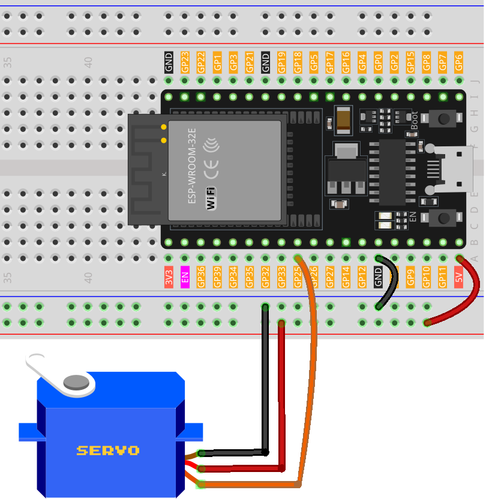

.. note::

    Ciao, benvenuto nella Comunità degli Appassionati di Raspberry Pi, Arduino e ESP32 di SunFounder su Facebook! Approfondisci la tua conoscenza di Raspberry Pi, Arduino e ESP32 insieme ad altri appassionati.

    **Why Join?**

    - **Expert Support**: Risolvi problemi post-vendita e sfide tecniche con l'aiuto della nostra comunità e del nostro team.
    - **Learn & Share**: Scambia consigli e tutorial per migliorare le tue competenze.
    - **Exclusive Previews**: Ottieni accesso anticipato alle nuove annunci di prodotti e anteprime esclusive.
    - **Special Discounts**: Goditi sconti esclusivi sui nostri prodotti più recenti.
    - **Festive Promotions and Giveaways**: Partecipa a giveaway e promozioni festive.

    👉 Pronto per esplorare e creare con noi? Clicca [|link_sf_facebook|] e unisciti oggi!

.. _esp32_lesson33_servo:

Lezione 33: Motore Servo (SG90)
==================================

In questa lezione, imparerai a controllare un motore servo con una scheda di sviluppo ESP32. Tratteremo il processo per fare oscillare il motore servo da 0 a 180 gradi e viceversa, offrendoti esperienza pratica nella gestione dei movimenti dei servi. Questo progetto è ideale per chi desidera comprendere il controllo dei motori e l'uso della modulazione di larghezza di impulso (PWM) nella robotica, utilizzando la versatile scheda ESP32.

Componenti Necessari
-----------------------

In questo progetto, abbiamo bisogno dei seguenti componenti.

È decisamente conveniente acquistare un kit completo, ecco il link:

.. list-table::
    :widths: 20 20 20
    :header-rows: 1

    *   - Nome	
        - ELEMENTI IN QUESTO KIT
        - LINK
    *   - Kit Sensori per Maker Universali
        - 94
        - |link_umsk|

Puoi anche acquistarli separatamente dai link qui sotto.

.. list-table::
    :widths: 30 20
    :header-rows: 1

    *   - Introduzione al Componente
        - Link per l'Acquisto

    *   - ESP32 & Scheda di Sviluppo (:ref:`cpn_esp32_wroom_32e`)
        - |link_esp32_camera_pro_kit_buy|
    *   - :ref:`cpn_servo`
        - |link_servo_buy|
    *   - :ref:`cpn_breadboard`
        - |link_breadboard_buy|

Cablaggio
------------

Codice
---------

.. raw:: html

    <iframe src=https://create.arduino.cc/editor/sunfounder01/877c9719-5f1b-4df1-9d3b-9e9500a5df08/preview?embed style="height:510px;width:100%;margin:10px 0" frameborder=0></iframe>

Analisi del Codice
---------------------------

1. Inclusione della Libreria

   La libreria ESP32Servo è inclusa per gestire le operazioni del motore servo.

   .. code-block:: arduino

     #include <ESP32Servo.h>

2. Definizione del Servo e del Pin

   Viene creato un oggetto Servo, e viene definito un pin per il controllo del servo.

   .. raw:: html
      
       

   .. code-block:: arduino

     Servo myServo;
     const int servoPin = 25;

3. Definizione dei Limiti di Larghezza degli Impulsi

   Vengono definiti la larghezza minima e massima degli impulsi per i limiti di movimento del servo.

   .. raw:: html
      
       

   .. code-block:: arduino

     const int minPulseWidth = 500; // 0.5 ms
     const int maxPulseWidth = 2500; // 2.5 ms

4. Funzione Setup

   - Il servo è collegato al pin definito e viene impostato il suo intervallo di larghezza di impulsi.
   - La frequenza PWM è impostata a 50Hz, standard per i servomotori.

   .. raw:: html
      
       

   .. code-block:: arduino

     void setup() {
       myServo.attach(servoPin, minPulseWidth, maxPulseWidth);
       myServo.setPeriodHertz(50);
     }

5. Funzione Loop

   - La rotazione del servo è controllata in un ciclo, muovendosi da 0 a 180 gradi, poi ritorna a 0 gradi.
   - ``writeMicroseconds()`` è utilizzata per impostare la posizione del servo basata sulla larghezza dell'impulso.

   .. raw:: html
      
       

   .. code-block:: arduino

      void loop() {
        // Ruota il servo da 0 a 180 gradi
        for (int angle = 0; angle <= 180; angle++) {
          int pulseWidth = map(angle, 0, 180, minPulseWidth, maxPulseWidth);
          myServo.writeMicroseconds(pulseWidth);
          delay(15);
        }
      
        // Ruota il servo da 180 a 0 gradi
        for (int angle = 180; angle >= 0; angle--) {
          int pulseWidth = map(angle, 0, 180, minPulseWidth, maxPulseWidth);
          myServo.writeMicroseconds(pulseWidth);
          delay(15);
        }
      }