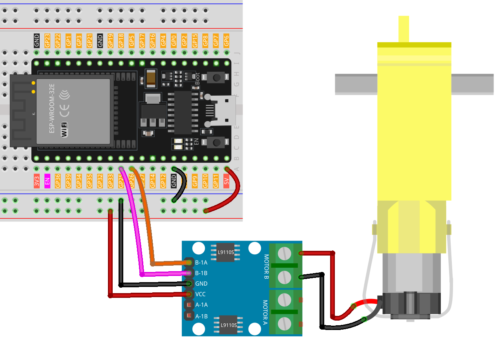

.. note::

    Ciao, benvenuto nella Comunità degli Appassionati di Raspberry Pi, Arduino e ESP32 di SunFounder su Facebook! Approfondisci la tua conoscenza di Raspberry Pi, Arduino e ESP32 insieme ad altri appassionati.

    **Why Join?**

    - **Expert Support**: Risolvi problemi post-vendita e sfide tecniche con l'aiuto della nostra comunità e del nostro team.
    - **Learn & Share**: Scambia consigli e tutorial per migliorare le tue competenze.
    - **Exclusive Previews**: Ottieni accesso anticipato alle nuove annunci di prodotti e anteprime esclusive.
    - **Special Discounts**: Goditi sconti esclusivi sui nostri prodotti più recenti.
    - **Festive Promotions and Giveaways**: Partecipa a giveaway e promozioni festive.

    👉 Pronto per esplorare e creare con noi? Clicca [|link_sf_facebook|] e unisciti oggi!

.. _esp32_lesson34_motor:

Lezione 34: Motore TT
==================================

In questa lezione, imparerai a controllare un motore con una scheda di sviluppo ESP32 e una scheda di controllo motore L9110. Copriremo la definizione e l'inizializzazione dei pin del motore, impostandoli come output, e regoleremo la velocità del motore utilizzando la funzione analogWrite. Questo progetto è ideale per chi cerca di comprendere il controllo del motore e la modulazione di larghezza di impulso (PWM) sulla piattaforma ESP32, fornendo una dimostrazione pratica delle operazioni di output in un ambiente microcontrollore.

Componenti Necessari
-------------------------

In questo progetto, abbiamo bisogno dei seguenti componenti.

È decisamente conveniente acquistare un kit completo, ecco il link:

.. list-table::
    :widths: 20 20 20
    :header-rows: 1

    *   - Nome	
        - ELEMENTI IN QUESTO KIT
        - LINK
    *   - Kit Sensori per Maker Universali
        - 94
        - |link_umsk|

Puoi anche acquistarli separatamente dai link qui sotto.

.. list-table::
    :widths: 30 20
    :header-rows: 1

    *   - Introduzione al Componente
        - Link per l'Acquisto

    *   - ESP32 & Scheda di Sviluppo (:ref:`cpn_esp32_wroom_32e`)
        - |link_esp32_camera_pro_kit_buy|
    *   - :ref:`cpn_ttmotor`
        - \-
    *   - :ref:`cpn_l9110`
        - \-
    *   - :ref:`cpn_breadboard`
        - |link_breadboard_buy|

Cablaggio
------------

Codice
------------

.. raw:: html

    <iframe src=https://create.arduino.cc/editor/sunfounder01/c1d4e7f5-140c-4ed4-a149-1af81df5dc0b/preview?embed style="height:510px;width:100%;margin:10px 0" frameborder=0></iframe>

Analisi del Codice
---------------------------

1. La prima parte del codice definisce i pin di controllo del motore. Questi sono collegati alla scheda di controllo motore L9110.

   .. code-block:: arduino
   
      // Definire i pin del motore
      const int motorB_1A = 26;
      const int motorB_2A = 25;

2. La funzione ``setup()`` inizializza i pin di controllo del motore come output utilizzando la funzione ``pinMode()``. Successivamente utilizza ``analogWrite()`` per impostare la velocità del motore. Il valore passato a ``analogWrite()`` può variare da 0 (spento) a 255 (velocità massima). Una funzione ``delay()`` viene poi utilizzata per mettere in pausa il codice per 5000 millisecondi (o 5 secondi), dopo i quali la velocità del motore è impostata a 0 (spento).

   .. code-block:: arduino
   
      void setup() {
        pinMode(motorB_1A, OUTPUT);  // impostare il pin 1 del motore come output
        pinMode(motorB_2A, OUTPUT);  // impostare il pin 2 del motore come output
   
        analogWrite(motorB_1A, 255);  // impostare la velocità del motore (0-255)
        analogWrite(motorB_2A, 0);
   
        delay(5000);
   
        analogWrite(motorB_1A, 0);  
        analogWrite(motorB_2A, 0);
      }
