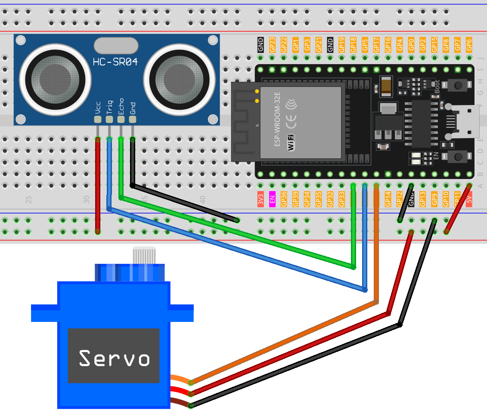

.. note:: 

    Bonjour et bienvenue dans la communauté des passionnés de SunFounder pour Raspberry Pi, Arduino et ESP32 sur Facebook ! Explorez plus en profondeur Raspberry Pi, Arduino et ESP32 avec d'autres enthousiastes.

    **Pourquoi rejoindre ?**

    - **Support d'experts** : Résolvez les problèmes après-vente et les défis techniques avec l'aide de notre communauté et de notre équipe.
    - **Apprendre & partager** : Échangez des conseils et des tutoriels pour renforcer vos compétences.
    - **Aperçus exclusifs** : Bénéficiez d'un accès anticipé aux annonces de nouveaux produits et aux avant-premières.
    - **Réductions spéciales** : Profitez de réductions exclusives sur nos produits les plus récents.
    - **Promotions festives et cadeaux** : Participez à des cadeaux et promotions festives.

    👉 Prêt à explorer et à créer avec nous ? Cliquez sur [|link_sf_facebook|] et rejoignez-nous aujourd'hui !

.. _esp32_trashcan:

Leçon 35 : Poubelle intelligente
================================

Ce projet s'articule autour du concept d'une poubelle intelligente. L'objectif 
principal est que le couvercle de la poubelle s'ouvre automatiquement lorsqu'un 
objet s'approche à une distance définie (20 cm dans ce cas). Cette fonctionnalité 
est rendue possible grâce à l'utilisation d'un capteur de distance à ultrasons 
associé à un moteur servo. La distance entre l'objet et le capteur est mesurée en 
continu. Si l'objet est suffisamment proche, le moteur servo est activé pour ouvrir 
le couvercle.

Composants nécessaires
-------------------------

Pour ce projet, nous avons besoin des composants suivants. 

Il est très pratique d'acheter un kit complet, voici le lien : 

.. list-table::
    :widths: 20 20 20
    :header-rows: 1

    *   - Nom    
        - COMPOSANTS DANS CE KIT
        - Lien
    *   - Kit de capteurs Universal Maker
        - 94
        - |link_umsk|

Vous pouvez également les acheter séparément via les liens ci-dessous.

.. list-table::
    :widths: 30 20
    :header-rows: 1

    *   - Description du composant
        - Lien d'achat

    *   - ESP32 & Carte de développement (:ref:`cpn_esp32_wroom_32e`)
        - |link_esp32_camera_pro_kit_buy|
    *   - :ref:`cpn_ultrasonic`
        - |link_ultrasonic_buy|
    *   - :ref:`cpn_servo`
        - |link_servo_buy|
    *   - :ref:`cpn_breadboard`
        - |link_breadboard_buy|
        

Câblage
----------

Code
-------

.. raw:: html

    <iframe src=https://create.arduino.cc/editor/sunfounder01/a4b1e0f2-4e01-4adc-9cb9-f984ca76dbfa/preview?embed style="height:510px;width:100%;margin:10px 0" frameborder=0></iframe>

    
Analyse du code
-----------------

Le projet repose sur la surveillance en temps réel de la distance entre un objet et une poubelle. Un capteur à ultrasons mesure en continu cette distance, et si un objet s'approche à moins de 20 cm, la poubelle interprète cela comme une intention de jeter des déchets et ouvre automatiquement son couvercle. Cette automatisation ajoute une dimension intelligente et pratique à une poubelle ordinaire.

#. Configuration initiale et déclaration des variables

   Nous incluons ici la bibliothèque ``ESP32Servo`` et définissons les constantes et les variables que nous utiliserons. Les broches pour le servo et le capteur à ultrasons sont déclarées. Nous avons également un tableau ``averDist`` pour conserver les trois mesures de distance.

   .. code-block:: arduino
       
        #include <ESP32Servo.h>

        // Configuration des paramètres du moteur servo
        Servo servo;
        const int servoPin = 27;
        const int openAngle = 0;
        const int closeAngle = 90;

        // Définir les largeurs d'impulsion minimales et maximales pour le servo
        const int minPulseWidth = 500; // 0,5 ms
        const int maxPulseWidth = 2500; // 2,5 ms

        // Configuration des paramètres du capteur à ultrasons
        const int trigPin = 26;
        const int echoPin = 25;
        long distance, averageDistance;
        long averDist[3];

        // Seuil de distance en centimètres
        const int distanceThreshold = 20;

#. Fonction ``setup()``

   La fonction ``setup()`` initialise la communication série, configure les broches du capteur à ultrasons et positionne initialement le servo en position fermée.

   .. code-block:: arduino
   
      void setup() {
        Serial.begin(9600);
        pinMode(trigPin, OUTPUT);
        pinMode(echoPin, INPUT);
        servo.attach(servoPin);
        servo.write(closeAngle);
        delay(100);
      }

   

#. Fonction ``loop()``

   La fonction ``loop()`` est responsable de mesurer en continu la distance, de calculer sa moyenne, puis de décider d'ouvrir ou de fermer le couvercle de la poubelle en fonction de cette distance moyenne.

   .. code-block:: arduino
   
        void loop() {
            // Mesurer la distance trois fois
            for (int i = 0; i <= 2; i++) {
                distance = readDistance();
                averDist[i] = distance;
                delay(10);
            }

            // Calculer la distance moyenne
            averageDistance = (averDist[0] + averDist[1] + averDist[2]) / 3;
            Serial.println(averageDistance);

            // Contrôler le servo en fonction de la distance moyenne
            if (averageDistance <= distanceThreshold) {
                servo.attach(servoPin);  // Réattacher le servo avant d'envoyer une commande
                delay(1);
                servo.write(openAngle);  // Faire pivoter le servo en position ouverte
                delay(3500);
            } else {
                servo.write(closeAngle);  // Faire pivoter le servo en position fermée
                delay(1000);
                servo.detach();  // Détacher le servo pour économiser de l'énergie lorsqu'il n'est pas utilisé
            }
        }
        

#. Fonction de lecture de distance

   Cette fonction, ``readDistance()``, interagit réellement avec le capteur à ultrasons. Elle envoie une impulsion et attend un écho. Le temps pris pour l'écho est ensuite utilisé pour calculer la distance entre le capteur et tout objet devant lui.

   Vous pouvez vous référer au :ref:`cpn_ultrasonic_principle` du capteur à ultrasons.

   .. code-block:: arduino
   
        float readDistance() {
            // Envoyer une impulsion sur la broche de déclenchement du capteur à ultrasons
            digitalWrite(trigPin, LOW);
            delayMicroseconds(2);
            digitalWrite(trigPin, HIGH);
            delayMicroseconds(10);
            digitalWrite(trigPin, LOW);

            // Mesurer la largeur d'impulsion de la broche d'écho et calculer la valeur de distance
            float distance = pulseIn(echoPin, HIGH) / 58.00;  // Formule : (340m/s * 1us) / 2
            return distance;
        }

#. Fonction d'écriture du servo

    Cette fonction mappe la valeur de l'angle à la largeur d'impulsion et appelle la fonction ``writeMicroseconds(pulseWidth)`` pour défléchir le servo à un angle spécifique.

    .. code-block:: arduino
        
        // Fonction pour faire fonctionner le servo
        void servoWrite(int angle){
            int pulseWidth = map(angle, 0, 180, minPulseWidth, maxPulseWidth);
            servo.writeMicroseconds(pulseWidth);
        }
