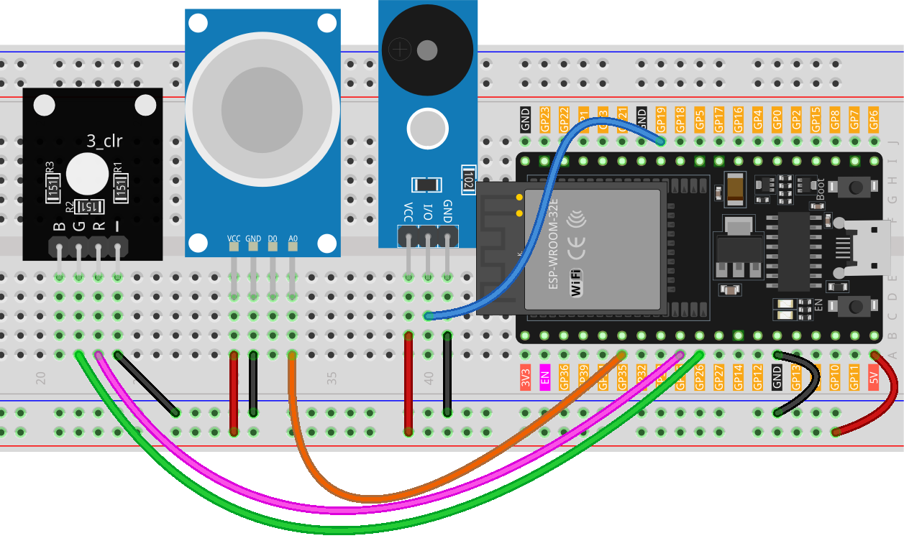

.. note::

    Ciao, benvenuto nella Comunità degli Appassionati di Raspberry Pi, Arduino e ESP32 di SunFounder su Facebook! Approfondisci la tua conoscenza di Raspberry Pi, Arduino e ESP32 insieme ad altri appassionati.

    **Why Join?**

    - **Expert Support**: Risolvi problemi post-vendita e sfide tecniche con l'aiuto della nostra comunità e del nostro team.
    - **Learn & Share**: Scambia consigli e tutorial per migliorare le tue competenze.
    - **Exclusive Previews**: Ottieni accesso anticipato alle nuove annunci di prodotti e anteprime esclusive.
    - **Special Discounts**: Goditi sconti esclusivi sui nostri prodotti più recenti.
    - **Festive Promotions and Giveaways**: Partecipa a giveaway e promozioni festive.

    👉 Pronto per esplorare e creare con noi? Clicca [|link_sf_facebook|] e unisciti oggi!

.. _esp32_gas_leak_alarm:

Lezione 36: Allarme per Fuga di Gas
======================================

Questo progetto si basa sulla simulazione di un rilevamento di fuga di gas 
utilizzando una scheda ESP32. Integrando un sensore di gas MQ-2 e un LED RGB, 
questa dimostrazione legge continuamente la concentrazione di gas. Se questa 
concentrazione supera una soglia predefinita, viene attivato un allarme (buzzer) 
e il LED RGB si illumina di rosso. Al contrario, se la concentrazione rimane al 
di sotto di questa soglia, l'allarme rimane inattivo e il LED brilla di verde. 
È importante notare che questa dimostrazione è puramente illustrativa e non 
dovrebbe sostituire i veri sistemi di rilevamento delle fughe di gas.

Componenti Necessari
------------------------

In questo progetto, abbiamo bisogno dei seguenti componenti.

È decisamente conveniente acquistare un kit completo, ecco il link:

.. list-table::
    :widths: 20 20 20
    :header-rows: 1

    *   - Nome	
        - ELEMENTI IN QUESTO KIT
        - LINK
    *   - Kit Sensori per Maker Universali
        - 94
        - |link_umsk|

Puoi anche acquistarli separatamente dai link qui sotto.

.. list-table::
    :widths: 30 20
    :header-rows: 1

    *   - Introduzione al Componente
        - Link per l'Acquisto

    *   - ESP32 & Scheda di Sviluppo (:ref:`cpn_esp32_wroom_32e`)
        - |link_esp32_camera_pro_kit_buy|
    *   - :ref:`cpn_gas`
        - |link_mq2_gas_sensor_module_buy|
    *   - :ref:`cpn_buzzer`
        - |link_passive_buzzer_module_buy|
    *   - :ref:`cpn_rgb`
        - \-
    *   - :ref:`cpn_breadboard`
        - |link_breadboard_buy|
        

Cablaggio
-------------

Codice
----------

.. raw:: html

    <iframe src=https://create.arduino.cc/editor/sunfounder01/3c24f636-7411-4d3d-8d2e-ac4400084a93/preview?embed style="height:510px;width:100%;margin:10px 0" frameborder=0></iframe>
    
Analisi del Codice
---------------------------

Il principio fondamentale del progetto si basa sul monitoraggio continuo della concentrazione di gas. Quando la concentrazione di gas rilevata supera una certa soglia, scatta un allarme e cambia il colore del LED in rosso. Questo serve come meccanismo di avviso simulato, indicativo di condizioni potenzialmente pericolose. Se la concentrazione scende sotto la soglia, l'allarme viene disattivato e il LED passa al verde, indicando un ambiente sicuro.

1. Definizione di Costanti e Variabili

    Queste righe dichiarano e inizializzano i numeri dei pin per vari componenti. Il ``sensorPin`` indica il pin analogico dove è collegato il sensore di gas MQ-2. ``sensorValue`` è una variabile intera che memorizza l'uscita analogica del sensore. Il ``buzzerPin`` indica il pin digitale a cui è collegato il buzzer. Infine, ``RPin`` e ``GPin`` sono i pin per i canali rosso e verde del LED RGB, rispettivamente.

    .. code-block:: arduino
   
        // Definire i numeri dei pin per il sensore di gas
        const int sensorPin = 35;
        int sensorValue;

        // Definire il numero del pin per il buzzer
        const int buzzerPin = 19;

        // Definire i numeri dei pin per il LED RGB
        const int RPin = 25;  // Canale R del LED RGB
        const int GPin = 26;  // Canale G del LED RGB

2. Inizializzazione in ``setup()``

    La funzione ``setup()`` inizializza le impostazioni necessarie. La comunicazione seriale inizia a una velocità di trasmissione di 9600, consentendoci di visualizzare le letture dei sensori sul Monitor Seriale. I pin per il buzzer e il LED RGB sono impostati come ``OUTPUT``, il che significa che invieranno segnali agli componenti esterni.

    .. code-block:: arduino
   
        void setup() {
            Serial.begin(9600);  // Iniziare la comunicazione seriale a 9600 baud
    
            // Inizializzare i pin del buzzer e del LED RGB come output
            pinMode(buzzerPin, OUTPUT);
            pinMode(RPin, OUTPUT);
            pinMode(GPin, OUTPUT);
        }

3. Loop Principale: Lettura del Sensore e Attivazione dell'Allarme

    La funzione ``loop()`` legge continuamente l'uscita del sensore di gas. La lettura viene poi visualizzata sul Monitor Seriale per l'osservazione. A seconda del valore del sensore, possono verificarsi due scenari:
    
    - Se il valore supera 300, il buzzer viene attivato usando ``tone()``, e il LED RGB diventa rosso.
    - Se il valore è inferiore a 300, il buzzer viene silenziato usando ``noTone()``, e il LED diventa verde.
    
    Infine, viene introdotto un ritardo di 50 millisecondi prima della prossima iterazione del loop per gestire la frequenza di lettura e ridurre il carico della CPU.

    .. code-block:: arduino
   
        void loop() {
            // Leggere il valore analogico del sensore di gas
            sensorValue = analogRead(sensorPin);

            // Stampare il valore del sensore sul monitor seriale
            Serial.print("Analog output: ");
            Serial.println(sensorValue);

            // Se il valore del sensore supera la soglia, attivare l'allarme e rendere il LED RGB rosso
            if (sensorValue > 3000) {
                tone(buzzerPin, 500, 300);
                digitalWrite(GPin, LOW);
                digitalWrite(RPin, HIGH);
                delay(500);
                // fermare la suoneria:
                noTone(buzzerPin);
            } else {
                // Se il valore del sensore è sotto la soglia, spegnere l'allarme e rendere il LED RGB verde
                noTone(buzzerPin);
                digitalWrite(RPin, LOW);
                digitalWrite(GPin, HIGH);
            }
            
            // Attendere 50 millisecondi prima della prossima iterazione del loop
            delay(50);
        }

    
   
