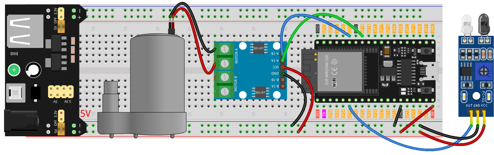

.. note::

    Bonjour et bienvenue dans la communauté des passionnés de Raspberry Pi, Arduino et ESP32 de SunFounder sur Facebook ! Approfondissez vos connaissances sur Raspberry Pi, Arduino et ESP32 avec d'autres enthousiastes.

    **Pourquoi nous rejoindre ?**

    - **Support d'experts** : Résolvez les problèmes post-vente et les défis techniques avec l'aide de notre communauté et de notre équipe.
    - **Apprendre & Partager** : Échangez des astuces et des tutoriels pour améliorer vos compétences.
    - **Aperçus exclusifs** : Accédez en avant-première aux annonces de nouveaux produits et aux aperçus.
    - **Réductions spéciales** : Profitez de réductions exclusives sur nos produits les plus récents.
    - **Promotions festives et cadeaux** : Participez à des cadeaux et promotions de vacances.

    👉 Prêt à explorer et créer avec nous ? Cliquez sur [|link_sf_facebook|] et rejoignez-nous aujourd'hui !

.. _esp32_soap_dispenser:

Leçon 37 : Distributeur automatique de savon
================================================

Le projet de distributeur automatique de savon utilise une carte Arduino Uno, 
un capteur infrarouge de détection d'obstacles et une pompe à eau.
Le capteur détecte la présence d'un objet, comme une main, ce qui active la pompe 
à eau pour distribuer le savon.

Composants nécessaires
---------------------------

Pour ce projet, nous avons besoin des composants suivants.

Il est certainement pratique d'acheter un kit complet, voici le lien :

.. list-table::
    :widths: 20 20 20
    :header-rows: 1

    *   - Nom
        - ARTICLES DANS CE KIT
        - LIEN
    *   - Kit de capteurs universels pour bricoleurs
        - 94
        - |link_umsk|

Vous pouvez également les acheter séparément via les liens ci-dessous.

.. list-table::
    :widths: 30 20
    :header-rows: 1

    *   - Introduction au composant
        - Lien d'achat

    *   - ESP32 & Carte de développement (:ref:`cpn_esp32_wroom_32e`)
        - |link_esp32_camera_pro_kit_buy|
    *   - :ref:`cpn_ir_obstacle`
        - |link_obstacle_avoidance_module_buy|
    *   - :ref:`cpn_pump`
        - \-
    *   - :ref:`cpn_l9110`
        - \-
    *   - :ref:`cpn_power_module`
        - \-
    *   - :ref:`cpn_breadboard`
        - |link_breadboard_buy|

Câblage
----------

Code
-------

.. raw:: html

    <iframe src=https://create.arduino.cc/editor/sunfounder01/f1923f60-5b82-497b-915f-ecc7ad46fea4/preview?embed style="height:510px;width:100%;margin:10px 0" frameborder=0></iframe>

Analyse du code
-------------------

L'idée principale derrière ce projet est de créer un système de distribution de savon sans contact. Le capteur infrarouge de détection d'obstacles détecte quand un objet (comme une main) est proche. En détectant un objet, le capteur envoie un signal à l'Arduino, qui à son tour active la pompe à eau pour distribuer le savon. La pompe reste active pendant une courte période, distribuant du savon, puis s'éteint.

#. **Définir les broches pour le capteur et la pompe**

    Dans cet extrait de code, nous définissons les broches Arduino qui se connectent au capteur et à la pompe.
    Nous définissons la broche 7 comme la broche du capteur et nous utiliserons la variable ``sensorValue`` pour stocker les données lues par ce capteur.
    Pour la pompe à eau, nous utilisons deux broches, 9 et 10.

    .. code-block:: arduino

        // Définir les numéros de broche pour le capteur d'obstacles infrarouge
        const int sensorPin = 35;
        int sensorValue;

        // Définir les numéros de broche pour la pompe à eau
        const int pump1A = 19;
        const int pump1B = 21;

#. **Configurer le capteur et la pompe**

    Dans la fonction ``setup()``, nous définissons les modes pour les broches que nous utilisons.
    La broche du capteur est réglée sur ``INPUT`` car elle sera utilisée pour recevoir des données du capteur.
    Les broches de la pompe sont réglées sur ``OUTPUT`` car elles enverront des commandes à la pompe.
    Nous nous assurons que la broche ``pump1B`` commence dans un état ``LOW`` (éteint),
    et nous commençons la communication série avec un débit en baud de 9600.

    .. code-block:: arduino

        void setup() {
            // Régler la broche du capteur en entrée
            pinMode(sensorPin, INPUT);

            // Initialiser les broches de la pompe en sortie
            pinMode(pump1A, OUTPUT);
            pinMode(pump1B, OUTPUT);

            // Maintenir pump1B en bas
            digitalWrite(pump1A, LOW);
            digitalWrite(pump1B, LOW);

            Serial.begin(9600);
        }

#. **Vérifier continuellement le capteur et contrôler la pompe**

   Dans la fonction ``loop()``, l'Arduino lit constamment la valeur du capteur avec ``digitalRead()`` et l'assigne à ``sensorValue()``. Il imprime ensuite cette valeur sur le moniteur série à des fins de débogage. Si le capteur détecte un objet, ``sensorValue()`` sera 0. Lorsque cela se produit, ``pump1A`` est mis sur ``HIGH``, activant la pompe, et un délai de 700 millisecondes permet à la pompe de distribuer du savon. La pompe est ensuite désactivée en réglant ``pump1A`` sur ``LOW``, et un délai d'une seconde donne au utilisateur le temps de retirer sa main avant que le cycle ne se répète.

   .. note::

      Si le capteur ne fonctionne pas correctement, ajustez l'émetteur et le récepteur IR pour les rendre parallèles. De plus, vous pouvez ajuster la portée de détection à l'aide du potentiomètre intégré.

   .. code-block:: arduino

        void loop() {
            sensorValue = digitalRead(sensorPin);
            Serial.println(sensorValue);

            // Si un objet est détecté, activer la pompe pour une brève période, puis l'éteindre
            if (sensorValue == 0) {
                digitalWrite(pump1A, HIGH);
                delay(700);
                digitalWrite(pump1A, LOW);
                delay(1000);
            }
        }
