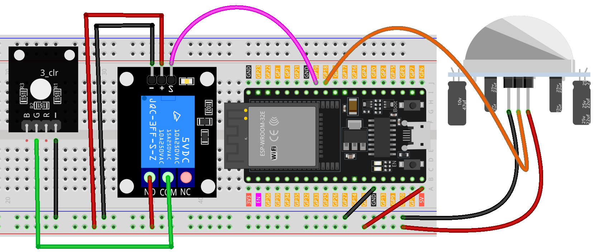

.. note:: 

    ¡Hola, bienvenido a la Comunidad de Entusiastas de Raspberry Pi, Arduino y ESP32 en Facebook! Profundiza en el mundo de Raspberry Pi, Arduino y ESP32 junto con otros entusiastas.

    **¿Por qué unirte?**

    - **Soporte experto**: Resuelve problemas postventa y desafíos técnicos con la ayuda de nuestra comunidad y equipo.
    - **Aprende y comparte**: Intercambia consejos y tutoriales para mejorar tus habilidades.
    - **Vistas previas exclusivas**: Accede a nuevos anuncios de productos y avances antes que nadie.
    - **Descuentos especiales**: Disfruta de descuentos exclusivos en nuestros productos más recientes.
    - **Promociones festivas y sorteos**: Participa en sorteos y promociones de temporada.

    👉 ¿Estás listo para explorar y crear con nosotros? Haz clic en [|link_sf_facebook|] y únete hoy mismo!

.. _esp32_motion_triggered_relay:

Lección 38: Relé activado por movimiento
=============================================

Este proyecto tiene como objetivo controlar una luz operada por un relé 
utilizando un sensor infrarrojo pasivo (PIR). Cuando el sensor PIR detecta 
movimiento, se activa el relé, encendiendo la luz. La luz permanece encendida 
durante 5 segundos después del último movimiento detectado.

.. warning::

    Como demostración, estamos utilizando un relé para controlar un módulo de LED RGB. 
    Sin embargo, en escenarios reales, este puede no ser el enfoque más práctico.

    **Aunque puedes conectar el relé a otros electrodomésticos en aplicaciones reales, se requiere extrema precaución al tratar con ALTA tensión AC. Un uso incorrecto o inapropiado puede causar lesiones graves o incluso la muerte. Por lo tanto, está destinado a personas que estén familiarizadas y sean expertas en el manejo de ALTA tensión AC. Siempre prioriza la seguridad.**

Componentes necesarios
--------------------------

En este proyecto necesitamos los siguientes componentes. 

Es muy conveniente comprar un kit completo, aquí tienes el enlace: 

.. list-table::
    :widths: 20 20 20
    :header-rows: 1

    *   - Nombre	
        - ARTÍCULOS EN ESTE KIT
        - ENLACE
    *   - Kit de Sensor Universal Maker
        - 94
        - |link_umsk|

También puedes comprarlos por separado a través de los enlaces a continuación.

.. list-table::
    :widths: 30 20
    :header-rows: 1

    *   - Introducción al componente
        - Enlace de compra

    *   - ESP32 & Placa de Desarrollo (:ref:`cpn_esp32_wroom_32e`)
        - |link_esp32_camera_pro_kit_buy|
    *   - :ref:`cpn_pir_motion`
        - \-
    *   - :ref:`cpn_relay`
        - \-
    *   - :ref:`cpn_rgb`
        - \-
    *   - :ref:`cpn_breadboard`
        - |link_breadboard_buy|
        

Conexiones
---------------------------

Código
---------------------------

.. raw:: html

    <iframe src=https://create.arduino.cc/editor/sunfounder01/5a29dc43-f362-434e-9e5a-f32dcd41b952/preview?embed style="height:510px;width:100%;margin:10px 0" frameborder=0></iframe>
    

Análisis del código
---------------------------

El proyecto se basa en la capacidad del sensor PIR para detectar movimiento. Cuando se detecta movimiento, el sensor envía una señal al Arduino, que a su vez activa el módulo de relé, lo que enciende una luz. La luz permanece encendida durante un tiempo determinado (en este caso, 5 segundos) después del último movimiento detectado, asegurando que el área permanezca iluminada por un corto período, incluso si el movimiento cesa.

1. **Configuración inicial y declaración de variables**

    Este segmento define las constantes y variables que se utilizarán en el código. Configuramos los pines del relé y del PIR, así como una constante de retraso para el movimiento. También tenemos una variable para rastrear el último tiempo de detección de movimiento y una bandera para monitorear si se detectó movimiento.

    .. code-block:: arduino
   
        // Definir el número de pin para el relé
        const int relayPin = 19;

        // Definir el número de pin para el sensor PIR
        const int pirPin = 18;

        // Umbral de retraso por movimiento en milisegundos
        const unsigned long MOTION_DELAY = 5000;

        unsigned long lastMotionTime = 0;  // Marca temporal del último movimiento detectado
        bool motionDetected = false;       // Bandera para verificar si se detectó movimiento
        
   

2. **Configuración de los pines en la función ``setup()``**

    En la función ``setup()``, configuramos los modos de los pines para el relé y el sensor PIR. También inicializamos el relé para que esté apagado al inicio.

    .. code-block:: arduino
    
        void setup() {
            pinMode(relayPin, OUTPUT);    // Configurar relayPin como pin de salida
            pinMode(pirPin, INPUT);       // Configurar el pin PIR como entrada
            digitalWrite(relayPin, LOW);  // Apagar el relé inicialmente
        }

3. **Lógica principal en la función ``loop()``**

    La función ``loop()`` contiene la lógica principal. Cuando el sensor PIR detecta movimiento, envía una señal ``HIGH``, encendiendo el relé y actualizando ``lastMotionTime``. Si no hay movimiento durante el retraso especificado (5 segundos en este caso), el relé se apaga.
    
    Este enfoque asegura que, incluso si el movimiento es esporádico o breve, la luz permanezca encendida durante al menos 5 segundos después del último movimiento detectado, proporcionando una duración de iluminación constante.

    .. code-block:: arduino
    
        void loop() {
            if (digitalRead(pirPin) == HIGH) {
                lastMotionTime = millis();     // Actualizar el último tiempo de movimiento
                digitalWrite(relayPin, HIGH);  // Encender el relé (y la luz)
                motionDetected = true;
            }
    
            // Si se detectó movimiento anteriormente y han pasado 5 segundos, apagar el relé
            if (motionDetected && (millis() - lastMotionTime >= MOTION_DELAY)) {
                digitalWrite(relayPin, LOW);  // Apagar el relé
                motionDetected = false;
            }
        }
    
   
