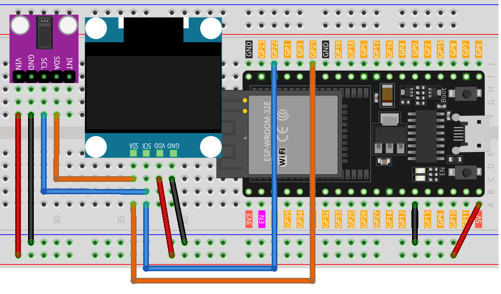

.. note::

    Bonjour, bienvenue dans la communauté des passionnés de SunFounder Raspberry Pi, Arduino et ESP32 sur Facebook ! Plongez plus profondément dans l'univers du Raspberry Pi, de l'Arduino et de l'ESP32 avec d'autres amateurs.

    **Pourquoi rejoindre ?**

    - **Support d'experts** : Résolvez les problèmes post-vente et les défis techniques avec l'aide de notre communauté et de notre équipe.
    - **Apprendre & Partager** : Échangez des conseils et des tutoriels pour améliorer vos compétences.
    - **Aperçus exclusifs** : Obtenez un accès anticipé aux annonces de nouveaux produits et aux aperçus.
    - **Réductions spéciales** : Profitez de réductions exclusives sur nos nouveaux produits.
    - **Promotions festives et cadeaux** : Participez à des tirages au sort et des promotions de fêtes.

    👉 Prêt à explorer et créer avec nous ? Cliquez sur [|link_sf_facebook|] et rejoignez-nous aujourd'hui !

.. _esp32_heartrate_monitor:

Leçon 39 : Moniteur de fréquence cardiaque
==============================================

Ce projet Arduino vise à construire un moniteur de fréquence cardiaque simple en utilisant un capteur d'oxymétrie de pouls MAX30102 et un afficheur OLED SSD1306. Le code mesure la fréquence cardiaque en déterminant le temps entre les battements de cœur. En prenant quatre mesures, il calcule leur moyenne et présente la fréquence cardiaque moyenne résultante sur un écran OLED. Si le capteur ne détecte pas de doigt, il envoie une invite à l'utilisateur pour positionner correctement son doigt sur le capteur.

Composants requis
---------------------

Pour ce projet, nous avons besoin des composants suivants.

Il est définitivement pratique d'acheter un kit complet, voici le lien :

.. list-table::
    :widths: 20 20 20
    :header-rows: 1

    *   - Nom	
        - ARTICLES DANS CE KIT
        - LIEN
    *   - Kit de capteurs universels pour créateurs
        - 94
        - |link_umsk|

Vous pouvez également les acheter séparément via les liens ci-dessous.

.. list-table::
    :widths: 30 20
    :header-rows: 1

    *   - Introduction au composant
        - Lien d'achat

    *   - ESP32 & Carte de développement (:ref:`cpn_esp32_wroom_32e`)
        - |link_esp32_camera_pro_kit_buy|
    *   - :ref:`cpn_max30102`
        - |link_max30102_module_buy|
    *   - :ref:`cpn_oled`
        - \-
    *   - :ref:`cpn_breadboard`
        - |link_breadboard_buy|
        

Câblage
---------

Code
-------

.. note:: 
   Pour installer la bibliothèque, ouvrez le Gestionnaire de bibliothèques Arduino, recherchez **"SparkFun MAX3010x"**, **"Adafruit SSD1306"**, et **"Adafruit GFX"**, puis installez-les.

.. raw:: html

    <iframe src=https://create.arduino.cc/editor/sunfounder01/1da3c9e2-e205-4af9-8741-43f7ea19bec8/preview?embed style="height:510px;width:100%;margin:10px 0" frameborder=0></iframe>
    
Analyse du code
--------------------

Le principe principal de ce projet est de capturer les pulsations du flux sanguin à travers un doigt en utilisant le capteur MAX30102.
À mesure que le sang est pompé à travers le corps, il provoque de petits changements dans le volume du sang dans les vaisseaux du bout du doigt.
En projetant de la lumière à travers le doigt et en mesurant la quantité de lumière qui est absorbée ou renvoyée,
le capteur détecte ces changements minuscules de volume.
L'intervalle de temps entre les impulsions successives est ensuite utilisé pour calculer la fréquence cardiaque en battements par minute (BPM).
Cette valeur est ensuite moyennée sur quatre mesures et affichée sur l'écran OLED.

1. **Inclusions de bibliothèques et déclarations initiales**:

   Le code commence par inclure les bibliothèques nécessaires pour l'affichage OLED, le capteur MAX30102, et le calcul de la fréquence cardiaque. De plus, la configuration pour l'affichage OLED et les variables pour le calcul de la fréquence cardiaque sont déclarées.

   .. note:: 
      Pour installer la bibliothèque, ouvrez le Gestionnaire de bibliothèques Arduino, recherchez **"SparkFun MAX3010x"**, **"Adafruit SSD1306"**, et **"Adafruit GFX"**, puis installez-les.

   .. code-block:: arduino

      #include <Adafruit_GFX.h>  // Bibliothèques OLED
      #include <Adafruit_SSD1306.h>
      #include <Wire.h>
      #include "MAX30105.h"   // Bibliothèque MAX3010x
      #include "heartRate.h"  // Algorithme de calcul de la fréquence cardiaque

      // ... Variables et configuration OLED

   Dans ce projet, nous avons également préparé quelques bitmaps.
   Le mot-clé ``PROGMEM`` indique que le tableau est stocké dans la mémoire programme du microcontrôleur.
   Stocker des données dans la mémoire programme (PROGMEM) au lieu de la RAM peut être utile pour de grandes quantités de données,
   qui autrement prendraient trop de place en RAM.

   .. code-block:: arduino

      static const unsigned char PROGMEM beat1_bmp[] = {...}

      static const unsigned char PROGMEM beat2_bmp[] = {...}

2. **Fonction Setup**:

   Initialise la communication I2C, démarre la communication série, initialise l'affichage OLED, 
   et configure le capteur MAX30102.

   .. code-block:: arduino

      void setup() {
          Wire.setClock(400000);
          Serial.begin(9600);
          display.begin(SSD1306_SWITCHCAPVCC, SCREEN_ADDRESS);
          // ... Reste du code de configuration

3. **Boucle principale**:

   La fonctionnalité principale réside ici. La valeur IR est lue à partir du capteur. 
   Si un doigt est détecté (valeur IR supérieure à 50,000), le programme vérifie si un battement de cœur est détecté. 
   Lorsqu'un battement de cœur est détecté, 
   l'écran OLED affiche le BPM et le temps entre les battements de cœur est utilisé pour calculer le BPM. 
   Sinon, il invite l'utilisateur à placer son doigt sur le capteur.
   
   Nous avons également préparé deux bitmaps avec des battements de cœur, 
   et en alternant entre ces deux bitmaps, nous pouvons obtenir un effet visuel dynamique.

   .. code-block:: arduino

      void loop() {
        // Obtenez la valeur IR du capteur
        long irValue = particleSensor.getIR();  
      
        // Si un doigt est détecté
        if (irValue > 50000) {
      
          // Vérifiez si un battement est détecté
          if (checkForBeat(irValue) == true) {

            // Mettre à jour l'affichage OLED
            // Calculer le BPM
      
            // Calculer le BPM moyen
            // Imprimez la valeur IR, la valeur BPM actuelle et la valeur BPM moyenne sur le moniteur série

            // Mettre à jour l'affichage OLED
            
          }
        }
        else {
          // ... Invite à placer le doigt sur le capteur
        }
      }
      
      
