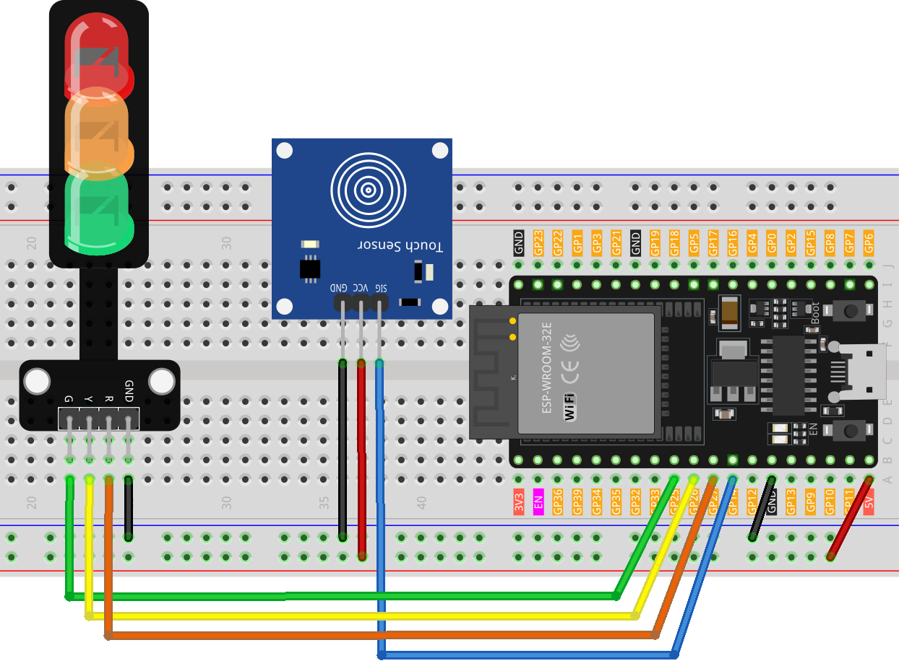

.. note::

    Ciao, benvenuto nella Comunità di Appassionati di SunFounder Raspberry Pi, Arduino e ESP32 su Facebook! Approfondisci la tua conoscenza di Raspberry Pi, Arduino e ESP32 insieme ad altri entusiasti.

    **Why Join?**

    - **Expert Support**: Risolvi problemi post-vendita e sfide tecniche con l'aiuto della nostra comunità e del nostro team.
    - **Learn & Share**: Scambia consigli e tutorial per migliorare le tue competenze.
    - **Exclusive Previews**: Ottieni accesso anticipato ai nuovi annunci di prodotto e anteprime.
    - **Special Discounts**: Goditi sconti esclusivi sui nostri prodotti più recenti.
    - **Festive Promotions and Giveaways**: Partecipa a giveaway e promozioni festive.

    👉 Pronto per esplorare e creare con noi? Clicca [|link_sf_facebook|] e unisciti oggi!

.. _esp32_touch_toggle_light:

Lezione 40: Interruttore luminoso tattile
===============================================

Questo progetto è un'implementazione semplice di un sistema di controllo semaforico utilizzando un sensore tattile e un modulo LED semaforico.
L'attivazione del sensore tattile avvia una sequenza dove i LED si illuminano nel seguente ordine: Rosso -> Giallo -> Verde.

Componenti Necessari
--------------------------

In questo progetto, abbiamo bisogno dei seguenti componenti.

È decisamente conveniente acquistare un kit completo, ecco il link:

.. list-table::
    :widths: 20 20 20
    :header-rows: 1

    *   - Nome	
        - ELEMENTI IN QUESTO KIT
        - LINK
    *   - Kit Sensori per Maker Universali
        - 94
        - |link_umsk|

Puoi anche acquistarli separatamente dai link qui sotto.

.. list-table::
    :widths: 30 20
    :header-rows: 1

    *   - Introduzione al Componente
        - Link per l'Acquisto

    *   - ESP32 & Scheda di Sviluppo (:ref:`cpn_esp32_wroom_32e`)
        - |link_esp32_camera_pro_kit_buy|
    *   - :ref:`cpn_touch`
        - \-
    *   - :ref:`cpn_traffic`
        - \-
    *   - :ref:`cpn_breadboard`
        - |link_breadboard_buy|
        

Cablaggio
-------------

Codice
-----------

.. raw:: html

    <iframe src=https://create.arduino.cc/editor/sunfounder01/3745fb2e-d031-4698-9360-a2f7e9a54c13/preview?embed style="height:510px;width:100%;margin:10px 0" frameborder=0></iframe>

  
Analisi del Codice
-----------------------

Il funzionamento di questo progetto è semplice: 
un rilevamento tattile sul sensore innesca l'illuminazione del prossimo LED nella sequenza (Rosso -> Giallo -> Verde), controllato dalla variabile ``currentLED``.

1. Definire i pin e i valori iniziali

    .. code-block:: arduino
   
        // Definire i pin per il sensore tattile e i LED
        const int touchSensorPin = 14;  // pin del sensore tattile
        const int rledPin = 27;         // pin del LED rosso
        const int yledPin = 26;         // pin del LED giallo
        const int gledPin = 25;         // pin del LED verde

        int lastTouchState;     // lo stato precedente del sensore tattile
        int currentTouchState;  // lo stato attuale del sensore tattile
        int currentLED = 0;     // LED attuale 0->Rosso, 1->Giallo, 2->Verde
   
   Queste linee stabiliscono le connessioni dei pin per i componenti della scheda Arduino e inizializzano lo stato del sensore tattile e dei LED.

2. Funzione setup()

    .. code-block:: arduino
   
        void setup() {
            Serial.begin(9600);              // inizia la comunicazione seriale
            pinMode(touchSensorPin, INPUT);  // configura il pin del sensore tattile come input

            // imposta i pin dei LED come uscite
            pinMode(rledPin, OUTPUT);
            pinMode(yledPin, OUTPUT);
            pinMode(gledPin, OUTPUT);

            currentTouchState = digitalRead(touchSensorPin);
        }
   
    Questa funzione configura l'impostazione iniziale per Arduino, definendo le modalità di input e output e avviando la comunicazione seriale per il debugging.

3. Funzione loop()

    .. code-block:: arduino
   
        void loop() {
            lastTouchState = currentTouchState;               // salva l'ultimo stato
            currentTouchState = digitalRead(touchSensorPin);  // leggi il nuovo stato

            // verifica se il sensore tattile è stato appena toccato
            if (lastTouchState == LOW && currentTouchState == HIGH) {
                Serial.println("Il sensore è stato toccato");

                turnAllLEDsOff();  // Spegni tutti i LED

                // accendi il prossimo LED nella sequenza
                switch (currentLED) {
                    case 0:
                        digitalWrite(rledPin, HIGH);
                        currentLED = 1;
                        break;
                    case 1:
                        digitalWrite(yledPin, HIGH);
                        currentLED = 2;
                        break;
                    case 2:
                        digitalWrite(gledPin, HIGH);
                        currentLED = 0;
                        break;
                }
            }
        }

    Il loop monitora continuamente il sensore tattile, passando attraverso i LED quando viene rilevato un tocco, garantendo che un solo LED sia acceso alla volta.

4. Funzione per spegnere i LED

    .. code-block:: arduino
      
        // funzione per spegnere tutti i LED
        void turnAllLEDsOff() {
            digitalWrite(rledPin, LOW);
            digitalWrite(yledPin, LOW);
            digitalWrite(gledPin, LOW);
        }

    Questa funzione ausiliaria spegne tutti i LED, aiutando nel processo di ciclizzazione.