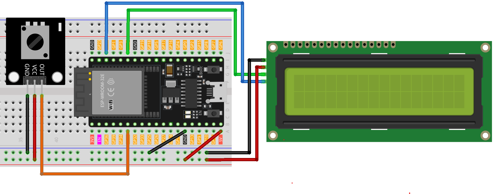

.. note::

    Ciao, benvenuto nella Comunità degli Appassionati di SunFounder Raspberry Pi, Arduino e ESP32 su Facebook! Immergiti più a fondo in Raspberry Pi, Arduino e ESP32 con altri entusiasti.

    **Why Join?**

    - **Expert Support**: Risolvi problemi post-vendita e sfide tecniche con l'aiuto della nostra comunità e del nostro team.
    - **Learn & Share**: Scambia consigli e tutorial per migliorare le tue abilità.
    - **Exclusive Previews**: Ottieni accesso anticipato ai nuovi annunci di prodotti e anteprime.
    - **Special Discounts**: Goditi sconti esclusivi sui nostri prodotti più recenti.
    - **Festive Promotions and Giveaways**: Partecipa a promozioni festive e giveaway.

    👉 Pronto per esplorare e creare con noi? Clicca [|link_sf_facebook|] e unisciti oggi!

.. _esp32_potentiometer_scale_value:

Lezione 41: Scala dei valori del potenziometro
=============================================================

Questo progetto si concentra sulla lettura del valore di un potenziometro e sulla sua visualizzazione su un LCD 1620 dotato di interfaccia I2C.
Inoltre, il valore viene trasmesso al monitor seriale per il monitoraggio in tempo reale.
Un aspetto distintivo di questo progetto è la rappresentazione grafica del valore del potenziometro sul LCD,
rappresentata come una barra di lunghezza variabile proporzionale alla lettura del potenziometro.

Componenti Necessari
--------------------------

In questo progetto, abbiamo bisogno dei seguenti componenti.

È decisamente conveniente acquistare un kit completo, ecco il link:

.. list-table::
    :widths: 20 20 20
    :header-rows: 1

    *   - Nome	
        - ELEMENTI IN QUESTO KIT
        - LINK
    *   - Kit Sensori per Maker Universali
        - 94
        - |link_umsk|

Puoi anche acquistarli separatamente dai link qui sotto.

.. list-table::
    :widths: 30 20
    :header-rows: 1

    *   - Introduzione al Componente
        - Link per l'Acquisto

    *   - ESP32 & Scheda di Sviluppo (:ref:`cpn_esp32_wroom_32e`)
        - |link_esp32_camera_pro_kit_buy|
    *   - :ref:`cpn_potentiometer`
        - \-
    *   - :ref:`cpn_i2c_lcd1602`
        - \-
    *   - :ref:`cpn_breadboard`
        - |link_breadboard_buy|
        

Cablaggio
------------

Codice
-----------

.. raw:: html

   <iframe src=https://create.arduino.cc/editor/sunfounder01/407cf491-e932-4334-a3f3-e04f7309c941/preview?embed style="height:510px;width:100%;margin:10px 0" frameborder=0></iframe>

   
Analisi del Codice
----------------------

La funzionalità principale di questo progetto è leggere costantemente il valore del potenziometro, mapparlo in una scala ridimensionata (0-16) e visualizzare il risultato sia numericamente che graficamente sul LCD. L'implementazione minimizza le oscillazioni aggiornando il display solo quando si verificano cambiamenti significativi nella lettura, mantenendo così un'esperienza visiva fluida.

1. **Inclusione delle Librerie e Inizializzazione**:

   .. code-block:: arduino
   
      // Librerie richieste per le operazioni I2C e LCD
      #include <Wire.h>
      #include <LiquidCrystal_I2C.h>

      // Inizializza l'LCD all'indirizzo I2C 0x27 con 16 colonne e 2 righe
      LiquidCrystal_I2C lcd(0x27, 16, 2);

   Questo segmento incorpora le librerie necessarie per la comunicazione I2C e il controllo dell'LCD. Successivamente, inizializza un'istanza dell'LCD con l'indirizzo I2C di ``0x27``, specificando le sue dimensioni come ``16 columns`` e ``2 rows``.

2. **Dichiarazione delle Variabili**:

   .. code-block:: arduino
   
      // Variabili per contenere le letture del potenziometro
      int lastRead = 0;     // Valore precedente del potenziometro
      int currentRead = 0;  // Valore attuale del potenziometro

   Le variabili ``lastRead`` e ``currentRead`` sono utilizzate per tenere traccia delle letture del potenziometro in momenti diversi.

3. **Funzione setup()**:

   .. code-block:: arduino
   
      void setup() {
        lcd.init();          // Inizia l'LCD
        lcd.backlight();     // Attiva la retroilluminazione dell'LCD
        Serial.begin(9600);  // Inizia la comunicazione seriale a 9600 baud
      }

   Questa funzione prepara l'LCD e avvia la comunicazione seriale, configurando l'ambiente per l'operatività del progetto.

4. **Loop Principale**:

   .. code-block:: arduino
   
      void loop() {
         // Leggi il valore attuale del potenziometro
         int currentRead = analogRead(35);

         // Mappa il valore letto da 0-4096 a 0-16
         int barLength = map(currentRead, 0, 4096, 0, 16);

         // Aggiorna l'LCD solo se la differenza tra la lettura attuale e quella precedente è maggiore di 2 per evitare jitter
         if (abs(lastRead - currentRead) > 2) {
            lcd.clear();
            lcd.setCursor(0, 0);
            lcd.print("Value:");
            lcd.setCursor(7, 0);
            lcd.print(currentRead);
            Serial.println(currentRead);

            // Visualizza una barra sulla seconda riga dell'LCD proporzionale al valore del potenziometro
            for (int i = 0; i < barLength; i++) {
               lcd.setCursor(i, 1);
               lcd.print(char(255));
            }
         }
         // Aggiorna il valore della lettura precedente per il prossimo ciclo
         lastRead = currentRead;

         // Introduce un ritardo per una lettura stabile
         delay(200);
      }

   * Legge il potenziometro e converte il suo valore in una scala adatta alla rappresentazione visiva.
   * Aggiorna l'LCD solo quando viene rilevato un cambiamento significativo, visualizzando il valore numerico e un grafico a barre corrispondente.
   * Invia anche la lettura al monitor seriale per l'osservazione esterna.
   * Garantisce stabilità e reattività introducendo un breve ritardo tra le iterazioni.

