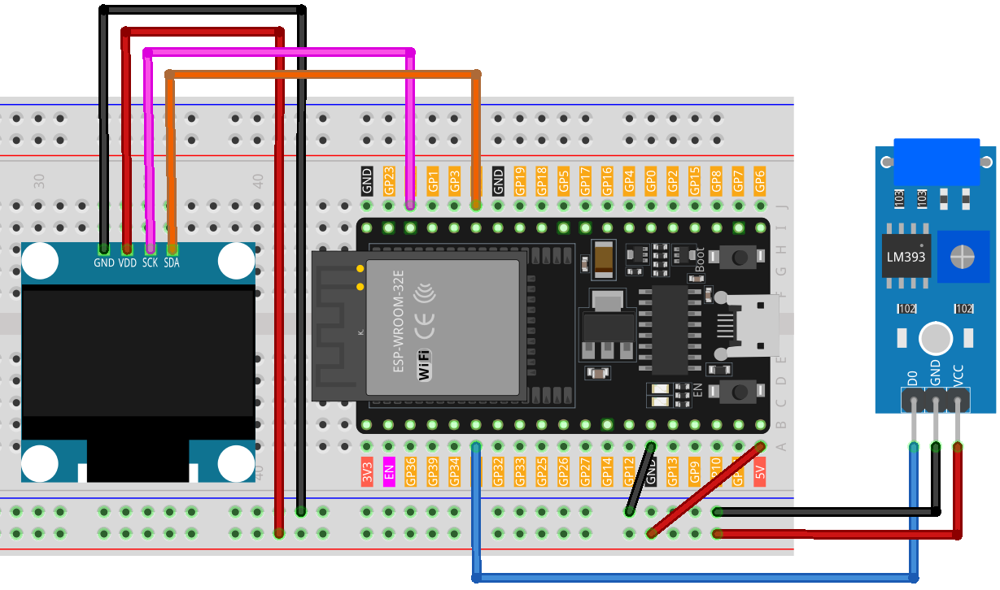

.. note::

    Bonjour, bienvenue dans la communauté des passionnés de SunFounder Raspberry Pi, Arduino et ESP32 sur Facebook ! Plongez plus profondément dans l'univers du Raspberry Pi, de l'Arduino et de l'ESP32 avec d'autres amateurs.

    **Pourquoi rejoindre ?**

    - **Support d'experts** : Résolvez les problèmes après-vente et les défis techniques avec l'aide de notre communauté et de notre équipe.
    - **Apprendre & Partager** : Échangez des conseils et des tutoriels pour améliorer vos compétences.
    - **Aperçus exclusifs** : Obtenez un accès anticipé aux annonces de nouveaux produits et aux aperçus.
    - **Réductions spéciales** : Profitez de réductions exclusives sur nos nouveaux produits.
    - **Promotions festives et cadeaux** : Participez à des tirages au sort et des promotions de fêtes.

    👉 Prêt à explorer et créer avec nous ? Cliquez sur [|link_sf_facebook|] et rejoignez-nous aujourd'hui !

.. _esp32_digital_dice:

Leçon 42 : Dé digital
=============================================================

Ce programme simule un lancer de dé sur un affichage OLED.
La simulation est déclenchée en secouant l'interrupteur de vibration, ce qui provoque le défilement des chiffres de 1 à 6,
similaire à un lancer de dé.
L'affichage s'arrête après une courte durée, révélant un nombre choisi au hasard qui représente le résultat du lancer de dé.

Composants requis
--------------------

Pour ce projet, nous avons besoin des composants suivants.

Il est définitivement pratique d'acheter un kit complet, voici le lien :

.. list-table::
    :widths: 20 20 20
    :header-rows: 1

    *   - Nom	
        - ARTICLES DANS CE KIT
        - LIEN
    *   - Kit de capteurs universels pour créateurs
        - 94
        - |link_umsk|

Vous pouvez également les acheter séparément via les liens ci-dessous.

.. list-table::
    :widths: 30 20
    :header-rows: 1

    *   - Introduction au composant
        - Lien d'achat

    *   - ESP32 & Carte de développement (:ref:`cpn_esp32_wroom_32e`)
        - |link_esp32_camera_pro_kit_buy|
    *   - :ref:`cpn_vibration`
        - |link_sw420_vibration_module_buy|
    *   - :ref:`cpn_oled`
        - \-
    *   - :ref:`cpn_breadboard`
        - |link_breadboard_buy|
        

Câblage
---------

Code
-------

.. note:: 
   Pour installer la bibliothèque, utilisez le Gestionnaire de bibliothèques Arduino et recherchez **"Adafruit SSD1306"** et **"Adafruit GFX"** puis installez-la.

.. raw:: html

    <iframe src=https://create.arduino.cc/editor/sunfounder01/f3c250f6-c5f6-4dc9-906a-a5a914741fe3/preview?embed style="height:510px;width:100%;margin:10px 0" frameborder=0></iframe>

Analyse du code
------------------

Décryptage complet du code :

1. Initialisation des variables :

    ``vibPin`` : Broche numérique connectée au capteur de vibration.

    .. code-block:: arduino

        const int vibPin = 35;    // La broche où est connecté l'interrupteur de vibration

2. Variables volatiles :

    ``rolling`` : Un indicateur volatile qui signale l'état de roulement du dé. Il est volatile car il est accédé à la fois dans la routine de service d'interruption et dans le programme principal.

    .. code-block:: arduino

        volatile bool rolling = false;

3. ``setup()`` :

    Configure le mode d'entrée du capteur de vibration.
    Attribue une interruption au capteur pour déclencher la fonction rollDice lors d'un changement d'état.
    Initialise l'affichage OLED.

    .. code-block:: arduino

        void setup() {
            // Initialiser les broches
            pinMode(vibPin, INPUT);  

            // initialiser l'objet OLED
            if (!display.begin(SSD1306_SWITCHCAPVCC, SCREEN_ADDRESS)) {
                Serial.println(F("SSD1306 allocation failed"));
                for (;;)
                ;
            }

            // Attacher une interruption à la broche vibPin. Lorsque l'interrupteur de vibration est activé, la fonction shakeDetected sera appelée
            attachInterrupt(digitalPinToInterrupt(vibPin), rollDice, CHANGE);
        }

4. ``loop()``:

    Vérifie continuellement si ``rolling`` est vrai, affichant un nombre aléatoire entre 1 et 6 pendant cet état. Le roulement cesse si le capteur a été secoué pendant plus de 500 millisecondes.

    .. code-block:: arduino

        void loop() {
            // Vérifier si ça roule
            if (rolling) {
                byte number = random(1, 7);  // Générer un nombre aléatoire entre 1 et 6
                displayNumber(number);
                delay(80);  // Délai pour rendre l'effet de roulement visible

                // Arrêter de rouler après 1 seconde
                if ((millis() - lastShakeTime) > 1000) {
                    rolling = false;
                }
            }
        }

5. ``rollDice()`` :

    La routine de service d'interruption pour le capteur de vibration. Elle initie le lancer de dé lorsque le capteur est secoué en enregistrant le temps actuel.

    .. code-block:: arduino

        // Gestionnaire d'interruption pour la détection de secousse
        void rollDice() {
            if (digitalRead(vibPin) == LOW) {
                lastShakeTime = millis();  // Enregistrer le temps de secousse
                rolling = true;            // Commencer à rouler
            }
        }

6. ``displayNumber()`` :

    Affiche un nombre sélectionné sur l'écran OLED.

    .. code-block:: arduino

        // Fonction pour afficher un nombre sur l'affichage à 7 segments
        void displayNumber(byte number) {
            display.clearDisplay();  // Effacer l'écran

            // Afficher le texte
            display.setTextSize(4);       // Définir la taille du texte
            display.setTextColor(WHITE);  // Définir la couleur du texte
            display.setCursor(54, 20);    // Définir la position du curseur
            display.println(number);
            display.display();  // Afficher le contenu à l'écran

        }