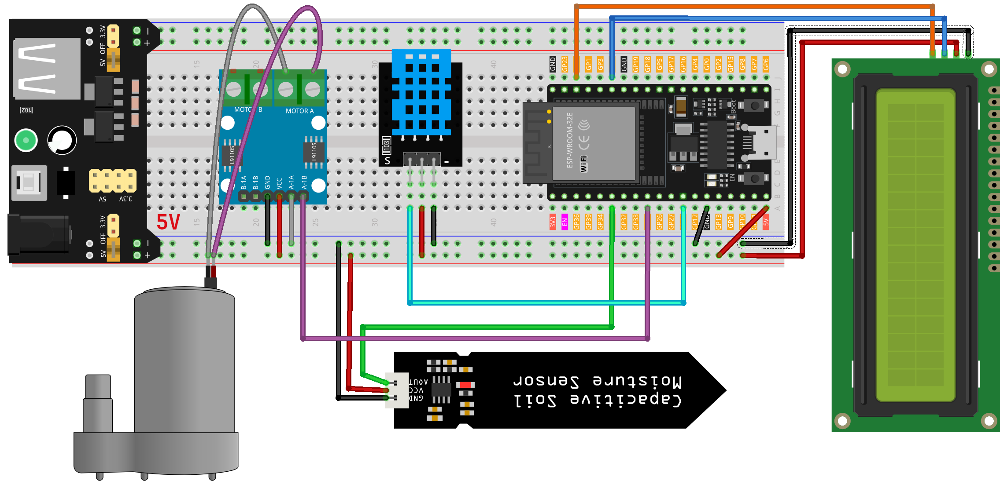
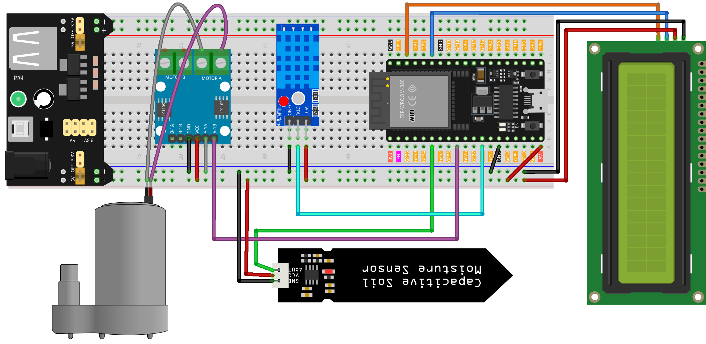

.. note::

    Bonjour, bienvenue dans la communauté des passionnés de SunFounder Raspberry Pi, Arduino et ESP32 sur Facebook ! Plongez plus profondément dans l'univers du Raspberry Pi, de l'Arduino et de l'ESP32 avec d'autres amateurs.

    **Pourquoi rejoindre ?**

    - **Support d'experts** : Résolvez les problèmes après-vente et les défis techniques avec l'aide de notre communauté et de notre équipe.
    - **Apprendre & Partager** : Échangez des conseils et des tutoriels pour améliorer vos compétences.
    - **Aperçus exclusifs** : Obtenez un accès anticipé aux annonces de nouveaux produits et aux aperçus.
    - **Réductions spéciales** : Profitez de réductions exclusives sur nos nouveaux produits.
    - **Promotions festives et cadeaux** : Participez à des tirages au sort et des promotions de fêtes.

    👉 Prêt à explorer et créer avec nous ? Cliquez sur [|link_sf_facebook|] et rejoignez-nous aujourd'hui !

.. _esp32_plant_monitor:

Leçon 43 : Moniteur de plante
=============================================================

Ce projet automatise intelligemment l'arrosage des plantes en déclenchant une pompe à eau lorsque le niveau d'humidité du sol passe sous un seuil prédéfini.
Il intègre également un affichage LCD qui présente la température, l'humidité,
et les niveaux d'humidité du sol, offrant aux utilisateurs des informations précieuses sur les conditions environnementales de la plante.

Composants requis
--------------------

Pour ce projet, nous avons besoin des composants suivants.

Il est définitivement pratique d'acheter un kit complet, voici le lien :

.. list-table::
    :widths: 20 20 20
    :header-rows: 1

    *   - Nom	
        - ARTICLES DANS CE KIT
        - LIEN
    *   - Kit de capteurs universels pour créateurs
        - 94
        - |link_umsk|

Vous pouvez également les acheter séparément via les liens ci-dessous.

.. list-table::
    :widths: 30 20
    :header-rows: 1

    *   - Introduction au composant
        - Lien d'achat

    *   - ESP32 & Carte de développement (:ref:`cpn_esp32_wroom_32e`)
        - |link_esp32_camera_pro_kit_buy|
    *   - :ref:`cpn_breadboard`
        - |link_breadboard_buy|
    *   - :ref:`cpn_power_module`
        - \-
    *   - :ref:`cpn_i2c_lcd1602`
        - |link_i2clcd1602_buy|
    *   - :ref:`cpn_pump`
        - \-
    *   - :ref:`cpn_l9110`
        - \-
    *   - :ref:`cpn_soil`
        - |link_soil_moisture_buy|
    *   - :ref:`cpn_dht11`
        - \-

Câblage
----------

.. note:: 
   Le kit peut contenir différentes versions du module DHT11. Veuillez confirmer la méthode de câblage selon le module que vous avez.

Code
-------

.. note:: 
   Pour installer la bibliothèque, utilisez le Gestionnaire de bibliothèques Arduino et recherchez **"LiquidCrystal I2C"** et **"DHT sensor library"** et installez-les.

.. raw:: html

    <iframe src=https://create.arduino.cc/editor/sunfounder01/c769b454-80f4-4516-83ce-9ff702d8627f/preview?embed style="height:510px;width:100%;margin:10px 0" frameborder=0></iframe>
    

Analyse du code
------------------

Le code est structuré pour gérer de manière fluide l'arrosage des plantes en surveillant les paramètres environnementaux :

1. Inclusions de bibliothèques et déclaration de constantes/variables :

    Intégrez les bibliothèques ``Wire.h``, ``LiquidCrystal_I2C.h``, et ``DHT.h`` pour la fonctionnalité.
    Spécifiez les affectations de broches et les paramètres pour le capteur DHT11, le capteur d'humidité du sol et la pompe à eau.

    .. code-block:: arduino

        #include <Wire.h>
        #include <LiquidCrystal_I2C.h>
        #include <DHT.h>

        #define DHTPIN 14              // Broche numérique pour le capteur DHT11
        #define DHTTYPE DHT11         // Type de capteur DHT11
        #define SOIL_MOISTURE_PIN 35  // Broche analogique pour le capteur d'humidité du sol
        #define WATER_PUMP_PIN 25     // Broche numérique pour la pompe à eau

        // Initialiser les objets de capteur et LCD
        DHT dht(DHTPIN, DHTTYPE);
        LiquidCrystal_I2C lcd(0x27, 16, 2);

2. ``setup()`` :

    Configurez les modes des broches pour le capteur d'humidité et la pompe.
    Désactivez initialement la pompe.
    Initialisez et activez le rétroéclairage de l'écran LCD.
    Activez le capteur DHT.

    .. code-block:: arduino

        void setup() {
            // Configurer les modes des broches
            pinMode(SOIL_MOISTURE_PIN, INPUT);
            pinMode(WATER_PUMP_PIN, OUTPUT);

            // Initialiser la pompe à eau comme éteinte
            digitalWrite(WATER_PUMP_PIN, LOW);

            // Initialiser l'écran LCD et le rétroéclairage
            lcd.init();
            lcd.backlight();

            // Démarrer le capteur DHT
            dht.begin();
        }

3. ``loop()`` :

    Mesurez l'humidité et la température via le capteur DHT.
    Évaluez l'humidité du sol à travers le capteur d'humidité du sol.
    Affichez la température et l'humidité sur l'écran LCD, puis montrez les niveaux d'humidité du sol.
    Évaluez l'humidité du sol pour décider de l'activation de la pompe à eau ; si l'humidité du sol est inférieure à 500 (seuil ajustable), faites fonctionner la pompe pendant 1 seconde.

    .. code-block:: arduino

        void loop() {
            // Lire l'humidité et la température du DHT11
            float humidity = dht.readHumidity();
            float temperature = dht.readTemperature();

            // Lire le niveau d'humidité du sol
            int soilMoisture = analogRead(SOIL_MOISTURE_PIN);

            // Afficher la température et l'humidité sur l'écran LCD
            lcd.clear();
            lcd.setCursor(0, 0);
            lcd.print("Temp: " + String(temperature) + "C");
            lcd.setCursor(0, 1);
            lcd.print("Humidity: " + String(humidity) + "%");

            delay(2000);

            // Afficher l'humidité du sol sur l'écran LCD
            lcd.clear();
            lcd.setCursor(0, 0);
            lcd.print("Soil Moisture: ");
            lcd.setCursor(0, 1);
            lcd.print(String(soilMoisture));

            // Activer la pompe à eau si le sol est sec
            if (soilMoisture > 650) {
                digitalWrite(WATER_PUMP_PIN, HIGH);  // Allumer la pompe à eau
                delay(1000);                         // Pomper de l'eau pendant 1 seconde
                digitalWrite(WATER_PUMP_PIN, LOW);   // Éteindre la pompe à eau
            }

            delay(2000);  // Attendre avant la prochaine itération de la boucle
        }

