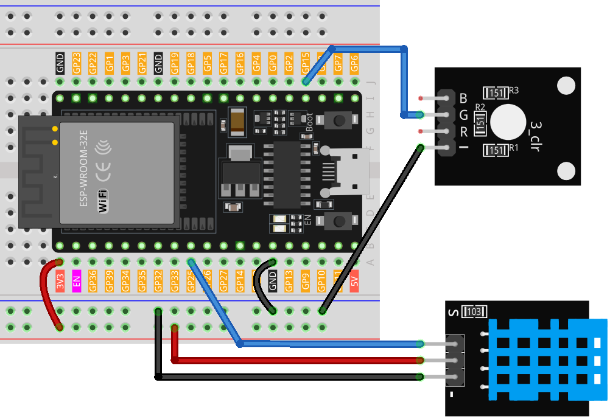
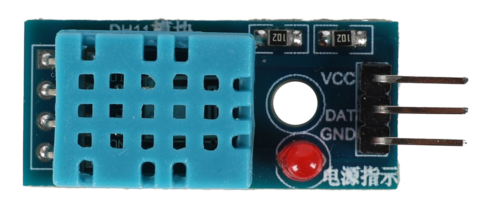
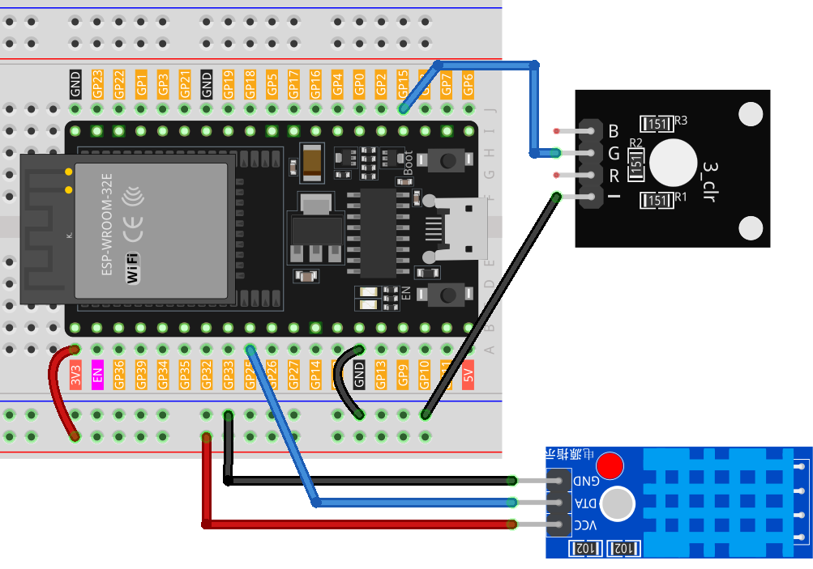

.. note:: 

    ¡Hola, bienvenido a la Comunidad de Entusiastas de Raspberry Pi, Arduino y ESP32 en Facebook! Profundiza en Raspberry Pi, Arduino y ESP32 junto con otros entusiastas.

    **¿Por qué unirte?**

    - **Soporte experto**: Resuelve problemas postventa y desafíos técnicos con la ayuda de nuestra comunidad y equipo.
    - **Aprende y comparte**: Intercambia consejos y tutoriales para mejorar tus habilidades.
    - **Vistas previas exclusivas**: Accede anticipadamente a nuevos anuncios de productos y avances.
    - **Descuentos especiales**: Disfruta de descuentos exclusivos en nuestros productos más recientes.
    - **Promociones festivas y sorteos**: Participa en sorteos y promociones especiales.

    👉 ¿Estás listo para explorar y crear con nosotros? Haz clic en [|link_sf_facebook|] y únete hoy mismo.

.. _esp32_adafruit_io:

Lección 48: Monitoreo de Temperatura y Humedad con Adafruit IO
===========================================================================

En este proyecto, te guiaremos sobre cómo usar una plataforma IoT popular. Existen muchas plataformas gratuitas (o de bajo costo) disponibles en línea para los entusiastas de la programación. Algunos ejemplos son Adafruit IO, Blynk, Arduino Cloud, ThingSpeak, entre otras. El uso de estas plataformas es bastante similar. Aquí, nos centraremos en Adafruit IO.

Escribiremos un programa de Arduino que use el sensor DHT11 para enviar lecturas de temperatura y humedad al panel de control de Adafruit IO. También podrás controlar un LED en el circuito a través de un interruptor en el panel de control.

**Componentes Requeridos**

En este proyecto, necesitamos los siguientes componentes.

Es definitivamente conveniente comprar un kit completo, aquí tienes el enlace:

.. list-table::
    :widths: 20 20 20
    :header-rows: 1

    *   - Nombre
        - ARTÍCULOS EN ESTE KIT
        - ENLACE
    *   - Universal Maker Sensor Kit
        - 94
        - |link_umsk|

También puedes comprarlos por separado desde los enlaces a continuación.

.. list-table::
    :widths: 30 20
    :header-rows: 1

    *   - INTRODUCCIÓN AL COMPONENTE
        - ENLACE DE COMPRA

    *   - ESP32 & Development Board (:ref:`cpn_esp32_wroom_32e`)
        - |link_esp32_camera_pro_kit_buy|
    *   - :ref:`cpn_rgb`
        - \-
    *   - :ref:`cpn_dht11`
        - |link_dht11_humiture_buy|

**Configuración del Panel de Control**

#. Visita |link_adafruit_io| y haz clic en **Start for free** para crear una cuenta gratuita.

   .. image:: img/sp230516_102503.png

#. Completa el formulario para crear una cuenta.

   .. image:: img/sp230516_102629.png

#. Después de crear la cuenta en Adafruit, necesitarás volver a abrir Adafruit IO. Haz clic en **Dashboards** y luego en **New Dashboard**.

   .. image:: img/sp230516_103347.png

#. Crea un **Nuevo Dashboard**.

   .. image:: img/sp230516_103744.png

#. Ingresa al **Dashboard** recién creado y crea un nuevo bloque.

   .. image:: img/sp230516_104234.png

#. Crea un bloque **Toggle**.

   .. image:: img/sp230516_105727.png

#. Luego, necesitarás crear un nuevo feed aquí. Este interruptor se usará para controlar el LED, y llamaremos a este feed "LED".

   .. image:: img/sp230516_105641.png

#. Marca el feed **LED**, luego pasa al siguiente paso.

   .. image:: img/sp230516_105925.png

#. Completa la configuración del bloque (principalmente Título del Bloque, Texto de Encendido y Texto de Apagado), luego haz clic en el botón **Create block** en la esquina inferior derecha para finalizar.

   .. image:: img/sp230516_110124.png

#. Ahora necesitamos crear dos **Text Blocks**. Se usarán para mostrar la temperatura y la humedad. Así que, crea dos feeds llamados **temperature** y **humidity**.

   .. image:: img/sp230516_110657.png

#. Después de crear los bloques, tu Dashboard debería lucir algo como esto:

   .. image:: img/sp230516_111134.png

#. Puedes ajustar el diseño usando la opción **Edit Layout** en el Dashboard.

   .. image:: img/sp230516_111240.png

#. Haz clic en **API KEY**, y verás tu nombre de usuario y **API KEY** mostrados. Anótalos ya que los necesitarás para tu código.

   .. image:: img/sp230516_111641.png

**Ejecución del Código**

.. |dht11_module| image:: img/Lesson_19_dht11_module.png
   :width: 100px

#. Construye el circuito.

   .. note::
      El kit puede contener diferentes versiones del módulo DHT11. Por favor, confirma el método de cableado según el módulo que tengas.

   .. csv-table::
      :header: "module", "diagram"
      :widths: 25, 75

      |dht11_module|, |dht11_module_circuit|
      |dht11_module_withLED|, |dht11_module_withLED_circuit|

#. Luego, conecta el ESP32 al ordenador mediante el cable USB.

#. Abre el código.

   * Abre el archivo ``Lesson_48_Adafruit_IO.ino`` ubicado en el directorio ``universal-maker-sensor-kit\esp32\Lesson_48_Adafruit_IO``, o copia el código en el IDE de Arduino.
   * Después de seleccionar la placa (ESP32 Dev Module) y el puerto adecuado, haz clic en el botón **Subir**.
   * :ref:`unknown_com_port`
   * Se utilizan las bibliotecas ``Adafruit_MQTT Library`` y ``DHT sensor library``, que puedes instalar desde el **Administrador de Bibliotecas**.

   .. raw:: html

       <iframe src=https://create.arduino.cc/editor/sunfounder01/987fb2fd-47e9-4a73-9020-6b2111eadd9c/preview?embed style="height:510px;width:100%;margin:10px 0" frameborder=0></iframe>

#. Localiza las siguientes líneas y reemplaza ``<SSID>`` y ``<PASSWORD>`` con los detalles específicos de tu red WiFi.

   .. code-block::  Arduino

       /************************* Punto de Acceso WiFi *********************************/

       #define WLAN_SSID "<SSID>"
       #define WLAN_PASS "<PASSWORD>"

#. Luego reemplaza ``<YOUR_ADAFRUIT_IO_USERNAME>`` con tu nombre de usuario de Adafruit IO y ``<YOUR_ADAFRUIT_IO_KEY>`` con la **API KEY** que acabas de copiar.

   .. code-block::  Arduino

       // Configuración de la cuenta Adafruit IO
       // (para obtener estos valores, visita https://io.adafruit.com y haz clic en Active Key)
       #define AIO_USERNAME "<YOUR_ADAFRUIT_IO_USERNAME>"
       #define AIO_KEY      "<YOUR_ADAFRUIT_IO_KEY>"

#. Después de seleccionar la placa correcta (ESP32 Dev Module) y el puerto, haz clic en el botón **Subir**.

#. Una vez que el código se haya subido con éxito, verás el siguiente mensaje en el monitor serial, indicando que la comunicación con Adafruit IO fue exitosa.

   .. code-block::

       Adafruit IO MQTTS (SSL/TLS) Example

       Connecting to xxxxx
       WiFi connected
       IP address: 
       192.168.18.76
       Connecting to MQTT... MQTT Connected!
       Temperature: 27.10
       Humidity: 61.00

#. Vuelve a Adafruit IO. Ahora podrás observar las lecturas de temperatura y humedad en el dashboard, o utilizar el interruptor de LED para controlar el estado de encendido/apagado del LED externo conectado al circuito.

   .. image:: img/sp230516_143220.png
