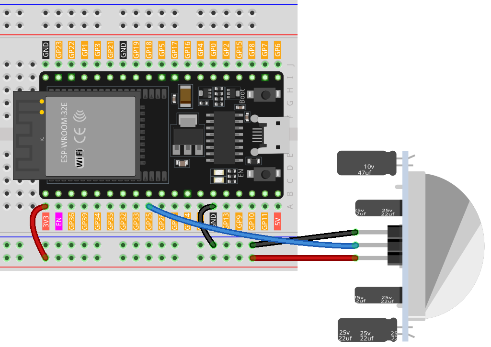

.. note:: 

    ¡Hola, bienvenido a la Comunidad de Entusiastas de Raspberry Pi, Arduino y ESP32 en Facebook! Profundiza en Raspberry Pi, Arduino y ESP32 junto con otros entusiastas.

    **¿Por qué unirte?**

    - **Soporte experto**: Resuelve problemas postventa y desafíos técnicos con la ayuda de nuestra comunidad y equipo.
    - **Aprende y comparte**: Intercambia consejos y tutoriales para mejorar tus habilidades.
    - **Vistas previas exclusivas**: Accede anticipadamente a nuevos anuncios de productos y avances.
    - **Descuentos especiales**: Disfruta de descuentos exclusivos en nuestros productos más recientes.
    - **Promociones festivas y sorteos**: Participa en sorteos y promociones especiales.

    👉 ¿Estás listo para explorar y crear con nosotros? Haz clic en [|link_sf_facebook|] y únete hoy mismo.

.. _esp32_iot_intrusion_alert_system:

Lección 49: Sistema de Notificación de Intrusión basado en Blynk
===================================================================

Este proyecto demuestra un sistema simple de detección de intrusión para el hogar utilizando un sensor de movimiento PIR (HC-SR501). 
Cuando el sistema está configurado en el modo "Away" a través de la aplicación Blynk, el sensor PIR monitorea el movimiento. 
Cualquier movimiento detectado desencadena una notificación en la aplicación Blynk, alertando al usuario sobre una posible intrusión.

**Componentes Requeridos**

En este proyecto, necesitamos los siguientes componentes.

Es definitivamente conveniente comprar un kit completo, aquí tienes el enlace:

.. list-table::
    :widths: 20 20 20
    :header-rows: 1

    *   - Nombre
        - ARTÍCULOS EN ESTE KIT
        - ENLACE
    *   - Universal Maker Sensor Kit
        - 94
        - |link_umsk|

También puedes comprarlos por separado desde los enlaces a continuación.

.. list-table::
    :widths: 30 20
    :header-rows: 1

    *   - INTRODUCCIÓN AL COMPONENTE
        - ENLACE DE COMPRA

    *   - ESP32 & Development Board (:ref:`cpn_esp32_wroom_32e`)
        - |link_esp32_camera_pro_kit_buy|
    *   - :ref:`cpn_pir_motion`
        - \-

1. Montaje del Circuito
--------------------------

2. Configuración de Blynk
---------------------------

**2.1 Inicialización de Blynk**

#. Dirígete a |link_blynk| y selecciona **START FREE** para crear una cuenta gratuita.

   .. image:: img/09_blynk_access.png
        :width: 90%

#. Ingresa tu correo electrónico para iniciar el proceso de registro.

   .. image:: img/09_blynk_sign_in.png
        :width: 70%
        :align: center

#. Confirma tu registro a través de tu correo electrónico.

    .. image:: img/09_blynk_password.png
        :width: 90%

#. Después de la confirmación, aparecerá **Blynk Tour**. Se recomienda seleccionar "Skip". Si también aparece **Quick Start**, considera saltarlo también.

    .. image:: img/09_blynk_tour.png
        :width: 90%

**2.2 Creación de Plantillas**

#. Primero, crea una plantilla en Blynk. Sigue las instrucciones para crear la plantilla **Intrusion Alert System**.

    .. image:: img/09_create_template_1_shadow.png
        :width: 700
        :align: center

#. Asigna un nombre a la plantilla, selecciona **ESP32** como hardware y selecciona **WiFi** como tipo de conexión, luego haz clic en **Done**.

    .. image:: img/09_create_template_2_shadow.png
        :width: 700
        :align: center

**2.3 Generación de Datastreams**

Abre la plantilla que acabas de configurar y vamos a crear dos datastreams.

#. Haz clic en **New Datastream**.

    .. image:: img/09_blynk_new_datastream.png
        :width: 700
        :align: center

#. En el pop-up, elige **Virtual Pin**.

    .. image:: img/09_blynk_datastream_virtual.png
        :width: 700
        :align: center

#. Nombra el **Virtual Pin V0** como **AwayMode**. Establece el **DATA TYPE** como **Integer** con los valores **MIN** y **MAX** establecidos como **0** y **1**.

    .. image:: img/09_create_template_shadow.png
        :width: 700
        :align: center

#. De manera similar, crea otro datastream de **Virtual Pin**. Nómbralo **Current Status** y establece el **DATA TYPE** como **String**.

    .. image:: img/09_datastream_1_shadow.png
        :width: 700
        :align: center

**2.4 Configuración de un Evento**

A continuación, configuraremos un evento que enviará una notificación por correo electrónico si se detecta una intrusión.

#. Haz clic en **Add New Event**.

    .. image:: img/09_blynk_event_add.png

#. Define el nombre del evento y su código específico. Para **TYPE**, selecciona **Warning** y escribe una breve descripción para el correo electrónico que se enviará cuando ocurra el evento. También puedes ajustar con qué frecuencia recibes las notificaciones.

    .. note::
        
        Asegúrate de que el **EVENT CODE** esté configurado como ``intrusion_detected``. Este código está predefinido en el código, por lo que cualquier cambio requerirá ajustar el código también.

    .. image:: img/09_event_1_shadow.png
        :width: 700
        :align: center

#. Ve a la sección **Notifications** para activar las notificaciones y configurar los detalles del correo electrónico.

    .. image:: img/09_event_2_shadow.png
        :width: 80%
        :align: center

.. raw:: html
    
      

**2.5 Ajuste del Web Dashboard**

Asegurarse de que el **Web Dashboard** interactúe perfectamente con el Sistema de Alerta de Intrusión es fundamental.

#. Simplemente arrastra y coloca tanto el **Switch widget** como el **Label widget** en el **Web Dashboard**.

    .. image:: img/09_web_dashboard_1_shadow.png
        :width: 100%
        :align: center

#. Cuando pases el ratón sobre un widget, aparecerán tres íconos. Usa el ícono de configuración para ajustar las propiedades del widget.

    .. image:: img/09_blynk_dashboard_set.png
        :width: 100%
        :align: center

#. En la configuración del **Switch widget**, selecciona **Datastream** como **AwayMode(V0)**. Establece **ONLABEL** y **OFFLABEL** para mostrar **"away"** y **"home"**, respectivamente.

    .. image:: img/09_web_dashboard_2_shadow.png
        :width: 100%
        :align: center

#. En la configuración del **Label widget**, selecciona **Datastream** como **Current Status(V1)**.

    .. image:: img/09_web_dashboard_3_shadow.png
        :width: 100%
        :align: center

**2.6 Guardando la Plantilla**

Finalmente, no olvides guardar tu plantilla.

    .. image:: img/09_save_template_shadow.png
        :width: 100%
        :align: center

**2.7 Creación de un Dispositivo**

#. Es hora de crear un nuevo dispositivo.

    .. image:: img/09_blynk_device_new.png
        :width: 700
        :align: center

#. Haz clic en **From template** para comenzar con una nueva configuración.

    .. image:: img/09_blynk_device_template.png
        :width: 700
        :align: center

#. Luego, selecciona la plantilla **Intrusion Alert System** y haz clic en **Create**.

    .. image:: img/09_blynk_device_template2.png
        :width: 700
        :align: center

#. Aquí verás el ``Template ID``, ``Device Name`` y ``AuthToken``. Necesitas copiar estos valores en tu código para que el ESP32 pueda trabajar con Blynk.

    .. image:: img/09_blynk_device_code.png
        :width: 700
        :align: center

3. Ejecución del Código
-----------------------------
#. Antes de ejecutar el código, asegúrate de instalar la biblioteca ``Blynk`` desde el **Library Manager** en el IDE de Arduino.

    .. image:: img/09_blynk_add_library.png
        :width: 700
        :align: center

#. Abre el archivo ``Lesson_49_Blynk_based_intrusion_system.ino`` ubicado en el directorio ``universal-maker-sensor-kit\esp32\Lesson_49_Blynk_based_intrusion_system``. También puedes copiar su contenido en el IDE de Arduino.

    .. raw:: html

        <iframe src="https://app.arduino.cc/sketches/ddb3006a-befa-46c4-bc71-9e32bcfbe31d?view-mode=embed" style="height:510px;width:100%;margin:10px 0" frameborder=0></iframe>

#. Reemplaza los valores de ``BLYNK_TEMPLATE_ID``, ``BLYNK_TEMPLATE_NAME`` y ``BLYNK_AUTH_TOKEN`` con tus propios ID únicos.

    .. code-block:: arduino
    
        #define BLYNK_TEMPLATE_ID "TMPxxxxxxx"
        #define BLYNK_TEMPLATE_NAME "Intrusion Alert System"
        #define BLYNK_AUTH_TOKEN "xxxxxxxxxxxxx"

#. También necesitas ingresar el ``ssid`` y la ``contraseña`` de tu red WiFi.

   .. code-block:: arduino

        char ssid[] = "your_ssid";
        char pass[] = "your_password";

#. Elige la placa correcta (**ESP32 Dev Module**) y el puerto, luego haz clic en el botón **Subir**.

#. Abre el monitor serial (configura la tasa de baudios a 115200) y espera el mensaje de conexión exitosa.

    .. image:: img/09_blynk_upload_code.png
        :align: center

#. Después de una conexión exitosa, activar el interruptor en Blynk comenzará la vigilancia del módulo PIR. Cuando se detecte movimiento (estado 1), dirá "¡Alguien aquí!" y enviará una alerta a tu correo electrónico.

    .. image:: img/09_blynk_code_alarm.png
        :width: 700
        :align: center

4. Explicación del Código
-------------------------------

#. **Configuración y Bibliotecas**

   Aquí, se configuran las constantes de Blynk y las credenciales. También se incluyen las bibliotecas necesarias para el ESP32 y Blynk.

    .. code-block:: arduino

        /* Comment this out to disable prints and save space */
        #define BLYNK_PRINT Serial

        #define BLYNK_TEMPLATE_ID "xxxxxxxxxxx"
        #define BLYNK_TEMPLATE_NAME "Intrusion Alert System"
        #define BLYNK_AUTH_TOKEN "xxxxxxxxxxxxxxxxxxxxxxxxxxx"

        #include <WiFi.h>
        #include <WiFiClient.h>
        #include <BlynkSimpleEsp32.h>

#. **Configuración WiFi**

   Ingresa tus credenciales WiFi.

   .. code-block:: arduino

        char ssid[] = "your_ssid";
        char pass[] = "your_password";

#. **Configuración del Sensor PIR**

   Establece el pin donde está conectado el sensor PIR e inicializa las variables de estado.

   .. code-block:: arduino

      const int sensorPin = 14;
      int state = 0;
      int awayHomeMode = 0;
      BlynkTimer timer;

#. **Función setup()**

   Esta función inicializa el sensor PIR como entrada, configura la comunicación serial, se conecta a WiFi y configura Blynk.

   - Usamos ``timer.setInterval(1000L, myTimerEvent)`` para establecer el intervalo del temporizador en ``setup()``, aquí se ejecuta la función ``myTimerEvent()`` cada **1000ms**. Puedes modificar el primer parámetro de ``timer.setInterval(1000L, myTimerEvent)`` para cambiar el intervalo entre ejecuciones de ``myTimerEvent``.

   .. raw:: html
    
      

   .. code-block:: arduino

        void setup() {

            pinMode(sensorPin, INPUT);  // Establece el pin del sensor PIR como entrada
            Serial.begin(115200);           // Inicia la comunicación serial a 115200 baudios para depuración
            
            // Configura Blynk y conéctate a WiFi
            Blynk.begin(BLYNK_AUTH_TOKEN, ssid, pass);
            
            timer.setInterval(1000L, myTimerEvent);  // Configura una función que se llamará cada segundo
        }

#. **Función loop()**

   La función loop ejecuta continuamente Blynk y las funciones del temporizador de Blynk.

   .. code-block:: arduino

        void loop() {
           Blynk.run();
           timer.run();
        }

#. **Interacción con la Aplicación Blynk**

   Estas funciones se llaman cuando el dispositivo se conecta a Blynk y cuando hay un cambio en el estado del pin virtual V0 en la aplicación Blynk.

   - Cada vez que el dispositivo se conecta al servidor de Blynk, o se reconecta debido a condiciones de red deficientes, se llama a la función ``BLYNK_CONNECTED()``. El comando ``Blynk.syncVirtual()`` solicita el valor de un solo pin virtual. El pin virtual especificado ejecutará la llamada ``BLYNK_WRITE()``.

   - Siempre que el valor de un pin virtual en el servidor BLYNK cambie, se activará ``BLYNK_WRITE()``.

   .. raw:: html
    
      

   .. code-block:: arduino
      
        // Esta función se llama cada vez que el dispositivo se conecta a Blynk.Cloud
        BLYNK_CONNECTED() {
            Blynk.syncVirtual(V0);
        }
      
        // Esta función se llama cada vez que cambia el estado del pin Virtual 0
        BLYNK_WRITE(V0) {
            awayHomeMode = param.asInt();
            // lógica adicional
        }

#. **Manejo de Datos**

   Cada segundo, la función ``myTimerEvent()`` llama a ``sendData()``. Si el modo de alejamiento está habilitado en Blynk, verifica el sensor PIR y envía una notificación a Blynk si se detecta movimiento.

   - Usamos ``Blynk.virtualWrite(V1, "Somebody in your house! Please check!");`` para cambiar el texto de una etiqueta.

   - Usa ``Blynk.logEvent("intrusion_detected");`` para registrar el evento en Blynk.

   .. raw:: html
    
      

   .. code-block:: arduino

        void myTimerEvent() {
           sendData();
        }

        void sendData() {
           if (awayHomeMode == 1) {
              state = digitalRead(sensorPin);  // Lee el estado del sensor PIR

              Serial.print("state:");
              Serial.println(state);

              // Si el sensor detecta movimiento, envía una alerta a la aplicación Blynk
              if (state == HIGH) {
                Serial.println("Somebody here!");
                Blynk.virtualWrite(V1, "Somebody in your house! Please check!");
                Blynk.logEvent("intrusion_detected");
              }
           }
        }

**Referencia**

- |link_blynk_doc|
- |link_blynk_quickstart| 
- |link_blynk_virtualWrite|
- |link_blynk_logEvent|
- |link_blynk_timer_intro|
- |link_blynk_syncing| 
- |link_blynk_write|
