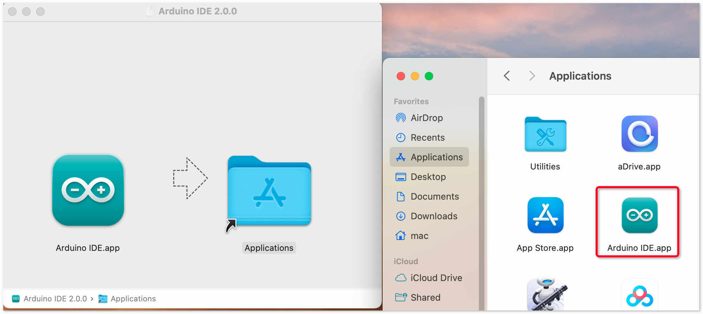

.. note::

    Bonjour et bienvenue dans la communauté des passionnés de SunFounder Raspberry Pi, Arduino et ESP32 sur Facebook ! Plongez plus profondément dans l'univers Raspberry Pi, Arduino et ESP32 avec d'autres enthousiastes.

    **Pourquoi rejoindre ?**

    - **Support d'experts** : Résolvez les problèmes post-vente et les défis techniques avec l'aide de notre communauté et de notre équipe.
    - **Apprendre & Partager** : Échangez des astuces et des tutoriels pour renforcer vos compétences.
    - **Aperçus exclusifs** : Obtenez un accès anticipé aux annonces de nouveaux produits et aux avant-premières.
    - **Réductions spéciales** : Profitez de réductions exclusives sur nos produits les plus récents.
    - **Promotions festives et cadeaux** : Participez à des cadeaux et des promotions festives.

    👉 Prêt à explorer et créer avec nous ? Cliquez sur [|link_sf_facebook|] et rejoignez-nous aujourd'hui !

.. _install_arduino:

Installer Arduino IDE (Important)
======================================

L'Arduino IDE, connu sous le nom d'Arduino Integrated Development Environment, fournit tout le support logiciel nécessaire pour réaliser un projet Arduino. C'est un logiciel de programmation spécialement conçu pour Arduino, fourni par l'équipe Arduino, qui nous permet d'écrire des programmes et de les télécharger sur la carte Arduino.

L'Arduino IDE 2.0 est un projet open source. Il représente une grande avancée par rapport à son robuste prédécesseur, l'Arduino IDE 1.x, et vient avec une interface utilisateur rénovée, un gestionnaire de cartes et de bibliothèques amélioré, un débogueur, une fonction d'auto-complétion et bien plus encore.

Dans ce tutoriel, nous montrerons comment télécharger et installer l'Arduino IDE 2.0 sur votre ordinateur Windows, Mac ou Linux.

Exigences
-------------------

* Windows - Win 10 et plus récent, 64 bits
* Linux - 64 bits
* Mac OS X - Version 10.14 : "Mojave" ou plus récent, 64 bits

Télécharger l'Arduino IDE 2.0
-------------------------------

#. Visitez |link_download_arduino|.

#. Téléchargez l'IDE pour votre version d'OS.

   .. image:: img/install_ide_01.png

Installation
------------------------------

Windows
^^^^^^^^^^^^^

#. Double-cliquez sur le fichier ``arduino-ide_xxxx.exe`` pour exécuter le fichier téléchargé.

#. Lisez le contrat de licence et acceptez-le.

   .. image:: img/install_ide_02.png

#. Choisissez les options d'installation.

   .. image:: img/install_ide_03.png

#. Choisissez le lieu d'installation. Il est recommandé d'installer le logiciel sur un disque autre que le disque système.

   .. image:: img/install_ide_04.png

#. Ensuite, terminez.

   .. image:: img/install_ide_05.png

macOS
^^^^^^^^^^^^^^^^

Double-cliquez sur le fichier ``arduino_ide_xxxx.dmg`` téléchargé et suivez les instructions pour copier **Arduino IDE.app** dans le dossier **Applications**, vous verrez l'Arduino IDE installé avec succès après quelques secondes.

Linux
^^^^^^^^^^^^

Pour le tutoriel sur l'installation de l'Arduino IDE 2.0 sur un système Linux, veuillez consulter : https://docs.arduino.cc/software/ide-v2/tutorials/getting-started/ide-v2-downloading-and-installing#linux

Ouvrir l'IDE
--------------

#. Lorsque vous ouvrez Arduino IDE 2.0 pour la première fois, il installe automatiquement les cartes Arduino AVR, les bibliothèques intégrées et les autres fichiers nécessaires.

   .. image:: img/install_ide_06.png

#. De plus, votre pare-feu ou centre de sécurité peut apparaître à plusieurs reprises vous demandant si vous souhaitez installer certains pilotes de périphérique. Veuillez installer tous.

   .. image:: img/install_ide_07.png

#. Votre Arduino IDE est maintenant prêt !

   .. note::
       Dans le cas où certaines installations n'auraient pas fonctionné en raison de problèmes de réseau ou d'autres raisons, vous pouvez rouvrir l'Arduino IDE et il terminera le reste de l'installation. La fenêtre de sortie ne s'ouvrira pas automatiquement après que toutes les installations soient complètes, sauf si vous cliquez sur Vérifier ou Télécharger.
