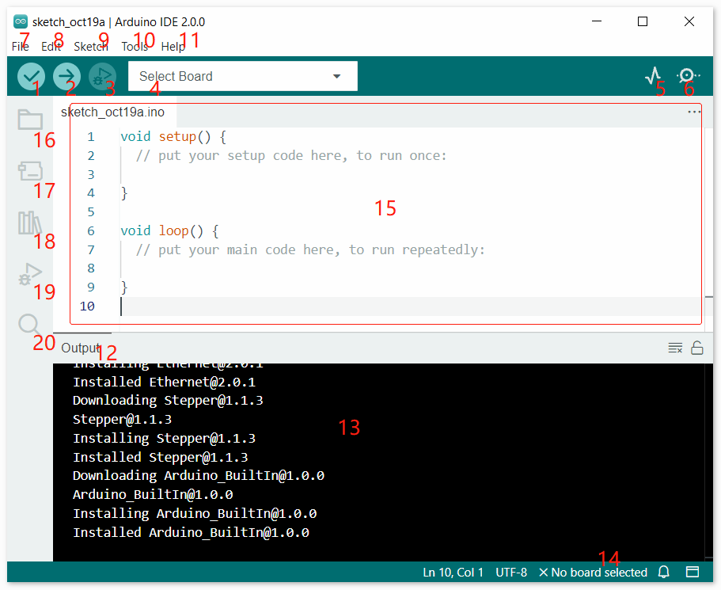

.. note:: 

    ¡Hola, bienvenido a la comunidad de entusiastas de SunFounder en Facebook sobre Raspberry Pi, Arduino y ESP32! Sumérgete más a fondo en Raspberry Pi, Arduino y ESP32 con otros aficionados.

    **¿Por qué unirse?**

    - **Soporte de Expertos**: Resuelve problemas posventa y desafíos técnicos con ayuda de nuestra comunidad y equipo.
    - **Aprender y Compartir**: Intercambia consejos y tutoriales para mejorar tus habilidades.
    - **Previsualizaciones Exclusivas**: Obtén acceso anticipado a anuncios de nuevos productos y avances exclusivos.
    - **Descuentos Especiales**: Disfruta de descuentos exclusivos en nuestros productos más nuevos.
    - **Promociones Festivas y Sorteos**: Participa en sorteos y promociones festivas.

    👉 ¿Listo para explorar y crear con nosotros? Haz clic en [|link_sf_facebook|] ¡y únete hoy!

Introducción al IDE de Arduino
=================================

1. **Verificar**: Compila tu código. Cualquier problema de sintaxis será señalado con errores.

2. **Subir**: Sube el código a tu placa. Cuando hagas clic en el botón, los LEDs RX y TX en la placa parpadearán rápidamente y no se detendrán hasta que la carga esté completa.

3. **Depurar**: Para la verificación de errores línea por línea.

4. **Seleccionar Placa**: Configuración rápida de la placa y el puerto.

5. **Trazador Serial**: Verifica el cambio del valor leído.

6. **Monitor Serial**: Haz clic en el botón y aparecerá una ventana. Recibe los datos enviados desde tu placa de control. Es muy útil para la depuración.

7. **Archivo**: Haz clic en el menú y aparecerá una lista desplegable, que incluye crear, abrir, guardar, cerrar archivos, configurar algunos parámetros, etc.

8. **Editar**: Haz clic en el menú. En la lista desplegable, hay algunas operaciones de edición como **Cortar**, **Copiar**, **Pegar**, **Buscar**, etc., con sus correspondientes atajos.

9. **Boceto**: Incluye operaciones como **Verificar**, **Subir**, **Agregar** archivos, etc. Una función más importante es **Incluir Biblioteca** - donde puedes añadir bibliotecas.

10. **Herramienta**: Incluye algunas herramientas - la más frecuentemente usada es Placa (la placa que usas) y Puerto (el puerto en el que está tu placa). Cada vez que quieras subir el código, necesitas seleccionar o verificar estos elementos.

11. **Ayuda**: Si eres principiante, puedes consultar las opciones bajo el menú y obtener la ayuda que necesitas, incluyendo operaciones en el IDE, información de introducción, solución de problemas, explicación del código, etc.

12. **Barra de Salida**: Cambia la pestaña de salida aquí.

13. **Ventana de Salida**: Imprime información.

14. **Placa y Puerto**: Aquí puedes previsualizar la placa y el puerto seleccionados para la carga del código. Puedes seleccionarlos de nuevo por **Herramientas** -> **Placa** / **Puerto** si alguno es incorrecto.

15. El área de edición del IDE. Puedes escribir código aquí.

16. **Sketchbook**: Para gestionar archivos de bocetos.

17. **Gestor de Placas**: Para gestionar el controlador de la placa.

18. **Gestor de Bibliotecas**: Para gestionar tus archivos de biblioteca.

19. **Depurar**: Ayuda a depurar el código.

20. **Buscar**: Busca códigos en tus bocetos.
