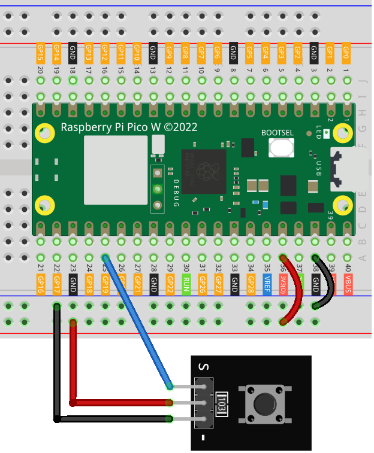

.. note:: 

    Bonjour et bienvenue dans la communauté des passionnés de SunFounder Raspberry Pi, Arduino et ESP32 sur Facebook ! Plongez dans l’univers du Raspberry Pi, de l’Arduino et de l’ESP32 avec d’autres passionnés.

    **Pourquoi nous rejoindre ?**

    - **Support d’experts** : Résolvez les problèmes après-vente et relevez des défis techniques avec l’aide de notre communauté et de notre équipe.
    - **Apprendre et partager** : Échangez des conseils et des tutoriels pour améliorer vos compétences.
    - **Aperçus exclusifs** : Accédez en avant-première aux annonces de nouveaux produits.
    - **Réductions spéciales** : Profitez de remises exclusives sur nos nouveaux produits.
    - **Promotions festives et cadeaux** : Participez à des concours et promotions spéciales.

    👉 Prêt à explorer et créer avec nous ? Cliquez sur [|link_sf_facebook|] et rejoignez-nous dès aujourd’hui !

.. _pico_lesson01_button:

Leçon 01 : Module Bouton
==================================

Dans cette leçon, vous apprendrez à utiliser le Raspberry Pi Pico W pour interagir avec la LED intégrée à l’aide d’un bouton. Lorsque vous appuyez sur le bouton, la LED s’allume, et lorsqu’il est relâché, elle s’éteint. Ce projet est idéal pour les débutants car il permet une expérience pratique des opérations d’entrée et de sortie sur le Raspberry Pi Pico W en utilisant MicroPython.

Composants Requis
--------------------------

Pour ce projet, nous avons besoin des composants suivants.

Il est plus pratique d’acheter un kit complet, voici le lien : 

.. list-table::
    :widths: 20 20 20
    :header-rows: 1

    *   - Nom	
        - Éléments dans ce kit
        - Lien
    *   - Universal Maker Sensor Kit
        - 94
        - |link_umsk|

Vous pouvez également les acheter séparément via les liens ci-dessous.

.. list-table::
    :widths: 30 20
    :header-rows: 1

    *   - Introduction des Composants
        - Lien d'achat

    *   - Raspberry Pi Pico W
        - \-
    *   - :ref:`cpn_button`
        - \-
    *   - :ref:`cpn_breadboard`
        - |link_breadboard_buy|

Câblage
---------------------------

Code
---------------------------

.. code-block:: python

   from machine import Pin
   import time
   
   # Définir GPIO 19 comme une entrée pour lire l'état du bouton
   button = Pin(19, Pin.IN)
   
   # Initialiser la LED intégrée du Raspberry Pi Pico W
   led = Pin('LED', Pin.OUT)
   
   while True:
       if button.value() == 0:  # Vérifier si le bouton est pressé
           led.value(1)  # Allumer la LED
       else:
           led.value(0)  # Éteindre la LED
   
       time.sleep(0.1)  # Courte pause pour réduire l'utilisation du CPU

Analyse du Code
---------------------------

#. Importation des Modules

   Le module ``machine`` est importé pour interagir avec les broches GPIO, et le module ``time`` est utilisé pour gérer le timing.

   .. code-block:: python

      from machine import Pin
      import time

#. Configuration du Bouton

   La broche GPIO 19 est configurée en tant qu’entrée. Elle servira à lire l’état du bouton-poussoir qui y est connecté.

   .. code-block:: python

      button = Pin(19, Pin.IN)

#. Configuration de la LED

   La LED intégrée est configurée en tant que sortie, ce qui nous permet de l'allumer ou de l'éteindre via le programme.

   .. code-block:: python

      led = Pin('LED', Pin.OUT)

#. Boucle Principale

   - Une boucle infinie est utilisée pour vérifier en continu l’état du bouton.
   - Si le bouton est pressé (``button.value() == 0``), la LED s’allume. Sinon, elle s’éteint.
   - Une courte pause de 0,1 seconde est ajoutée pour réduire l’utilisation du processeur.
   
   Le :ref:`button module<cpn_button>` utilisé dans ce projet possède une résistance de tirage interne (voir son :ref:`schematic diagram<cpn_button_sch>`), ce qui signifie que le bouton est en niveau bas lorsqu'il est pressé et en niveau haut lorsqu'il est relâché.

   .. code-block:: python

      while True:
          if button.value() == 0:  # Vérifier si le bouton est pressé
              led.value(1)  # Allumer la LED
          else:
              led.value(0)  # Éteindre la LED
          time.sleep(0.1)  # Courte pause pour réduire l'utilisation du CPU
