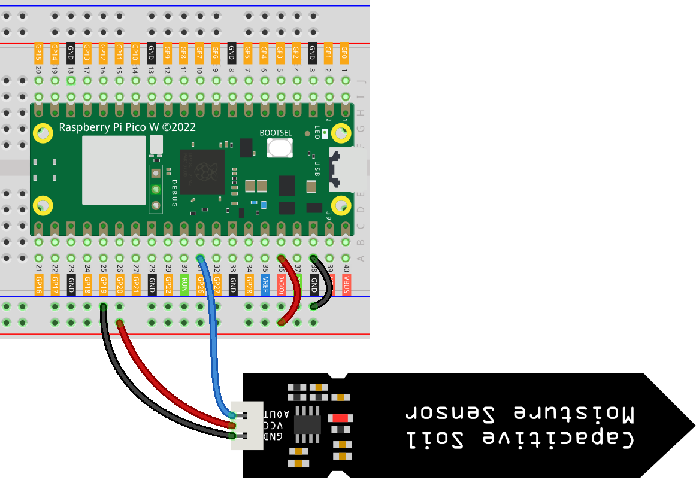

.. note:: 

    Ciao, benvenuto nella Comunità di appassionati di SunFounder Raspberry Pi & Arduino & ESP32 su Facebook! Immergiti ancora di più nel mondo di Raspberry Pi, Arduino e ESP32 insieme ad altri entusiasti.

    **Perché unirsi?**

    - **Supporto esperto**: Risolvi problemi post-vendita e sfide tecniche con l'aiuto della nostra comunità e del nostro team.
    - **Impara & Condividi**: Scambia consigli e tutorial per migliorare le tue competenze.
    - **Anteprime esclusive**: Ottieni accesso anticipato a nuovi annunci di prodotti e anteprime.
    - **Sconti speciali**: Goditi sconti esclusivi sui nostri prodotti più recenti.
    - **Promozioni festive e giveaway**: Partecipa a giveaway e promozioni festive.

    👉 Pronto a esplorare e creare con noi? Clicca [|link_sf_facebook|] e unisciti oggi!

.. _pico_lesson02_soil_moisture:

Lezione 02: Modulo di Misurazione dell'Umidità del Suolo
============================================================

In questa lezione, imparerai a utilizzare il Raspberry Pi Pico W per misurare i livelli di umidità del suolo usando un sensore capacitivo e un ADC (Convertitore Analogico-Digitale). Questo progetto, adatto ai principianti, ti introdurrà alla gestione dei segnali analogici in MicroPython.

Componenti necessari
-----------------------

Per questo progetto, abbiamo bisogno dei seguenti componenti.

È sicuramente conveniente acquistare un kit completo, ecco il link:

.. list-table::
    :widths: 20 20 20
    :header-rows: 1

    *   - Nome	
        - ELEMENTI IN QUESTO KIT
        - LINK
    *   - Kit Sensori Universali per Maker
        - 94
        - |link_umsk|

Puoi anche acquistarli separatamente dai link sottostanti.

.. list-table::
    :widths: 30 20
    :header-rows: 1

    *   - Introduzione ai Componenti
        - Link per l'acquisto

    *   - Raspberry Pi Pico W
        - |link_picow_buy|
    *   - :ref:`cpn_soil`
        - |link_soil_moisture_buy|
    *   - :ref:`cpn_breadboard`
        - |link_breadboard_buy|

Cablaggio
--------------

Codice
------------

.. code-block:: python

   from machine import ADC
   import time
   
   # Inizializza un oggetto ADC sul pin GPIO 26.
   # Questo viene solitamente utilizzato per la lettura di segnali analogici.
   sensor_AO = ADC(26)
   
   # Continua a leggere e stampare i dati del sensore.
   while True:
       value = sensor_AO.read_u16()  # Leggi e converti il valore analogico in un intero a 16 bit
       print("AO:", value)  # Stampa il valore analogico
   
       time.sleep_ms(200)  # Attendere 200 millisecondi prima della prossima lettura

Analisi del Codice
-------------------------

#. Importazione delle Biblioteche:

   .. code-block:: python

      from machine import ADC
      import time

#. Configurazione ADC:

   .. code-block:: python

      sensor_AO = ADC(26)

   Questo codice inizializza un oggetto ADC sul pin GPIO 26. L'ADC viene utilizzato per convertire segnali analogici (da sensori analogici) in dati digitali che il microcontrollore può elaborare.

#. Lettura dei Dati del Sensore in un Ciclo:

   .. code-block:: python
    
      while True:
          value = sensor_AO.read_u16()
          print("AO:", value)
          time.sleep_ms(200)

   Il ciclo ``while True`` continua indefinitamente, leggendo costantemente i dati dal sensore. Il metodo ``read_u16()`` legge il valore analogico e lo converte in un intero senza segno a 16 bit. L'istruzione ``print`` visualizza questo valore. Il ``time.sleep_ms(200)`` fa sì che il ciclo attenda 200 millisecondi prima di leggere nuovamente il valore del sensore, evitando letture di dati e output sulla console eccessivi.