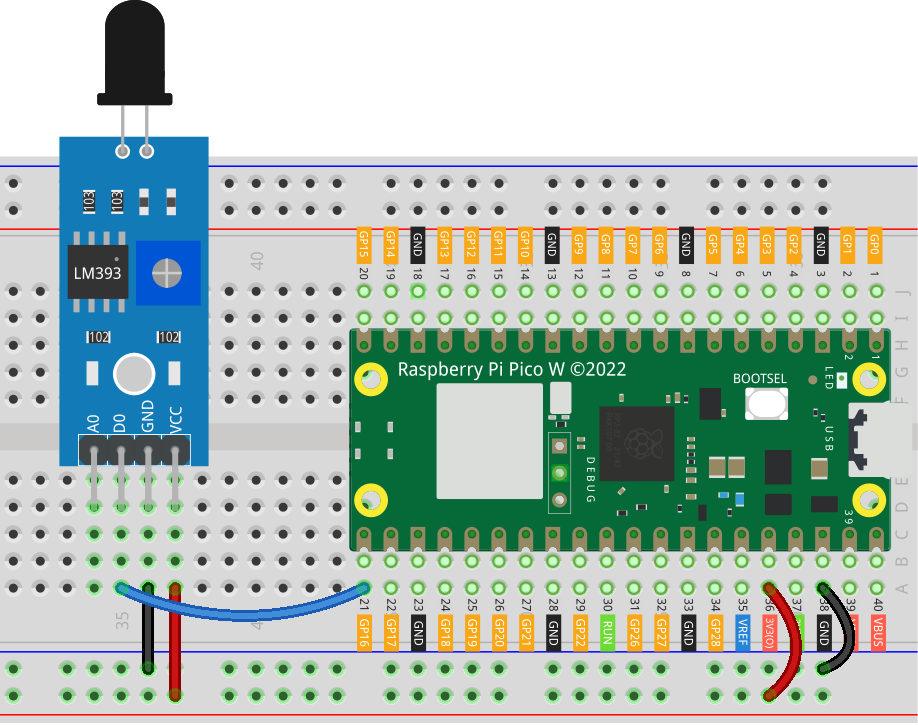

.. note:: 

    Ciao, benvenuto nella Comunità di appassionati di SunFounder Raspberry Pi & Arduino & ESP32 su Facebook! Immergiti ancora di più nel mondo di Raspberry Pi, Arduino e ESP32 insieme ad altri entusiasti.

    **Perché unirsi?**

    - **Supporto esperto**: Risolvi problemi post-vendita e sfide tecniche con l'aiuto della nostra comunità e del nostro team.
    - **Impara & Condividi**: Scambia consigli e tutorial per migliorare le tue competenze.
    - **Anteprime esclusive**: Ottieni accesso anticipato a nuovi annunci di prodotti e anteprime.
    - **Sconti speciali**: Goditi sconti esclusivi sui nostri prodotti più recenti.
    - **Promozioni festive e giveaway**: Partecipa a giveaway e promozioni festive.

    👉 Pronto a esplorare e creare con noi? Clicca [|link_sf_facebook|] e unisciti oggi!

.. _pico_lesson03_flame:

Lezione 03: Modulo Sensore di Fiamma
========================================

In questa lezione, imparerai come utilizzare il Raspberry Pi Pico W per rilevare il fuoco tramite un sensore di fiamma. Quando il sensore rileva una fiamma, il LED integrato del Raspberry Pi Pico W si accenderà e visualizzerà un messaggio che indica il rilevamento del fuoco. Se non viene rilevato alcun fuoco, il LED rimane spento e mostra un messaggio diverso. Questo progetto introduce l'uso di sensori esterni e fornisce esperienza pratica nella gestione di input e output digitali su Raspberry Pi Pico W usando MicroPython.

Componenti necessari
------------------------

Per questo progetto, abbiamo bisogno dei seguenti componenti.

È sicuramente conveniente acquistare un kit completo, ecco il link:

.. list-table::
    :widths: 20 20 20
    :header-rows: 1

    *   - Nome	
        - ELEMENTI IN QUESTO KIT
        - LINK
    *   - Kit Sensori Universali per Maker
        - 94
        - |link_umsk|

Puoi anche acquistarli separatamente dai link sottostanti.

.. list-table::
    :widths: 30 20
    :header-rows: 1

    *   - Introduzione ai Componenti
        - Link per l'acquisto

    *   - Raspberry Pi Pico W
        - |link_picow_buy|
    *   - :ref:`cpn_flame`
        - |link_flame_sensor_module_buy|
    *   - :ref:`cpn_breadboard`
        - |link_breadboard_buy|

Cablaggio
------------

Codice
----------

.. code-block:: python

   from machine import Pin
   import time
   
   # Imposta il GPIO 16 come pin di input per leggere lo stato del sensore di fiamma
   flame_sensor = Pin(16, Pin.IN)
   
   # Inizializza il LED integrato del Raspberry Pi Pico W
   led = Pin("LED", Pin.OUT)
   
   while True:
       if flame_sensor.value() == 0:
           led.value(1)  # Accendi il LED
           print("** Fire detected!!! **")
       else:
           led.value(0)  # Spegni il LED
           print("No Fire detected")
   
       time.sleep(0.1)  # Breve ritardo per ridurre l'uso della CPU

Analisi del Codice
----------------------

#. Importazione dei Moduli Necessari

   Questa parte del codice importa i moduli necessari. ``machine`` è usato per interagire con i pin GPIO, e ``time`` fornisce funzionalità per i ritardi.
   
   .. code-block:: python

      from machine import Pin
      import time

#. Inizializzazione del Sensore di Fiamma e del LED

   Imposta il sensore di fiamma e il LED integrato. Il pin 16 è configurato come input per leggere il sensore di fiamma, e il LED integrato è impostato come output.
   
   .. code-block:: python

      flame_sensor = Pin(16, Pin.IN)
      led = Pin("LED", Pin.OUT)

#. Ciclo Principale

   - Un loop infinito controlla lo stato del sensore di fiamma. Se il sensore rileva una fiamma (valore 0), accende il LED e stampa un messaggio. Altrimenti, spegne il LED e stampa un messaggio diverso.
   - Un ritardo di 0.1 secondi riduce l'uso della CPU.

   .. raw :: html
      
       
   
   .. code-block:: python

      while True:
          if flame_sensor.value() == 0:
              led.value(1)
              print("** Fire detected!!! **")
          else:
              led.value(0)
              print("No Fire detected")
          time.sleep(0.1)