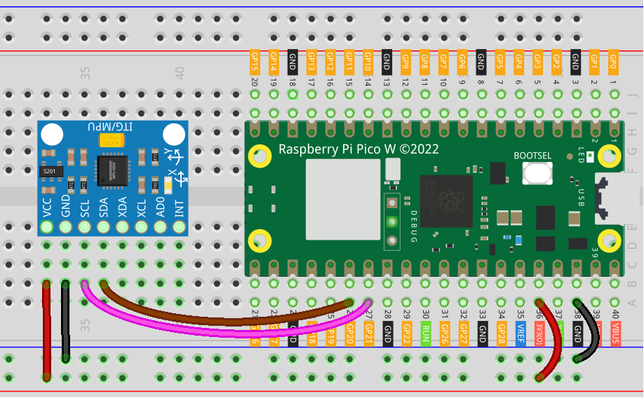

.. note:: 

    Bonjour et bienvenue dans la communauté des passionnés de SunFounder Raspberry Pi, Arduino et ESP32 sur Facebook ! Plongez dans l’univers du Raspberry Pi, d’Arduino et d’ESP32 avec d’autres passionnés.

    **Pourquoi nous rejoindre ?**

    - **Support d’experts** : Résolvez les problèmes après-vente et relevez des défis techniques avec l’aide de notre communauté et de notre équipe.
    - **Apprendre et partager** : Échangez des conseils et des tutoriels pour améliorer vos compétences.
    - **Aperçus exclusifs** : Accédez en avant-première aux annonces de nouveaux produits.
    - **Réductions spéciales** : Profitez de remises exclusives sur nos nouveaux produits.
    - **Promotions festives et cadeaux** : Participez à des concours et promotions spéciales.

    👉 Prêt à explorer et créer avec nous ? Cliquez sur [|link_sf_facebook|] et rejoignez-nous dès aujourd’hui !

.. _pico_lesson05_mpu6050:

Leçon 05 : Module Gyroscope & Accéléromètre (MPU6050)
==========================================================

Dans cette leçon, vous apprendrez à utiliser le Raspberry Pi Pico W avec le module MPU6050, qui combine un gyroscope et un accéléromètre. Vous découvrirez comment connecter le MPU6050 au Raspberry Pi Pico W et lire ses données d’accélération et de gyroscope en utilisant MicroPython. Cette leçon vous guidera dans l’écriture d’un script permettant d’afficher en continu les valeurs X, Y et Z de l’accéléromètre et du gyroscope.

Composants Requis
--------------------------

Pour ce projet, nous avons besoin des composants suivants.

Il est plus pratique d’acheter un kit complet, voici le lien :

.. list-table::
    :widths: 20 20 20
    :header-rows: 1

    *   - Nom	
        - Éléments dans ce kit
        - Lien
    *   - Universal Maker Sensor Kit
        - 94
        - |link_umsk|

Vous pouvez également les acheter séparément via les liens ci-dessous.

.. list-table::
    :widths: 30 20
    :header-rows: 1

    *   - Introduction des Composants
        - Lien d'achat

    *   - Raspberry Pi Pico W
        - \-
    *   - :ref:`cpn_mpu6050`
        - |link_mpu6050_buy|
    *   - :ref:`cpn_breadboard`
        - |link_breadboard_buy|

Câblage
---------------------------

Code
---------------------------

.. note::

    * Ouvrez le fichier ``05_mpu6050_module.py`` sous le chemin ``universal-maker-sensor-kit-main/pico/Lesson_05_MPU6050_Module`` ou copiez ce code dans Thonny, puis cliquez sur "Exécuter le script actuel" ou appuyez simplement sur F5. Pour des tutoriels détaillés, veuillez consulter :ref:`open_run_code_py`. 

    * Vous devez utiliser les fichiers ``imu.py`` et ``vector3d.py``, assurez-vous qu’ils sont bien téléchargés sur le Pico W. Pour un tutoriel détaillé, référez-vous à :ref:`add_libraries_py`.

    * N'oubliez pas de sélectionner l'interpréteur "MicroPython (Raspberry Pi Pico)" dans le coin inférieur droit. 
    

.. code-block:: python

   # Importation des bibliothèques
   from imu import MPU6050
   from machine import I2C, Pin
   import time
   
   # Initialisation du bus I2C pour MPU6050
   i2c = I2C(1, sda=Pin(20), scl=Pin(21), freq=400000)  # Bus I2C 1, SDA broche 20, SCL broche 21, 400 kHz
   
   # Création de l’objet MPU6050
   mpu = MPU6050(i2c)
   
   # Boucle principale pour lire et afficher les données du capteur
   while True:
       # Affichage des données de l’accéléromètre (x, y, z)
       print("-" * 50)
       print("x: %s, y: %s, z: %s" % (mpu.accel.x, mpu.accel.y, mpu.accel.z))
       time.sleep(0.1)
   
       # Affichage des données du gyroscope (x, y, z)
       print("X: %s, Y: %s, Z: %s" % (mpu.gyro.x, mpu.gyro.y, mpu.gyro.z))
       time.sleep(0.1)
   
       # Pause entre les lectures
       time.sleep(0.5)
   

Analyse du Code
---------------------------

#. Importation des Bibliothèques et Initialisation du Bus I2C

   Le code commence par l’importation des bibliothèques nécessaires. La bibliothèque ``imu`` est utilisée pour lire les valeurs du capteur MPU6050, et ``machine`` permet de contrôler les fonctionnalités matérielles du Raspberry Pi Pico W. L’I2C est initialisé en utilisant des broches spécifiques (SDA et SCL) pour la communication des données.

   Pour plus d’informations sur la bibliothèque ``imu``, veuillez visiter |link_imu|.

   .. code-block:: python

      from imu import MPU6050
      from machine import I2C, Pin
      import time

      i2c = I2C(1, sda=Pin(20), scl=Pin(21), freq=400000)

#. Création de l’Objet MPU6050

   Un objet MPU6050 est créé en utilisant l’I2C initialisé. Cet objet sera utilisé pour accéder aux données du capteur.

   .. code-block:: python

      mpu = MPU6050(i2c)

#. Lecture et Affichage des Données du Capteur en Boucle

   Le code entre ensuite dans une boucle infinie où il lit et affiche continuellement les données de l’accéléromètre et du gyroscope. La fonction ``time.sleep`` est utilisée pour insérer un délai entre chaque lecture.

   .. code-block:: python

      while True:
          print("-" * 50)
          print("x: %s, y: %s, z: %s" % (mpu.accel.x, mpu.accel.y, mpu.accel.z))
          time.sleep(0.1)
          print("X: %s, Y: %s, Y: %s" % (mpu.gyro.x, mpu.gyro.y, mpu.gyro.z))
          time.sleep(0.1)
          time.sleep(0.5)