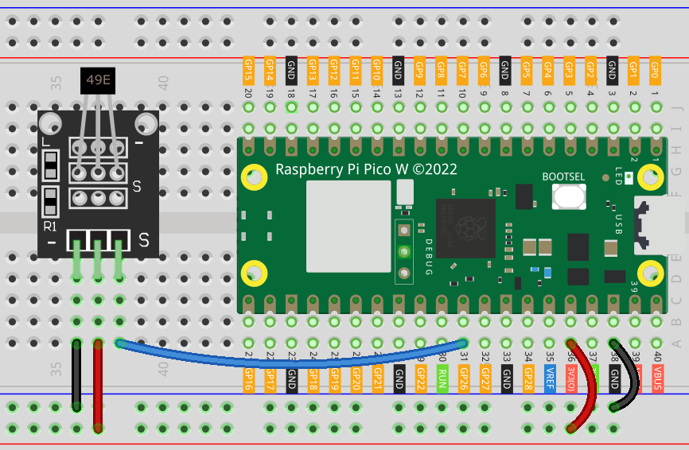

.. note:: 

    Ciao, benvenuto nella Comunità di appassionati di SunFounder Raspberry Pi & Arduino & ESP32 su Facebook! Approfondisci le tue conoscenze su Raspberry Pi, Arduino e ESP32 insieme ad altri entusiasti.

    **Perché unirsi?**

    - **Supporto esperto**: Risolvi problemi post-vendita e sfide tecniche con l’aiuto della nostra community e del nostro team.
    - **Impara & Condividi**: Scambia suggerimenti e tutorial per migliorare le tue competenze.
    - **Anteprime esclusive**: Accedi in anteprima a nuovi annunci di prodotti e contenuti esclusivi.
    - **Sconti speciali**: Approfitta di sconti riservati sui nostri prodotti più recenti.
    - **Promozioni festive e giveaway**: Partecipa a promozioni stagionali e concorsi a premi.

    👉 Pronto a esplorare e creare con noi? Clicca [|link_sf_facebook|] e unisciti subito!

.. _pico_lesson06_hall_sensor:

Lezione 06: Modulo Sensore di Effetto Hall
==============================================

In questa lezione imparerai a utilizzare il Raspberry Pi Pico W per misurare i campi magnetici tramite un sensore a effetto Hall. Collegando il sensore al Pico W, scoprirai come leggere i valori analogici e interpretarli per rilevare la presenza e il tipo di polo magnetico. Questo progetto stimolante è perfetto per chi è alle prime armi, in quanto offre esperienza pratica nella gestione di ingressi analogici sul Raspberry Pi Pico W con MicroPython. Imparerai a configurare il sensore, leggere i suoi dati e applicare logica condizionale per identificare il tipo di polo magnetico, migliorando così le tue competenze in elettronica e programmazione.

Componenti necessari
------------------------

Per questo progetto, abbiamo bisogno dei seguenti componenti.

È sicuramente comodo acquistare un kit completo. Ecco il link:

.. list-table::
    :widths: 20 20 20
    :header-rows: 1

    *   - Nome	
        - ELEMENTI IN QUESTO KIT
        - LINK
    *   - Kit Sensori Universali per Maker
        - 94
        - |link_umsk|

Puoi anche acquistare i componenti singolarmente dai link qui sotto.

.. list-table::
    :widths: 30 20
    :header-rows: 1

    *   - Introduzione ai Componenti
        - Link per l'acquisto

    *   - Raspberry Pi Pico W
        - |link_picow_buy|
    *   - :ref:`cpn_hall`
        - \-
    *   - :ref:`cpn_breadboard`
        - |link_breadboard_buy|

Cablaggio
---------------

Codice
----------------

.. code-block:: python

   import machine
   import utime
   
   # Inizializza un ADC sul pin GPIO 26 per le letture del sensore Hall.
   hall_sensor = machine.ADC(26)
   
   # Monitora e elabora continuamente i dati del sensore Hall.
   while True:
       # Leggi il valore analogico dal sensore e convertilo in un intero a 16 bit.
       value = hall_sensor.read_u16()
       print(value, end="")  # Stampa il valore grezzo del sensore.
   
       # Rileva e stampa il tipo di polo magnetico in base alla lettura del sensore.
       if value >= 48000:
           print(" - South pole detected", end="")
       elif value <= 18000:
           print(" - North pole detected", end="")

       print()

       # Attende 200 millisecondi prima della prossima lettura
       utime.sleep_ms(200)

Analisi del Codice
-----------------------

#. **Importazione dei Moduli Necessari**:

   In questa sezione vengono importati i moduli necessari. ``machine`` serve per l'interfaccia hardware e ``utime`` per la gestione dei tempi.

   .. code-block:: python

      import machine
      import utime

#. **Inizializzazione del Sensore Hall**:

   Inizializziamo un ADC (convertitore analogico-digitale) sul pin GPIO 26, dove è collegato il sensore Hall. La funzione ``machine.ADC`` consente di leggere valori analogici dal sensore.

   .. code-block:: python
   
      hall_sensor = machine.ADC(26)

#. **Ciclo Principale di Lettura del Sensore**:

   In questo ciclo, ``hall_sensor.read_u16()`` legge il valore analogico del sensore e lo converte in un intero a 16 bit. Il ciclo è infinito.

   .. code-block:: python

      while True:
          value = hall_sensor.read_u16()

#. **Elaborazione dei Dati del Sensore**:

   Dopo la lettura, il codice verifica se il valore supera o scende sotto determinate soglie per determinare se è stato rilevato un polo magnetico nord o sud. I valori ``48000`` e ``18000`` sono soglie indicative, che puoi regolare in base alle condizioni reali.

   Il modulo sensore Hall è dotato di un sensore lineare a effetto Hall 49E, capace di rilevare sia la polarità che l’intensità relativa del campo magnetico. Se si avvicina il polo sud di un magnete al lato con la scritta 49E (quello con il testo inciso), il valore letto aumenterà in proporzione all’intensità del campo magnetico applicato. Al contrario, avvicinando il polo nord, il valore diminuirà proporzionalmente. Per ulteriori dettagli, consulta :ref:`cpn_hall`.

   .. code-block:: python

      print(value, end="")
      if value >= 48000:
          print(" - South pole detected", end="")
      elif value <= 18000:
          print(" - North pole detected", end="")
      print()

#. **Ritardo tra le Letture**:

   Questa riga introduce un ritardo di 200 millisecondi tra una lettura e l’altra, usando ``utime.sleep_ms``, per evitare letture troppo frequenti e sovraccarico dell’output.

   .. code-block:: python

      utime.sleep_ms(200)
    
