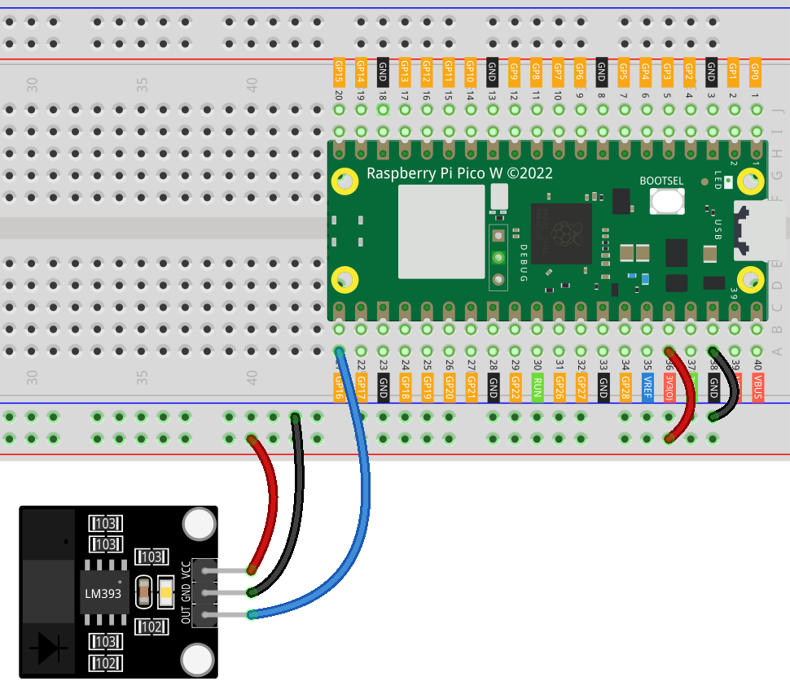

.. note:: 

    Bonjour et bienvenue dans la communauté des passionnés de SunFounder Raspberry Pi, Arduino et ESP32 sur Facebook ! Plongez dans l’univers du Raspberry Pi, d’Arduino et d’ESP32 avec d’autres passionnés.

    **Pourquoi nous rejoindre ?**

    - **Support d’experts** : Résolvez les problèmes après-vente et relevez des défis techniques avec l’aide de notre communauté et de notre équipe.
    - **Apprendre et partager** : Échangez des conseils et des tutoriels pour améliorer vos compétences.
    - **Aperçus exclusifs** : Accédez en avant-première aux annonces de nouveaux produits.
    - **Réductions spéciales** : Profitez de remises exclusives sur nos nouveaux produits.
    - **Promotions festives et cadeaux** : Participez à des concours et promotions spéciales.

    👉 Prêt à explorer et créer avec nous ? Cliquez sur [|link_sf_facebook|] et rejoignez-nous dès aujourd’hui !

.. _pico_lesson07_speed:

Leçon 07 : Module Capteur de Vitesse Infrarouge
=================================================

Dans cette leçon, vous apprendrez à utiliser le Raspberry Pi Pico W pour interagir avec un module capteur de vitesse infrarouge. En connectant le capteur au GPIO 16, vous serez en mesure de détecter des obstructions en temps réel. Le programme surveille la sortie du capteur et affiche "Obstruction détectée" lorsqu’une obstruction est détectée sur la console. Si aucune obstruction n'est présente, il affiche "Libre".

Composants Requis
--------------------------

Pour ce projet, nous avons besoin des composants suivants.

Il est plus pratique d’acheter un kit complet, voici le lien :

.. list-table::
    :widths: 20 20 20
    :header-rows: 1

    *   - Nom	
        - Éléments dans ce kit
        - Lien
    *   - Universal Maker Sensor Kit
        - 94
        - |link_umsk|

Vous pouvez également les acheter séparément via les liens ci-dessous.

.. list-table::
    :widths: 30 20
    :header-rows: 1

    *   - Introduction des Composants
        - Lien d'achat

    *   - Raspberry Pi Pico W
        - \-
    *   - :ref:`cpn_speed`
        - |link_speed_sensor_module_buy|
    *   - :ref:`cpn_breadboard`
        - |link_breadboard_buy|

Câblage
---------------------------

Code
---------------------------

.. code-block:: python

   from machine import Pin
   import time
   
   # Définition du GPIO 16 comme une entrée pour lire l'état du capteur de vitesse
   speed_sensor = Pin(16, Pin.IN)
   
   while True:
       if speed_sensor.value() == 1:
           print("Obstruction detected")
       else:
           print("Unobstructed")
   
       time.sleep(0.1)  # Courte pause pour réduire l'utilisation du processeur

Analyse du Code
---------------------------

#. **Importation des Bibliothèques** :

   Ce code commence par importer les bibliothèques nécessaires. La bibliothèque ``machine`` est utilisée pour interagir avec les broches GPIO, et la bibliothèque ``time`` permet d’ajouter des délais dans le programme.

   .. code-block:: python

      from machine import Pin
      import time

#. **Configuration du Capteur** :

   Le capteur de vitesse infrarouge est connecté au GPIO 16. Il est configuré en entrée, ce qui signifie que le Pico W lira les données provenant de cette broche.

   .. code-block:: python

      speed_sensor = Pin(16, Pin.IN)

#. **Boucle Principale** :

   La boucle ``while True:`` crée une boucle infinie. À l’intérieur de cette boucle, le programme vérifie en continu la valeur du capteur.
   
   Si ``speed_sensor.value()`` est égal à 1, cela signifie qu’une obstruction est détectée. Si c’est 0, alors il n’y a aucune obstruction.

   .. code-block:: python

      while True:
          if speed_sensor.value() == 1:
              print("Obstruction detected")
          else:
              print("Unobstructed")

#. **Délai pour Réduire l’Utilisation du CPU** :

   Une courte pause de 0,1 seconde est introduite à chaque itération de la boucle. Cela permet de réduire l'utilisation du processeur en évitant que la boucle ne tourne trop rapidement.

   .. code-block:: python
     
      time.sleep(0.1)

#. **Informations Supplémentaires** :

   Si un encodeur est monté sur le moteur, la vitesse de rotation du moteur peut être calculée en comptant le nombre de fois où une obstruction passe devant le capteur dans une période spécifique.

   .. image:: img/Lesson_07_Encoder_Disk.png
      :align: center
      :width: 20%