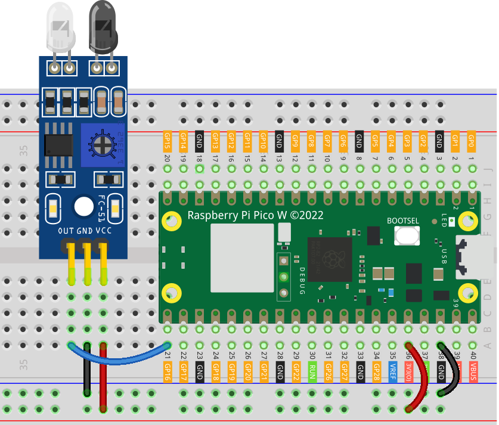

.. note:: 

    Bonjour et bienvenue dans la communauté des passionnés de SunFounder Raspberry Pi, Arduino et ESP32 sur Facebook ! Plongez dans l’univers du Raspberry Pi, d’Arduino et d’ESP32 avec d’autres passionnés.

    **Pourquoi nous rejoindre ?**

    - **Support d’experts** : Résolvez les problèmes après-vente et relevez des défis techniques avec l’aide de notre communauté et de notre équipe.
    - **Apprendre et partager** : Échangez des conseils et des tutoriels pour améliorer vos compétences.
    - **Aperçus exclusifs** : Accédez en avant-première aux annonces de nouveaux produits.
    - **Réductions spéciales** : Profitez de remises exclusives sur nos nouveaux produits.
    - **Promotions festives et cadeaux** : Participez à des concours et promotions spéciales.

    👉 Prêt à explorer et créer avec nous ? Cliquez sur [|link_sf_facebook|] et rejoignez-nous dès aujourd’hui !

.. _pico_lesson08_ir_obstacle_avoidance:

Leçon 08 : Module Capteur d'Évitement d'Obstacles IR
=======================================================

Dans cette leçon, vous apprendrez à utiliser le Raspberry Pi Pico W avec un module capteur d'évitement d'obstacles infrarouge (IR). Nous vous guiderons dans l’installation du capteur et l’écriture d’un script MicroPython qui lit en continu sa valeur pour détecter les obstacles. En surveillant les changements dans les données du capteur, vous comprendrez comment l’utiliser pour une détection d’obstacles basique.

Composants Requis
--------------------------

Pour ce projet, nous avons besoin des composants suivants.

Il est plus pratique d’acheter un kit complet, voici le lien :

.. list-table::
    :widths: 20 20 20
    :header-rows: 1

    *   - Nom	
        - Éléments dans ce kit
        - Lien
    *   - Universal Maker Sensor Kit
        - 94
        - |link_umsk|

Vous pouvez également les acheter séparément via les liens ci-dessous.

.. list-table::
    :widths: 30 20
    :header-rows: 1

    *   - Introduction des Composants
        - Lien d'achat

    *   - Raspberry Pi Pico W
        - \-
    *   - :ref:`cpn_ir_obstacle`
        - |link_obstacle_avoidance_module_buy|
    *   - :ref:`cpn_breadboard`
        - |link_breadboard_buy|

Câblage
---------------------------

Code
---------------------------

.. code-block:: python

   from machine import Pin
   import time
   
   # Initialisation du capteur d’évitement d’obstacles connecté à la broche 16 en entrée
   obstacle_avoidance_sensor = Pin(16, Pin.IN)
   
   while True:
       # Lire et afficher la valeur du capteur d'évitement d'obstacles
       print(obstacle_avoidance_sensor.value())
   
       # Attendre 0,1 seconde avant la prochaine lecture
       time.sleep(0.1)

Analyse du Code
---------------------------

#. Importation des Bibliothèques

   Le module ``machine`` est importé pour interagir avec les broches GPIO, et le module ``time`` est utilisé pour ajouter des délais.

   .. code-block:: python

      from machine import Pin
      import time

#. Configuration du Capteur
   
   Le capteur d’évitement d’obstacles est configuré comme un dispositif d’entrée sur la broche GPIO 16. Le paramètre ``Pin.IN`` configure la broche en mode entrée.

   .. code-block:: python

      obstacle_avoidance_sensor = Pin(16, Pin.IN)

#. Lecture des Données du Capteur en Boucle

   La boucle ``while True:`` vérifie en continu la sortie du capteur. Si le capteur détecte un obstacle, il renvoie ``0``, qui est ensuite affiché. La fonction ``time.sleep(0.1)`` ajoute un court délai pour rendre les lectures plus gérables.

   .. code-block:: python

      while True:
          print(obstacle_avoidance_sensor.value())
          time.sleep(0.1)

   .. note:: 
   
      Si le capteur ne fonctionne pas correctement, ajustez l’émetteur et le récepteur infrarouges pour qu’ils soient parallèles. De plus, vous pouvez régler la plage de détection à l’aide du potentiomètre intégré.
