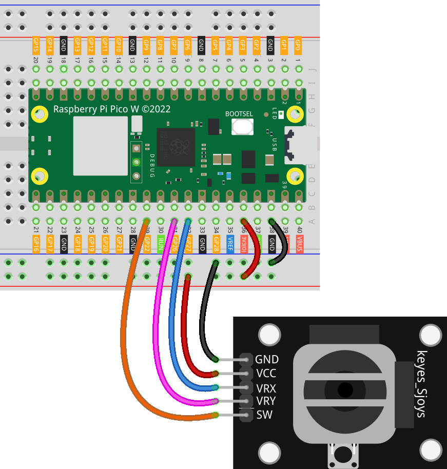

.. note:: 

    Bonjour et bienvenue dans la communauté des passionnés de SunFounder Raspberry Pi, Arduino et ESP32 sur Facebook ! Plongez dans l’univers du Raspberry Pi, d’Arduino et d’ESP32 avec d’autres passionnés.

    **Pourquoi nous rejoindre ?**

    - **Support d’experts** : Résolvez les problèmes après-vente et relevez des défis techniques avec l’aide de notre communauté et de notre équipe.
    - **Apprendre et partager** : Échangez des conseils et des tutoriels pour améliorer vos compétences.
    - **Aperçus exclusifs** : Accédez en avant-première aux annonces de nouveaux produits.
    - **Réductions spéciales** : Profitez de remises exclusives sur nos nouveaux produits.
    - **Promotions festives et cadeaux** : Participez à des concours et promotions spéciales.

    👉 Prêt à explorer et créer avec nous ? Cliquez sur [|link_sf_facebook|] et rejoignez-nous dès aujourd’hui !

.. _pico_lesson09_joystick:

Leçon 09 : Module Joystick
==================================

Dans cette leçon, vous apprendrez à interfacer et à lire les données d’un module joystick avec le Raspberry Pi Pico W. Vous découvrirez comment initialiser et lire les valeurs analogiques des axes X et Y du joystick, ainsi que gérer l’entrée numérique de son bouton à l’aide de MicroPython. Cette leçon est idéale pour les débutants, offrant une expérience pratique en lecture et interprétation d’entrées analogiques et numériques sur le Raspberry Pi Pico W.

Composants Requis
--------------------------

Pour ce projet, nous avons besoin des composants suivants.

Il est plus pratique d’acheter un kit complet, voici le lien :

.. list-table::
    :widths: 20 20 20
    :header-rows: 1

    *   - Nom	
        - Éléments dans ce kit
        - Lien
    *   - Universal Maker Sensor Kit
        - 94
        - |link_umsk|

Vous pouvez également les acheter séparément via les liens ci-dessous.

.. list-table::
    :widths: 30 20
    :header-rows: 1

    *   - Introduction des Composants
        - Lien d'achat

    *   - Raspberry Pi Pico W
        - \-
    *   - :ref:`cpn_joystick`
        - |link_joystick_buy|
    *   - :ref:`cpn_breadboard`
        - |link_breadboard_buy|

Câblage
---------------------------

Code
---------------------------

.. code-block:: python

   import machine  # Importer le module de contrôle matériel
   import time  # Importer le module de gestion du temps
   
   # Initialisation des axes X et Y du joystick
   x_joystick = machine.ADC(27)
   y_joystick = machine.ADC(26)
   
   # Initialisation du bouton du joystick avec une résistance de pull-up
   z_switch = machine.Pin(22, machine.Pin.IN, machine.Pin.PULL_UP)
   
   while True:  # Boucle de lecture continue
       x_value = x_joystick.read_u16()  # Lire la valeur de l'axe X
       y_value = y_joystick.read_u16()  # Lire la valeur de l'axe Y
       z_value = z_switch.value()  # Lire l'état du bouton
   
       # Afficher les valeurs du joystick et l'état du bouton
       print("X: ", x_value, " Y: ", y_value)
       print("SW: ", z_value)
   
       time.sleep_ms(200)  # Pause de 200 millisecondes avant la prochaine lecture

Analyse du Code
---------------------------

#. Importation des Bibliothèques

   Les modules ``machine`` et ``time`` sont importés pour le contrôle du matériel et la gestion du temps.

   .. code-block:: python

      import machine  # Importer le module de contrôle matériel
      import time  # Importer le module de gestion du temps

#. Initialisation des Axes du Joystick

   Les axes X et Y du joystick sont connectés aux broches analogiques (27 et 26 respectivement). Ces broches sont initialisées en tant qu’objets ADC (Convertisseur Analogique-Numérique).

   .. code-block:: python

      x_joystick = machine.ADC(27)
      y_joystick = machine.ADC(26)

#. Initialisation du Bouton du Joystick

   Le bouton du joystick est connecté à la broche 22. Il est configuré en entrée avec une résistance de pull-up. Lorsqu’il n’est pas pressé, il renvoie un signal haut (1), et lorsqu’il est pressé, il renvoie un signal bas (0).

   .. code-block:: python

      z_switch = machine.Pin(22, machine.Pin.IN, machine.Pin.PULL_UP)

#. Boucle Principale

   - Une boucle infinie lit continuellement les valeurs du joystick.
   - La méthode ``read_u16()`` est utilisée pour lire des valeurs 16 bits des axes X et Y.
   - La méthode ``value()`` est utilisée pour lire l’état du bouton.
   - Les valeurs sont ensuite affichées, et une pause de 200 millisecondes est ajoutée pour éviter une surcharge du CPU.

   .. raw:: html

       

   .. code-block:: python

      while True:  # Boucle de lecture continue
          x_value = x_joystick.read_u16()  # Lire la valeur de l'axe X
          y_value = y_joystick.read_u16()  # Lire la valeur de l'axe Y
          z_value = z_switch.value()  # Lire l'état du bouton

          # Afficher les valeurs du joystick et l'état du bouton
          print("X: ", x_value, " Y: ", y_value)
          print("SW: ", z_value)

          time.sleep_ms(200)  # Pause de 200 millisecondes avant la prochaine lecture