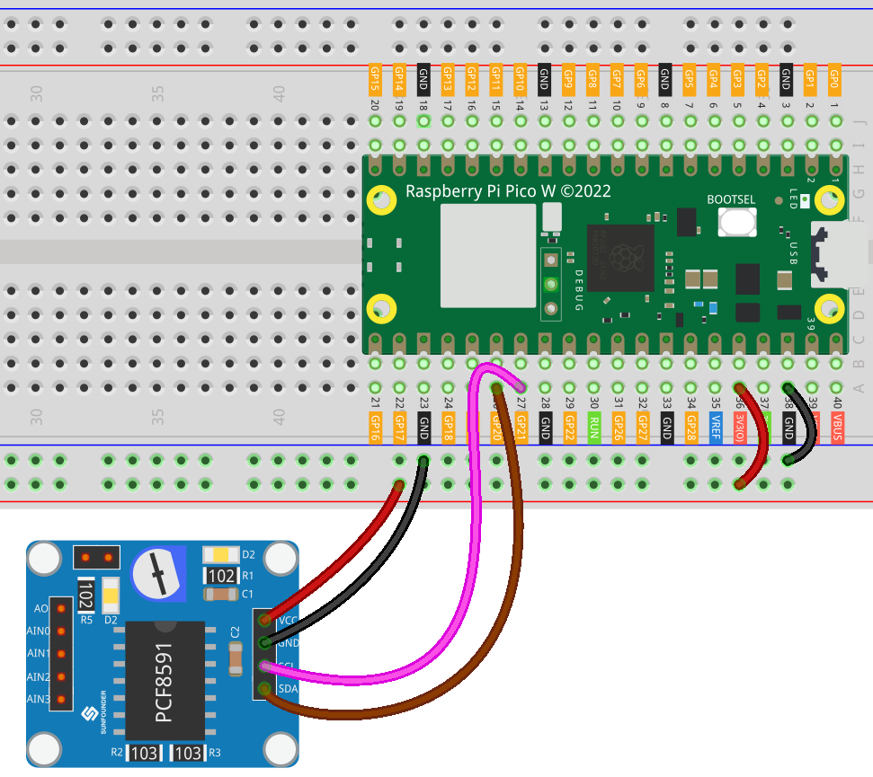

.. note:: 

    Ciao, benvenuto nella Comunità di appassionati di SunFounder Raspberry Pi & Arduino & ESP32 su Facebook! Approfondisci le tue competenze su Raspberry Pi, Arduino e ESP32 insieme ad altri entusiasti.

    **Perché unirsi?**

    - **Supporto esperto**: Risolvi problemi post-vendita e sfide tecniche con l’aiuto della nostra community e del nostro team.
    - **Impara & Condividi**: Condividi suggerimenti e tutorial per accrescere le tue competenze.
    - **Anteprime esclusive**: Accedi in anteprima a nuovi annunci di prodotto e contenuti esclusivi.
    - **Sconti speciali**: Approfitta di offerte esclusive sui nostri prodotti più recenti.
    - **Promozioni festive e giveaway**: Partecipa a promozioni stagionali e concorsi a premi.

    👉 Pronto a esplorare e creare con noi? Clicca [|link_sf_facebook|] e unisciti subito!

.. _pico_lesson10_pcf8591:

Lezione 10: Modulo Convertitore ADC DAC PCF8591
==================================================

In questa lezione imparerai a collegare il Raspberry Pi Pico W al modulo convertitore ADC DAC PCF8591 utilizzando MicroPython. Imposterai una connessione I2C, inizializzerai il modulo PCF8591 e leggerai i valori analogici dai suoi canali. Questa esercitazione pratica ti aiuterà a comprendere meglio la conversione analogico-digitale e la comunicazione I2C sul Raspberry Pi Pico W. Il potenziometro integrato è collegato ad AIN0 tramite ponticelli, mentre il LED D2 è connesso ad AOUT: ruotando il potenziometro potrai osservare la variazione dell’intensità luminosa del LED.

Componenti necessari
------------------------

Per questo progetto sono necessari i seguenti componenti.

È sicuramente conveniente acquistare un kit completo. Ecco il link:

.. list-table::
    :widths: 20 20 20
    :header-rows: 1

    *   - Nome	
        - ELEMENTI IN QUESTO KIT
        - LINK
    *   - Kit Sensori Universali per Maker
        - 94
        - |link_umsk|

Puoi anche acquistare i componenti separatamente dai link riportati di seguito.

.. list-table::
    :widths: 30 20
    :header-rows: 1

    *   - Introduzione ai Componenti
        - Link per l'acquisto

    *   - Raspberry Pi Pico W
        - |link_picow_buy|
    *   - :ref:`cpn_pcf8591`
        - |link_pcf8591_module_buy|
    *   - :ref:`cpn_breadboard`
        - |link_breadboard_buy|

Cablaggio
-------------

Codice
----------

.. note::

    * Apri il file ``10_pcf8591_module.py`` nel percorso ``universal-maker-sensor-kit-main/pico/Lesson_10_PCF8591_Module`` oppure copia questo codice in Thonny, quindi clicca su "Run Current Script" o premi F5 per eseguirlo. Per il tutorial completo, vedi :ref:`open_run_code_py`.

    * È necessario utilizzare il file ``PCF8591.py``: assicurati che sia stato caricato su Pico W. Per istruzioni dettagliate consulta :ref:`add_libraries_py`.

    * Non dimenticare di selezionare l’interprete "MicroPython (Raspberry Pi Pico)" nell’angolo in basso a destra.

.. code-block:: python

   from machine import I2C, Pin
   import time
   from PCF8591 import PCF8591
   
   # Configura la connessione I2C sui pin 20 (SDA) e 21 (SCL)
   i2c = I2C(0, sda=Pin(20), scl=Pin(21))
   
   # Inizializza il modulo PCF8591 con l'indirizzo 0x48
   pcf8591 = PCF8591(0x48, i2c)  # Modifica l’indirizzo se necessario
   
   # Verifica se il modulo PCF8591 è connesso correttamente
   if pcf8591.begin():
       print("PCF8591 found")
   
   # Ciclo principale per leggere valori analogici
   while True:
       # Legge e stampa il valore analogico dal canale AIN0
       AIN0 = pcf8591.analog_read(PCF8591.AIN0)
       print("AIN0 ", AIN0)  # Può essere usato anche PCF8591.CHANNEL_0
       # È possibile leggere anche altri canali rimuovendo i commenti qui sotto
       # print("AIN1 ", pcf8591.analog_read(PCF8591.AIN1))
       # print("AIN2 ", pcf8591.analog_read(PCF8591.AIN2))
       # print("AIN3 ", pcf8591.analog_read(PCF8591.AIN3))
   
       # Scrive il valore su AOUT. Questo cambia la luminosità del LED D2 sul modulo.
       pcf8591.analog_write(AIN0)
   
       # Attende 0,2 secondi prima della prossima lettura
       time.sleep(0.2)

Analisi del Codice
--------------------------

#. Importazione delle Librerie e Configurazione I2C

   - Il modulo ``machine`` viene importato per la comunicazione I2C e l’uso dei pin.
   - Il modulo ``time`` è importato per introdurre ritardi nel programma.
   - La libreria ``PCF8591`` semplifica l’interazione con il modulo. Per maggiori informazioni visita |link_PCF8591_micropython_library|.

   .. raw:: html

       

   .. code-block:: python

      from machine import I2C, Pin
      import time
      from PCF8591 import PCF8591

#. Inizializzazione della Connessione I2C

   La comunicazione I2C viene configurata usando i pin GPIO 20 (SDA) e 21 (SCL) del Raspberry Pi Pico W.

   .. code-block:: python

      i2c = I2C(0, sda=Pin(20), scl=Pin(21))

#. Inizializzazione del Modulo PCF8591

   Il modulo viene inizializzato con l’indirizzo I2C 0x48. Questo può variare in base alla configurazione del modulo.

   .. code-block:: python

      pcf8591 = PCF8591(0x48, i2c)

#. Verifica della Connessione

   Il programma verifica che il modulo PCF8591 sia correttamente rilevato.

   .. code-block:: python

      if pcf8591.begin():
          print("PCF8591 found")

#. Ciclo Principale per la Lettura dei Valori Analogici

   - Il programma entra in un ciclo infinito in cui legge costantemente il valore analogico dal canale AIN0.
   - Usa ``analog_read`` per acquisire il dato dal canale specificato.
   - Usa ``analog_write`` per inviare il valore ad AOUT.
   - Il potenziometro è collegato ad AIN0, il LED D2 ad AOUT, quindi la rotazione del potenziometro influisce sull’intensità luminosa del LED.
   - Consulta lo schema del modulo PCF8591 in :ref:`schematic <cpn_pcf8591_sch>` per maggiori dettagli.
   - Un ritardo di 0,2 secondi è introdotto per stabilizzare le letture.

   .. raw:: html 

       

   .. code-block:: python

      while True:
          # Legge e stampa il valore analogico dal canale AIN0
          AIN0 = pcf8591.analog_read(PCF8591.AIN0)
          print("AIN0 ", AIN0)  # Può essere utilizzato anche PCF8591.CHANNEL_0
          # È possibile leggere altri canali rimuovendo i commenti dalle righe seguenti
          # print("AIN1 ", pcf8591.analog_read(PCF8591.AIN1))
          # print("AIN2 ", pcf8591.analog_read(PCF8591.AIN2))
          # print("AIN3 ", pcf8591.analog_read(PCF8591.AIN3))
      
          # Scrive il valore su AOUT. Questo modifica la luminosità del LED D2 sul modulo.
          pcf8591.analog_write(AIN0)
      
          # Attende 0,2 secondi prima della lettura successiva
          time.sleep(0.2)
