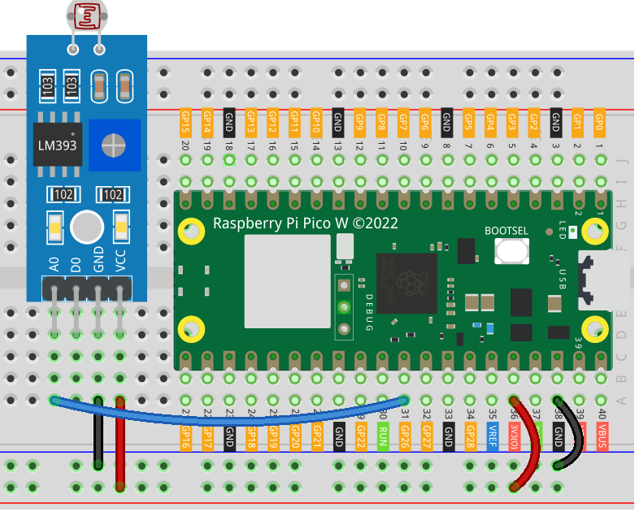

.. note:: 

    ¡Hola, bienvenido a la Comunidad de Aficionados de SunFounder Raspberry Pi & Arduino & ESP32 en Facebook! Sumérgete más en Raspberry Pi, Arduino y ESP32 con otros entusiastas.

    **Why Join?**

    - **Soporte de Expertos**: Resuelve problemas posventa y desafíos técnicos con ayuda de nuestra comunidad y equipo.
    - **Aprender y Compartir**: Intercambia consejos y tutoriales para potenciar tus habilidades.
    - **Previsualizaciones Exclusivas**: Accede de manera anticipada a los anuncios de nuevos productos y avances exclusivos.
    - **Descuentos Especiales**: Disfruta de descuentos exclusivos en nuestros productos más recientes.
    - **Promociones Festivas y Sorteos**: Participa en sorteos y promociones de festividades.

    👉 ¿Listo para explorar y crear con nosotros? Haz clic en [|link_sf_facebook|] y únete hoy.

.. _pico_lesson11_photoresistor:

Lección 11: Módulo Fotoresistor
==================================

En esta lección, aprenderás cómo conectar un módulo fotoresistor al Raspberry Pi Pico W para medir la intensidad de la luz. Al conectar el fotoresistor a la entrada analógica, podrás leer diferentes valores analógicos que corresponden a variados niveles de luz. Este proyecto es ideal para principiantes y ofrece experiencia práctica en la utilización de entradas analógicas en el Raspberry Pi Pico W con MicroPython.

Componentes Necesarios
--------------------------

Para este proyecto, necesitaremos los siguientes componentes:

Es definitivamente conveniente comprar un kit completo, aquí está el enlace:

.. list-table::
    :widths: 20 20 20
    :header-rows: 1

    *   - Nombre	
        - ÍTEMS EN ESTE KIT
        - ENLACE
    *   - Kit de Sensores Universal Maker
        - 94
        - |link_umsk|

También puedes comprarlos por separado en los siguientes enlaces.

.. list-table::
    :widths: 30 20
    :header-rows: 1

    *   - Introducción del Componente
        - Enlace de Compra

    *   - Raspberry Pi Pico W
        - \-
    *   - :ref:`cpn_photoresistor`
        - |link_photoresistor_sensor_module_buy|
    *   - :ref:`cpn_breadboard`
        - |link_breadboard_buy|

Cableado
---------------------------

Código
---------------------------

.. code-block:: python

   import machine  # Biblioteca de control de hardware
   import time  # Biblioteca de control de tiempo
   
   photoresistor = machine.ADC(26)  # Inicializa el ADC en el pin 26
   
   while True:
       value = photoresistor.read_u16()  # Lee el valor analógico
       print(value)  # Imprime el valor
   
       time.sleep_ms(200)  # Retardo de 200 ms entre lecturas

Análisis del Código
---------------------------

1. **Importación de Bibliotecas**:

   El código comienza importando las bibliotecas necesarias. La biblioteca ``machine`` se utiliza para controlar componentes de hardware, y la biblioteca ``time`` se usa para gestionar tareas relacionadas con el tiempo, como los retardos.

   .. code-block:: python

      import machine  # Biblioteca de control de hardware
      import time  # Biblioteca de control de tiempo

2. **Inicialización del Fotoresistor**:

   Aquí, inicializamos el fotoresistor. Utilizamos la clase ``machine.ADC`` para crear un objeto ADC en el pin 26, donde está conectado el fotoresistor. El objeto ADC se utilizará para leer los valores analógicos del fotoresistor.

   .. code-block:: python

      photoresistor = machine.ADC(26)  # Inicializa el ADC en el pin 26

3. **Lectura del Fotoresistor**:

   En este bucle, el código lee continuamente el valor analógico del fotoresistor usando ``photoresistor.read_u16()``. Este método lee el valor como un entero sin signo de 16 bits. El valor se imprime luego en la consola.

   .. code-block:: python

      while True:
          value = photoresistor.read_u16()  # Lee el valor analógico
          print(value)  # Imprime el valor

4. **Agregando un Retardo**:

   Para evitar que el código se ejecute demasiado rápido y sature la consola con datos, se introduce un retardo de 200 milisegundos después de cada lectura usando ``time.sleep_ms(200)``.

   .. code-block:: python

      time.sleep_ms(200)  # Retardo de 200 ms entre lecturas