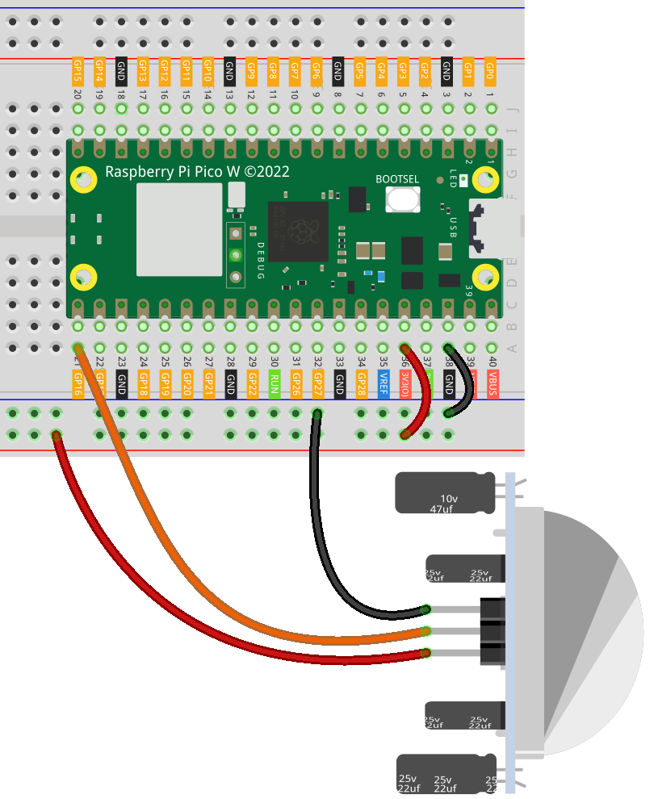

.. note:: 

    Bonjour et bienvenue dans la communauté des passionnés de SunFounder Raspberry Pi, Arduino et ESP32 sur Facebook ! Explorez davantage le Raspberry Pi, Arduino et ESP32 avec d'autres passionnés.

    **Pourquoi nous rejoindre ?**

    - **Support d’experts** : Résolvez les problèmes après-vente et les défis techniques avec l'aide de notre communauté et de notre équipe.
    - **Apprendre et partager** : Échangez des astuces et des tutoriels pour perfectionner vos compétences.
    - **Aperçus exclusifs** : Accédez en avant-première aux annonces de nouveaux produits et aux aperçus exclusifs.
    - **Réductions spéciales** : Profitez de réductions exclusives sur nos nouveaux produits.
    - **Promotions festives et concours** : Participez à des concours et promotions lors des fêtes.

    👉 Prêt à explorer et à créer avec nous ? Cliquez sur [|link_sf_facebook|] et rejoignez-nous dès aujourd’hui !

.. _pico_lesson12_pir_motion:

Leçon 12 : Module de Détection de Mouvement PIR (HC-SR501)
=====================================================================

Dans cette leçon, vous apprendrez à connecter un capteur de mouvement PIR au Raspberry Pi Pico W. Vous découvrirez comment configurer le capteur pour la détection de mouvement et utiliser un code MicroPython basique pour réagir aux déplacements. En surveillant le capteur PIR, vous acquerrez de l'expérience dans la gestion des entrées numériques et dans la création d'un système de sécurité simple ou d'un déclencheur d'automatisation.

Composants Requis
--------------------------

Pour ce projet, nous avons besoin des composants suivants.

Il est certainement plus pratique d'acheter un kit complet, voici le lien :

.. list-table::
    :widths: 20 20 20
    :header-rows: 1

    *   - Nom	
        - Éléments dans ce kit
        - Lien
    *   - Universal Maker Sensor Kit
        - 94
        - |link_umsk|

Vous pouvez également les acheter séparément via les liens ci-dessous.

.. list-table::
    :widths: 30 20
    :header-rows: 1

    *   - Introduction des composants
        - Lien d'achat

    *   - Raspberry Pi Pico W
        - \-
    *   - :ref:`cpn_pir_motion`
        - \-
    *   - :ref:`cpn_breadboard`
        - |link_breadboard_buy|

Câblage
---------------------------

Code
---------------------------

.. code-block:: python

   from machine import Pin
   import time
   
   # Initialiser le capteur PIR connecté à la broche 16 en entrée
   pir_sensor = Pin(16, Pin.IN)
   
   while True:
       # Vérifier la valeur du capteur PIR
       if pir_sensor.value() == 0:  
           print("Monitoring...")  # Aucun mouvement détecté
       else:
           print("Somebody here!")  # Mouvement détecté
       
       time.sleep(0.1)  # Délai court de 0.1 seconde pour réduire l’utilisation du CPU

Analyse du Code
---------------------------

1. Importation des modules

   Le module ``machine`` est importé pour utiliser la classe ``Pin`` afin de contrôler les broches GPIO. Le module ``time`` est importé pour gérer les délais dans la boucle.

   .. code-block:: python

      from machine import Pin
      import time

2. Initialisation du capteur PIR

   Le capteur PIR est connecté à la broche GPIO 16 du Raspberry Pi Pico W. Il est configuré comme un périphérique d'entrée, car il envoie des données au microcontrôleur.

   .. code-block:: python

      # Initialiser le capteur PIR connecté à la broche 16 en entrée
      pir_sensor = Pin(16, Pin.IN)

3. Boucle principale

   La boucle ``while True`` permet au code de s'exécuter en continu. À l'intérieur de cette boucle, la valeur du capteur PIR est vérifiée. Si la valeur est ``0``, cela signifie qu'aucun mouvement n'a été détecté. Sinon, un mouvement est détecté. Un délai de 0.1 seconde est ajouté pour réduire l'utilisation du CPU et éviter que le code ne s'exécute trop rapidement.

   .. code-block:: python

      while True:
          # Vérifier la valeur du capteur PIR
          if pir_sensor.value() == 0:  
              print("Surveillance...")  # Aucun mouvement détecté
          else:
              print("Quelqu'un est là !")  # Mouvement détecté

          time.sleep(0.1)  # Délai court de 0.1 seconde pour réduire l’utilisation du CPU
