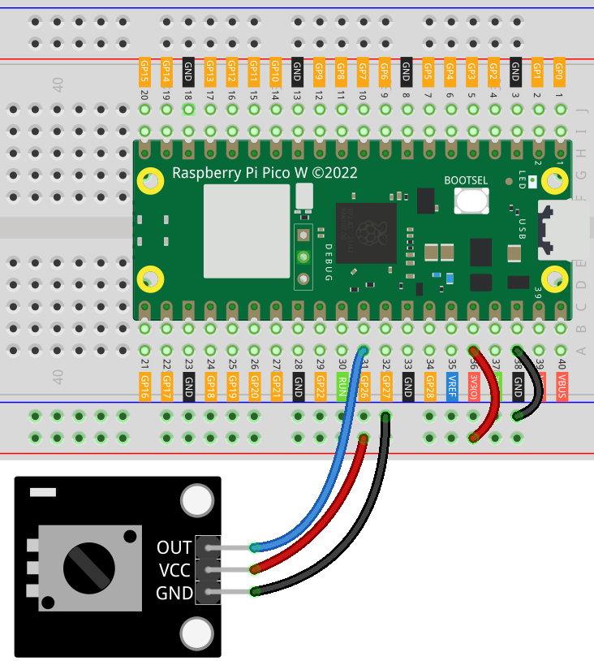

.. note:: 

    ¡Hola, bienvenido a la Comunidad de Entusiastas de SunFounder Raspberry Pi & Arduino & ESP32 en Facebook! Profundiza en Raspberry Pi, Arduino y ESP32 con otros aficionados.

    **Why Join?**

    - **Soporte de Expertos**: Resuelve problemas posventa y desafíos técnicos con la ayuda de nuestra comunidad y equipo.
    - **Aprender y Compartir**: Intercambia consejos y tutoriales para mejorar tus habilidades.
    - **Vistas Previas Exclusivas**: Obtén acceso anticipado a anuncios de nuevos productos y avances exclusivos.
    - **Descuentos Especiales**: Disfruta de descuentos exclusivos en nuestros productos más recientes.
    - **Promociones Festivas y Sorteos**: Participa en sorteos y promociones festivas.

    👉 ¿Listo para explorar y crear con nosotros? Haz clic en [|link_sf_facebook|] y únete hoy.

.. _pico_lesson13_potentiometer:

Lección 13: Módulo de Potenciómetro
======================================

En esta lección, aprenderás a usar un potenciómetro con el Raspberry Pi Pico W para medir valores analógicos. El potenciómetro, que es una resistencia variable, te permite ajustar el voltaje que el Raspberry Pi Pico W lee en uno de sus pines de entrada analógica. Al girar el dial del potenciómetro, observarás cambios en el valor de entrada. Este proyecto ofrece una comprensión básica de las entradas analógicas y su aplicación en proyectos electrónicos, lo que lo hace un punto de entrada ideal para principiantes en electrónica y programación en MicroPython.

Componentes Necesarios
--------------------------

Para este proyecto, necesitamos los siguientes componentes:

Es definitivamente conveniente comprar un kit completo, aquí está el enlace:

.. list-table::
    :widths: 20 20 20
    :header-rows: 1

    *   - Nombre	
        - ELEMENTOS EN ESTE KIT
        - ENLACE
    *   - Kit de Sensores Universal Maker
        - 94
        - |link_umsk|

También puedes comprarlos por separado en los siguientes enlaces.

.. list-table::
    :widths: 30 20
    :header-rows: 1

    *   - Introducción del Componente
        - Enlace de Compra

    *   - Raspberry Pi Pico W
        - \-
    *   - :ref:`cpn_potentiometer`
        - |link_potentiometer_sensor_module_buy|
    *   - :ref:`cpn_breadboard`
        - |link_breadboard_buy|

Cableado
---------------------------

Código
---------------------------

.. code-block:: python

   import machine  # Biblioteca de control de hardware
   import time  # Biblioteca de control de tiempo
   
   potenciometro = machine.ADC(26)  # Inicializa el ADC en el pin 26
   
   while True:
       valor = potenciometro.read_u16()  # Lee el valor analógico
       print(valor)  # Imprime el valor
   
       time.sleep_ms(200)  # Retardo de 200 ms entre lecturas

Análisis del Código
---------------------------

1. Importar Bibliotecas

   Primero, se importan las bibliotecas necesarias. ``machine`` es para el control de hardware, y ``time`` es para la gestión de retardos.

   .. code-block:: python

      import machine  # Biblioteca de control de hardware
      import time     # Biblioteca de control de tiempo

2. Inicializar el ADC (Convertidor Analógico a Digital)

   El potenciómetro está conectado al pin 26 del Pico W. Este pin se inicializa como un pin ADC para leer valores analógicos.

   .. code-block:: python

      potenciometro = machine.ADC(26)  # Inicializa el ADC en el pin 26

3. Lectura e Impresión del Valor Analógico

   El código entra en un bucle infinito (``while True:``) donde continuamente lee el valor analógico del potenciómetro usando ``potenciometro.read_u16()`` e imprime ese valor.

   .. code-block:: python

      while True:
          valor = potenciometro.read_u16()  # Lee el valor analógico
          print(valor)                      # Imprime el valor

4. Añadir un Retardo

   Para evitar que el bucle se ejecute demasiado rápido, se introduce un retardo de 200 milisegundos usando ``time.sleep_ms(200)``. Esto proporciona una salida legible y reduce la carga del procesador.

   .. code-block:: python

      time.sleep_ms(200)                # Retardo de 200 ms entre lecturas